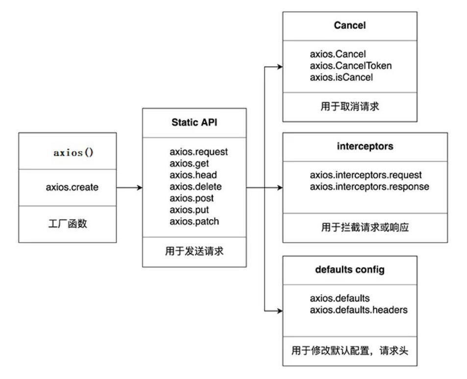

# axios

文档

https://github.com/axios/axios

## 1.简介

```
前端最流行的ajax请求库
react/vue官方都推荐使用axios发ajax请求
```

## 2.axios的特点

```
基于promise的异步ajax请求库
浏览器端/node端都可以使用
支持请求／响应拦截器
支持请求取消
请求/响应数据转换
批量发送多个请求
默认为发送数据为json格式
```

## 3.axios常用语法

```
axios(config): 通用/最本质的发任意类型请求的方式
axios(url[, config]): 可以只指定url发get请求
axios.request(config): 等同于axios(config)
axios.get(url[, config]): 发get请求
axios.delete(url[, config]): 发delete请求
axios.post(url[, data, config]): 发post请求
axios.put(url[, data, config]): 发put请求

axios.defaults.xxx: 请求的默认全局配置
axios.defaults.baseURL = 'http://localhost:3000': 设置公共url
axios.interceptors.request.use(): 添加请求拦截器
axios.interceptors.response.use(): 添加响应拦截器

axios.create([config]): 创建一个新的axios(它没有下面的功能)

axios.Cancel(): 用于创建取消请求的错误对象
axios.CancelToken(): 用于创建取消请求的token对象
axios.isCancel(): 是否是一个取消请求的错误
axios.all(promises): 用于批量执行多个异步请求
axios.spread(): 用来指定接收所有成功数据的回调函数的方法

注：axios函数、get、post请求本质上都是request请求
```



## 4.axios基本使用

```html
<button onclick="testGet()">发送GET请求</button><br>
<button onclick="testPost()">发送POST请求</button><br>
<button onclick="testPut()">发送PUT请求</button><br>
<button onclick="testDelete()">发送Delete请求</button><br>

<script src="https://cdn.bootcss.com/axios/0.19.0/axios.js"></script>
<script>
    axios.defaults.baseURL = 'http://localhost:3000'
	
    function testGet () {
        /* axios({ // 配置对象: 属性名是一些特定名称
        // method: 'GET',
        // url: '/posts'
        // url: '/posts/2'
        // url: '/posts?id=2'
        url: '/posts',
        params: { // 指定query参数, 而不是params参数
          id: 3
        }
      }) */
        axios.get('/posts', {
            params: {
                id: 3
            }
        }).then(
            response => {
                console.log(response.data, response.status, response.statusText)
            }
        ).catch(error => {
            alert(error.message)
        })
    }

    function testPost () {
        /* axios({ // 配置对象: 属性名是一些特定名称
        method: 'POST',
        url: '/posts',
        data: { // 指定请求体参数数据
          title: 'eee',
          author: 'fff'
        }
      }) */
        axios.post('/posts', {title: 'ggg', author: 'fff'}, {})
            .then(
            response => {
                console.log(response.data, response.status, response.statusText)
            },
            error => {
                alert(error.message)
            }
        )
    }

    function testPut () {
        /* axios({ // 配置对象: 属性名是一些特定名称
        method: 'PUT',
        url: '/posts/2',
        data: { // 指定请求体参数数据
          title: 'atguigu',
          author: 'xfzhang'
        }
      }) */
        axios.put('/posts/3', {title: 'hhh', author: 'jjj'}, {})
            .then(
            response => {
                console.log(response.data, response.status, response.statusText)
            },
            error => {
                alert(error.message)
            }
        )
    }

    function testDelete () {
        /* axios({ // 配置对象: 属性名是一些特定名称
        method: 'DELETE',
        url: '/posts/2'
      })
       */
        // axios.delete('/posts/3')
        //等价于axios(config)
        axios.request('/posts/3', {method: 'DELETE'})
            .then(
            response => {
                console.log(response.data, response.status, response.statusText)
            },
            error => {
                alert(error.message)
            }
        )
    }
    
    const request1 = axios({
      url: "/posts/3",
      method: 'DELETE',
    })

    const request2 = axios({
      url: "/posts"
    })

    axios.all([request1, request2]).then(([res1, res2]) => {
      console.log(res1, res2);
    });
</script>
```

## 5.axios.create(config) (难点！)

```
1.根据指定配置创建一个新的axios, 也就是每个新axios都有自己的配置
2.新axios只是没有取消请求和批量发请求的方法, 其它所有语法都是一致的
3.为什么要设计这个语法?
(1)需求: 项目中有部分接口需要的配置与另一部分接口需要的配置不太一样, 如何处理
(2)解决: 创建2个新axios, 每个都有自己特有的配置, 分别应用到不同要求的接口请求中
```

```html
<script src="https://cdn.bootcss.com/axios/0.19.0/axios.js"></script>
<script>
    axios.defaults.baseURL = 'http://localhost:3000'
    axios.defaults.timeout = 10000
    axios({
        url: '/posts'
    })

    // instance不是axios的实例, instance是函数
    const instance = axios.create({ // 指定instance的默认配置
        baseURL: 'http://localhost:4000',
        timeout: 15000
    })

    instance({
        url: '/post'
    })
</script>
```

## 6.axios拦截器

```
请求拦截器
1. 是什么? 
在真正在发请求执行的回调函数
2. 作用
对请求的配置做一些处理: data, header, 界面loading提示
对请求进行检查, 如果不满足条件不发请求

添加响应拦截器
1. 是什么? 
在得到响应后执行的回调函数(在外层的回调之前)
2. 作用
对请求成功的数据进行处理
对请求失败进行处理
```

## 7.axios的处理链流程-拦截器函数/ajax请求/请求的回调函数的调用顺序

```
1.说明: 调用axios()并不是立即发送ajax请求, 而是需要经历一个较长的流程

2.流程: 请求拦截器2 => 请求拦截器1 => 发ajax请求 => 响应拦截器1 => 响应拦截器2 => 请求的回调

3.注意: 此流程是通过promise串连起来的, 请求拦截器传递的是config, 响应拦截器传递的是response
```

```html
<script src="https://cdn.bootcss.com/axios/0.19.0/axios.js"></script>
<script>
    axios.defaults.baseURL = 'http://localhost:3000'

    /* 
    添加请求拦截器
    1. 是什么? 
      在真正在发请求执行的回调函数
    2. 作用
        对请求的配置做一些处理: data, header, 界面loading提示
        对请求进行检查, 如果不满足条件不发请求
    */
    axios.interceptors.request.use(function (config) {
        console.log('req interceptor1 onResolved()', config)
        return config;
    });
    axios.interceptors.request.use(function (config) {
        console.log('req interceptor2 onResolved()', config)
        // return config; // 必须返回config
        return config
    });

    /* 
     添加响应拦截器
     1. 是什么? 
        在得到响应后执行的回调函数(在外层的回调之前)
    2. 作用
        对请求成功的数据进行处理
        对请求失败进行处理
    */
    axios.interceptors.response.use(
        function (response) {
            console.log('res interceptor1 onResolved()', response)
            // return response;
            return response.data;
        },
        function (error) {
            console.log('res interceptor1 onRejected()')
            return Promise.reject(error);
        }
    )
    axios.interceptors.response.use(
        function (data) {
            console.log('res interceptor2 onResolved()', data)
            return data;
        },
        function (error) {
            console.log('res interceptor2 onRejected()')
            return Promise.reject(error);
        }
    )

    axios({
        url: '/posts'
    }).then(
        data => {
            console.log('onResolved()', data)
        },
        error => {
            console.log('onRejected()')
        }
    )
</script>
```

## 8.取消请求

```
1.基本流程

配置cancelToken对象

   缓存用于取消请求的cancel函数

   在后面特定时机调用cancel函数取消请求

   在错误回调中判断如果error是cancel, 做相应处理

2.实现功能

   点击按钮, 取消某个正在请求中的请求

在请求一个接口前, 取消前面一个未完成的请求
```

```html
//基础版
<button onclick="getProducts1()">获取商品列表1</button><br>
<button onclick="getProducts2()">获取商品列表2</button><br>
<button onclick="cancelReq()">取消请求</button><br>

<script src="https://cdn.bootcss.com/axios/0.19.0/axios.js"></script>
<script>
    axios.defaults.baseURL = 'http://localhost:4000'
    let cancel
    function getProducts1() {
        axios('/getProducts12', {
            cancelToken: new axios.CancelToken((c) => { // 在CancelToken中立即同步执行, 并传入用于取消请求的函数
                // 保存用于取消请求的函数
                cancel = c
            })
        })
            .then(
            response => {
                // cancel = null
                console.log('1111 onResolved', response.data)
            },
            error => {
                if (axios.isCancel(error)) { // 取消请求导致的错误
                    console.log('1111 取消请求', error.message)
                } else {
                    console.log('1111 请求出错', error.message)
                }

            }
        )
    }

    function getProducts2() {
        axios({
            url: '/getProducts2',
            cancelToken: new axios.CancelToken((c) => { // 在CancelToken中立即同步执行, 并传入用于取消请求的函数
                // 保存用于取消请求的函数
                cancel = c
            })
        }).then(
            response => console.log('2222 onResolved', response.data),
            error => {
                if (axios.isCancel(error)) {
                    console.log('2222 取消请求', error.message)
                } else {
                    console.log('2222 请求出错', error.message)
                }
            }
        )
    }

    function cancelReq() {
        // 取消请求
        if (cancel) {
            cancel('强制取消')
        }
    }
</script>
```

```html
//加强版-自动取消未完成的请求
<button onclick="getProducts1()">获取商品列表1</button><br>
<button onclick="getProducts2()">获取商品列表2</button><br>

<script src="https://cdn.bootcss.com/axios/0.19.0/axios.js"></script>
<script>
    /* 需求: 自动取消上次未完成的请求 */
    axios.defaults.baseURL = 'http://localhost:4000'
    let cancel
    function getProducts1() {

        // 如果有未完成的请求, 取消这个请求
        if (cancel) {
            cancel('强制取消')
        }

        axios('/getProducts1', {
            cancelToken: new axios.CancelToken((c) => { // 在CancelToken中立即同步执行, 并传入用于取消请求的函数
                // 保存用于取消请求的函数
                cancel = c
            })
        })
            .then(
            response => {
                // cancel = null //axios底层置为空了，也可不写
                console.log('1111 onResolved', response.data)
            },
            error => {
                // cancel = null
                if (axios.isCancel(error)) { // 取消请求导致的错误
                    console.log('1111 取消请求', error.message)
                } else {
                    cancel = null
                    console.log('1111 请求出错', error.message)
                }

            }
        )
    }

    function getProducts2() {
        // 如果有未完成的请求, 取消这个请求
        if (cancel) {
            cancel('强制取消')
        }
        
        axios({
            url: '/getProducts2',
            cancelToken: new axios.CancelToken((c) => { // 在CancelToken中立即同步执行, 并传入用于取消请求的函数
                // 保存用于取消请求的函数
                cancel = c
            })
        }).then(
            response => {
                // cancel = null //axios底层置为空了，也可不写
                console.log('2222 onResolved', response.data)
            },
            error => {
                if (axios.isCancel(error)) {
                    console.log('2222 取消请求', error.message)
                } else {
                    cancel = null
                    console.log('2222 请求出错', error.message)
                }
            }
        )
    }
</script>
```

```html
//最终版-使用拦截器
<button onclick="getProducts1()">获取商品列表1</button><br>
<button onclick="getProducts2()">获取商品列表2</button><br>
<button onclick="cancelReq()">取消请求</button><br>

<script src="https://cdn.bootcss.com/axios/0.19.0/axios.js"></script>
<script>
    /* 需求: 自动取消未完成的请求 */
    axios.defaults.baseURL = 'http://localhost:4000'
    let cancel // 用于保存取消请求的函数

    // 添加请求拦截器
    axios.interceptors.request.use(config => {
        // 如果有未完成的请求, 取消这个请求
        if (cancel) {
            cancel('强制取消')
        }
        // 添加cancelToken的配置
        config.cancelToken = new axios.CancelToken((c) => { // 在CancelToken中立即同步执行, 并传入用于取消请求的函数
            // 保存用于取消请求的函数
            cancel = c
        })

        return config // 必须返回它
    })

    // 添加响应拦截器-统一处理请求错误
    axios.interceptors.response.use(
        response => {
            cancel = null
            return response
        },

        error => {
            if (axios.isCancel(error)) { // 取消请求导致的错误
                alert('取消请求错误: ' + error.message)
            } else {
                cancel = null
                alert('请求错误: ' + error.message)
            }
            return new Promise(() => {}) // 返回pending状态的promise 中断promise链
        }
    )

    function getProducts1() {
        axios('/getProducts12')
            .then(
            response => {
                console.log('1111 onResolved', response.data)
            },
            /*  error => {
          console.log('1111 请求出错', error.message)
        } */
        )
    }

    function getProducts2() {
        axios('/getProducts2').then(
            response => {
                console.log('2222 onResolved', response.data)
            },
            /* error => {
         console.log('2222 请求出错', error.message)
        } */
        )
    }
</script>
```

## 9.axios二次封装

```html
<div>
    <button onclick="getPosts()">获取文章列表</button>
    <button onclick="addPost()">添加文章</button>
</div>

<script src="https://cdn.bootcss.com/nprogress/0.2.0/nprogress.js"></script>
<script src="https://cdn.bootcss.com/qs/6.9.0/qs.js"></script>
<script src="https://cdn.bootcss.com/axios/0.19.0/axios.js"></script>

<!-- 
1). 统一进行请求配置
2). 请求过程中loading提示
3). 请求体参数以urlencoded形式传递
4). 请求成功的value不再是response, 而是response.data
5). 请求失败统一进行提示处理, 每个请求不需要单独处理
-->

<script>
    // 1). 统一进行请求配置
    const instance = axios.create({
        baseURL: 'http://localhost:4000',  // 指定基础url
        timeout: 15000, // 指定请求超时时间
    })

    // 添加请求拦截器
    instance.interceptors.request.use((config) => {
        // 2). 请求过程中loading提示
        // 显示loading
        NProgress.start()
        // axios默认以json格式发送，此处需要转换格式
        // 3). 请求体参数以urlencoded形式传递
        // 对data参数数据进行处理: 转换为urlencoded格式(原本是对象)
        if (config.data instanceof Object) {
            //注：此处引入是Qs不是qs
            config.data = Qs.stringify(config.data)
        }
        return config
    })

    // 添加响应拦截器
    instance.interceptors.response.use(
        response => {
            // 隐藏loading
            NProgress.done()
            // 4). 请求成功的value不再是response, 而是response.data
            return response.data
        },
        error => {
            // 隐藏loading
            NProgress.done()
            // 5). 请求失败统一进行提示处理, 每个请求不需要单独处理
            alert('统一处理请求出错: ' + error.message)
            return new Promise(() => {}) // 返回pending状态的promise 中断promise链
        }
    )

</script>
<script>
    function getPosts() {
        instance.get('/post').then(
            result => {
                console.table(result.data)
            },
            error => {
                alert(error.message)
            }
        )
    }
    async function addPost() {
        const result = await instance.post('/post', {title: 'newTitle', author: 'newAuthor'})
        console.table(result.data)
    }

</script>
```

## 10.源码分析

```
1. axios与Axios的关系
    axios函数对应的是Axios.prototype.request方法通过bind(Axiox的实例)产生的函数
    axios有Axios原型上的所有发特定类型请求的方法: get()/post()/put()/delete()
    axios有Axios的实例上的所有属性: defaults/interceptors
    后面又添加了create()/CancelToken()/all()
2. axios.create()返回的对象与axios的区别
    1). 相同: 
        都是一个能发任意请求的函数: request(config)
        都有发特定请求的各种方法: get()/post()/put()/delete()
        都有默认配置和拦截器的属性: defaults/interceptors
    2). 不同:
        默认匹配的值不一样
        instance没有axios后面添加的一引起方法: create()/CancelToken()/all()
3. axios发请求的流程
    1). 整体流程: request(config)  ===> dispatchRequest(config) ===> xhrAdapter(config)
    2). request(config): 将请求拦截器 / dispatchRequest() / 响应拦截器 通过promise链串连起来, 返回promise
    3). dispatchRequest(config): 转换请求数据 ===> 调用xhrAdapter()发请求 ===> 请求返回后转换响应数据. 返回promise
    4). xhrAdapter(config): 创建XHR对象, 根据config进行相应设置, 发送特定请求, 并接收响应数据, 返回promise 
4. axios的请求/响应拦截器是什么?
    1). 请求拦截器: 在真正发请求前, 可以对请求进行检查或配置进行特定处理的函数, 
               包括成功/失败的函数, 传递的必须是config
    2). 响应拦截器: 在请求返回后, 可以对响应数据进行特定处理的函数,
               包括成功/失败的函数, 传递的默认是response
5. axios的请求/响应数据转换器是什么?
    1). 请求转换器: 对请求头和请求体数据进行特定处理的函数
        setContentTypeIfUnset(headers, 'application/json;charset=utf-8');
        return JSON.stringify(data)
    2). 响应转换器: 将响应体json字符串解析为js对象或数组的函数
        response.data = JSON.parse(response.data)
6. response的整体结构
    {
        data,
        status,
        statusText,
        headers,
        config,
        request
    }
7. error的整体结构
    {
        message,
        request,
        response
    }
8. 如何取消未完成的请求
    1).当配置了cancelToken对象时, 保存cancel函数
        创建一个用于将来中断请求的cancelPromise
        并定义了一个用于取消请求的cancel函数
        将cancel函数传递出来
    2.调用cancel()取消请求
        执行cacel函数, 传入错误信息message
        内部会让cancelPromise变为成功, 且成功的值为一个Cancel对象
        在cancelPromise的成功回调中中断请求, 并让发请求的proimse失败, 失败的reason为Cacel对象
```

## 11.手写mini-axios

```html
<button onclick="testGet()">发送GET请求</button><br>
<button onclick="testPost()">发送POST请求</button><br>
<button onclick="testPut()">发送PUT请求</button><br>
<button onclick="testDelete()">发送Delete请求</button><br>

<script>
    /* 
    1.函数的返回值为promise, 成功的结果为response, 异常的结果为error
    2.能处理多种类型的请求: GET/POST/PUT/DELETE
    3.函数的参数为一个配置对象
      {
        url: '',   // 请求地址
        method: '',   // 请求方式GET/POST/PUT/DELETE
        params: {},  // GET/DELETE请求的query参数
        data: {}, // POST或PUT请求的请求体参数 
      }
    4.响应json数据自动解析为js对象/数组
    */

    /* 
    能发ajax请求的函数
    1. 接收一个配置
    2. 返回值是promise
    3. 使用xhr发ajax请求
    4. 携带请求参数
    5. 取响应结果, 并更新promise状态
    */
    function axios({ // 1. 接收一个配置
        url,
        method='GET',
        params={},
        data={}
    }) {

        // 4.1. 准备query参数  {a: 1, b: 2} ==> a=1&b=2 ==> url?a=1&b=2
        let queryStr = ''
        Object.keys(params).forEach(key => {
            queryStr += `${key}=${params[key]}&`
        })  // a=1&b=2&
        if (queryStr) {
            queryStr = queryStr.substring(0, queryStr.length-1)  // a=1&b=2
            url += '?' + queryStr
        }

        // 4.2. 准备请求体参数
        data = JSON.stringify(data)

        // 2. 返回值是promise
        return new Promise((resolve, reject) => {
            // 3. 使用xhr发ajax请求
            const xhr = new XMLHttpRequest()
            xhr.open(method, url, true)
            if (method==='POST' || method==='PUT' || method==='DELETE') {
                xhr.send(data) 
            } else { // GET
                xhr.send()
            }
            // 5. 取响应结果, 并更新promise状态
            xhr.onreadystatechange = () => {
                // 请求没完成, 直接结束
                const {readyState, status, statusText} = xhr
                if (readyState!==4) return

                // 成功了, 更新为成功, 并传入成功的response
                if (status>=200 && status<=299) {
                    const response = {
                        data: JSON.parse(xhr.response),
                        status,
                        statusText
                    }
                    resolve(response)
                    // 失败了, 更新为失败, 并传入成功的error
                } else {
                    reject(new Error('request error status is ' + status))
                }
            }

        })
    }
    axios.get = function (url, config) {
        // return axios(Object.assign({url}, config))
        return axios({url, ...config})
    }
    axios.post = function (url, data, config) {
        return axios(Object.assign({url, data}, config))
    }

</script>

<script>
    function testGet () {
        axios({ // 配置对象: 属性名是一些特定名称
            // method: 'GET',
            // url: 'http://localhost:3000/posts'
            // url: 'http://localhost:3000/posts/2'
            // url: 'http://localhost:3000/posts?id=2'
            url: 'http://localhost:3000/posts',
            params: { // 指定query参数, 而不是params参数
                id: 3,
            }
        }).then(
            response => {
                console.log(response.data, response.status, response.statusText)
            },
            error => {
                alert(error.message)
            }
        )
    }

    function testPost () {
        axios({ // 配置对象: 属性名是一些特定名称
            method: 'POST',
            url: 'http://localhost:3000/posts',
            data: { // 指定请求体参数数据
                title: 'ccc',
                author: 'ddd'
            }
        }).then(
            response => {
                console.log(response.data, response.status, response.statusText)
            },
            error => {
                alert(error.message)
            }
        )
    }

    function testPut () {
        axios({ // 配置对象: 属性名是一些特定名称
            method: 'PUT',
            url: 'http://localhost:3000/posts/17',
            data: { // 指定请求体参数数据
                title: 'atguigu',
                author: 'xfzhang'
            }
        }).then(
            response => {
                console.log(response.data, response.status, response.statusText)
            },
            error => {
                alert(error.message)
            }
        )
    }

    function testDelete () {
        axios({ // 配置对象: 属性名是一些特定名称
            method: 'DELETE',
            url: 'http://localhost:3000/posts/17',
            data: {
                id: 123232
            }
        }).then(
            response => {
                console.log(response.data, response.status, response.statusText)
            },
            error => {
                alert(error.message)
            }
        )
    }
</script>
```


