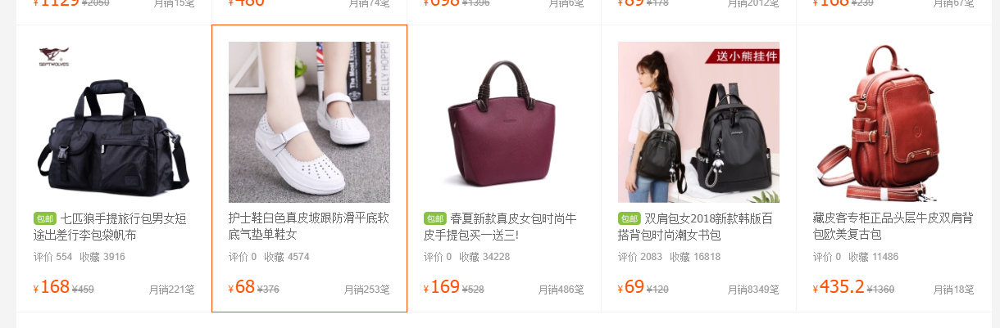
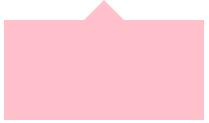

# 盒子模型

## 1.文档流

```css
文档流（normal flow）
- 网页是一个多层的结构，一层摞着一层
- 通过CSS可以分别为每一层来设置样式
- 作为用户来讲只能看到最顶上一层
- 这些层中，最底下的一层称为文档流，文档流是网页的基础
我们所创建的元素默认都是在文档流中进行排列

- 对于我们来说元素主要有两个状态
    在文档流中
    不在文档流中（脱离文档流）

- 元素在文档流中的特点:
- 块元素（<h1>~<h6>、<p>、<div>、<ul>、<ol>、<li>）
    - 块元素会在页面中独占一行(自上向下垂直排列)
    - 默认宽度是父元素的全部（会把父元素撑满）
    - 默认高度是被内容撑开（子元素）
	- 块元素是一个容器及盒子，里面可以放行内或者块级元素。
	- p 和 h 里面不能放块级元素

- 行内元素（<a>、<strong>、<b>、<em>、<i>、<del>、<s>、<ins>、<u>、<span>）
    - 行内元素不会独占页面的一行，只占自身的大小
    - 行内元素在页面中左向右水平排列，如果一行之中不能容纳下所有的行内元素
    	则元素会换到第二行继续自左向右排列（书写习惯一致）
    - 行内元素的默认宽度和高度都是被内容撑开
    - 行内元素只能容纳文本或则其他行内元素。

- 行内块元素 （、<input />、<td>）
	- 行内块相邻在一行上,之间会有空白缝隙
	- img底下也有空隙

实例:
.box1{
    width: 100px;
    background-color: yellow;
}
.box2{
    width: 100px;
    background-color: red;
}
span{
    background-color: #bfa;
}

<div class="box1">我是div1</div>
<div class="box2">我是div2</div>
<span>我是span1</span>
<span>我是span2</span>
<span>我是span2</span>
<span>我是span2</span>
<span>我是span2</span>
```

## 2.盒子模型

### 2.1概述

```css
盒模型、盒子模型、框模型（box model）
- CSS将页面中的所有元素都设置为了一个矩形的盒子
- 将元素设置为矩形的盒子后，对页面的布局就变成将不同的盒子摆放到不同的位置
- 每一个盒子都由一下几个部分组成：
    内容区（content）
    内边距（padding）
    边框（border）
    外边距（margin）

我们根据稳定性来分，建议如下:
按照 优先使用 宽度 （width），其次 使用内边距（padding），再次  外边距（margin）。

实例:
.box1{
    /* 
        内容区（content），元素中的所有的子元素和文本内容都在内容区中排列  
        内容区的大小由width 和 height两个属性来设置
        width 设置内容区的宽度
        height 设置内容区的高度          
    */
    width: 200px;
    height: 200px;
    background-color: #bfa;

    /* 
        边框（border），边框属于盒子边缘，边框里边属于盒子内部，出了边框都是盒子的外部
        边框的大小会影响到整个盒子的大小
        要设置边框，需要至少设置三个样式：
        边框的宽度 border-width
        边框的颜色 border-color
        边框的样式 border-style
    */
    border-width: 10px;
    border-color: red;
    border-style: solid;
}
<div class="box1"></div>
```

### 2.2边框

```css
边框的宽度 border-width
边框的颜色 border-color
边框的样式 border-style

实例:
.box1{
    width: 200px;
    height: 200px;
    background-color: #bfa;

    /* 
        border-width: 10px;
        默认值，一般都是 3个像素
        border-width可以用来指定四个方向的边框的宽度
        值的情况
            四个值：上 右 下 左
            三个值：上 左右 下
            两个值：上下 左右
            一个值：上下左右

        除了border-width还有一组 border-xxx-width
            xxx可以是 top right bottom left
            用来单独指定某一个边的宽度
    */
    
    border-width: 10px;
    border-top-width: 10px;
    border-left-width: 30px;

    color: red;

    /* 
        border-color用来指定边框的颜色，同样可以分别指定四个边的边框
        规则和border-width一样

        border-color也可以省略不写，如果省略了则自动使用color的颜色值
    */
    border-color: orange red yellow green;
    border-color: orange;


    /* 
        border-style 指定边框的样式
            solid 表示实线
            dotted 点状虚线
            dashed 虚线
            double 双线
    
        border-style的默认值是none 表示没有边框

    */
    border-style: solid dotted dashed double;
    border-style: solid;

    border-width: 10px;
    border-color: orange;
    border-style: solid;

    /* 
        border简写属性，通过该属性可以同时设置边框所有的相关样式，并且没有顺序要求

        除了border以外还有四个 border-xxx
            border-top
            border-right
            border-bottom
            border-left
    */
    border: solid 10px orange;
    border-top: 10px solid red;
    border-left: 10px solid red;
    border-bottom: 10px solid red;

    border: 10px red solid;
    border-right: none;
    
    /* 留一边框做法: 先去掉所有边，再留需要的一边 */
    border: none;
    border-bottom: 1px dashed red;
}

<div class="box1"></div>
```

### 2.3内边距

```css
.box1{
    width: 200px;
    height: 200px;
    background-color: #bfa;
    border: 10px orange solid;

    /* 
        内边距（padding）
        - 内容区和边框之间的距离是内边距
        - 一共有四个方向的内边距：
            padding-top
            padding-right
            padding-bottom
            padding-left

        - 内边距的设置会影响到盒子的大小
        - 背景颜色会延伸到内边距上

        一般盒子的可见框的大小，由内容区、内边距 和 边框共同决定，
        所以在计算盒子大小时，需要将这三个区域加到一起计算
    */

    padding-top: 100px;
    padding-left: 100px;
    padding-right: 100px;
    padding-bottom: 100px;

    /* 
        padding 内边距的简写属性，可以同时指定四个方向的内边距
        规则和 border-width 一样
    */
    padding: 10px 20px 30px 40px;
    padding: 10px 20px 30px ;
    padding: 10px 20px ;
    padding: 10px ;
}

.inner{
    width: 100%;
    height: 100%;
    background-color: yellow;
}

<div class="box1">
	<div class="inner"></div>
</div>

注:
特殊情况，如果这个盒子没有宽度 则 padding 不会撑开盒子!!!
```

### 2.4外边距

```css
.box1{
    width: 200px;
    height: 200px;
    background-color: #bfa;
    border: 10px red solid;

    /* 
        外边距（margin）
            - 外边距不会影响盒子可见框的大小
            - 但是外边距会影响盒子的位置
            - 一共有四个方向的外边距：
                margin-top
                - 上外边距，设置一个正值，元素会向下移动
                margin-right
                - 默认情况下设置margin-right不会产生任何效果
                margin-bottom
                - 下外边距，设置一个正值，其下边的元素会向下移动
                margin-left
                - 左外边距，设置一个正值，元素会向右移动

                - margin也可以设置负值，如果是负值则元素会向相反的方向移动

            - 元素在页面中是按照自左向右的顺序排列的，
                所以默认情况下如果我们设置的左和上外边距则会移动元素自身
                而设置下和右外边距会移动其他元素

            - margin的简写属性
            	margin 可以同时设置四个方向的外边距 ，用法和padding一样

            - margin会影响到盒子实际占用空间
    */

    margin-top: 100px;
    margin-left: 100px;
    margin-bottom: 100px;

    margin-bottom: 100px;
    margin-top: -100px;
    margin-left: -100px;
    margin-bottom: -100px;

    margin-right: 0px;

    margin: 100px;
}

.box2{
    width: 220px;
    height: 220px;
    background-color: yellow
}

<div class="box1"></div>
<div class="box2"></div>
```

## 3.元素的水平方向的布局

```css
.outer{
    width: 800px;
    height: 200px;
    border: 10px red solid;
}

.inner{
	/* width: auto;  width的值默认就是auto*/
    width: 200px;
    height: 200px;
    background-color: #bfa;
    margin-right: auto;
    margin-left: auto;
    /* margin-left: 100px;
    margin-right: 400px */
    /*
    元素的水平方向的布局：
    	元素在其父元素中水平方向的位置由以下几个属性共同决定：
            margin-left
            border-left
            padding-left
            width
            padding-right
            border-right
            margin-right

    	一个元素在其父元素中，水平布局必须要满足以下的等式
      margin-left+border-left+padding-left+width+padding-right+border-right+margin-right = 其父元素内容区的宽度 （必须满足）
        0 + 0 + 0 + 200 + 0 + 0 + 0 = 800
        0 + 0 + 0 + 200 + 0 + 0 + 600 = 800

        100 + 0 + 0 + 200 + 0 + 0 + 400 = 800
        100 + 0 + 0 + 200 + 0 + 0 + 500 = 800
        - 以上等式必须满足，如果相加结果使等式不成立，则称为过度约束，则等式会自动调整
        	- 调整的情况：
        		- 如果这七个值中没有为 auto 的情况，则浏览器会自动调整margin-right值以使等式满足
    - 这七个值中有三个值和设置为auto
        width
        margin-left
        maring-right
        - 如果某个值为auto，则会自动调整为auto的那个值以使等式成立
            0 + 0 + 0 + auto + 0 + 0 + 0 = 800  auto = 800
            0 + 0 + 0 + auto + 0 + 0 + 200 = 800  auto = 600
            200 + 0 + 0 + auto + 0 + 0 + 200 = 800  auto = 400

            auto + 0 + 0 + 200 + 0 + 0 + 200 = 800  auto = 400

            auto + 0 + 0 + 200 + 0 + 0 + auto = 800  auto = 300

        - 如果将一个宽度和一个外边距设置为auto，则宽度会调整到最大，设置为auto的外边距会自动为0
        - 如果将三个值都设置为auto，则外边距都是0，宽度最大
        - 如果将两个外边距设置为auto，宽度固定值，则会将外边距设置为相同的值
    		所以我们经常利用这个特点来使一个元素在其父元素中水平居中
            示例：
                width:xxxpx;
                margin:0 auto;

	*/
}
<div class="outer">
	<div class="inner"></div>
</div>
```

## 4.元素的垂直方向的布局

```css
.outer{
    background-color: #bfa;
    height: 600px;
    /* 
    	默认情况下父元素的高度被内容撑开
    */
}

.inner{
    width: 100px;
    background-color: yellow;
    height: 100px;
    margin-bottom: 100px;

}

.box1{
    width: 200px;
    height: 200px;
    background-color: #bfa;
    /* 
    子元素是在父元素的内容区中排列的，
        如果子元素的大小超过了父元素，则子元素会从父元素中溢出
        使用 overflow 属性来设置父元素如何处理溢出的子元素

    可选值：
        visible，默认值 子元素会从父元素中溢出，在父元素外部的位置显示
        hidden 溢出内容将会被裁剪不会显示
        scroll 生成两个滚动条，通过滚动条来查看完整的内容
        auto 根据需要生成滚动条

        overflow-x: 
        overflow-y:
    */
    overflow: auto;
}

.box2{
    width: 100px;
    height: 400px;
    background-color: orange;
}

 <div class="outer">
    <div class="inner"></div>
    <div class="inner"></div>
</div>

<div class="box1">
	在我的后园，可以看见墙外有两株树，一株是枣树，还有一株也是枣树。 这上面的夜的天空，奇怪而高，我生平没有见过这样奇怪而高的天空。他仿佛要离开人间而去，使人们仰面不再看见。然而现在却非常之蓝，闪闪地䀹着几十个星星的眼，冷眼。他的口角上现出微笑，似乎自以为大有深意，而将繁霜洒在我的园里的野花草上。 我不知道那些花草真叫什么名字，人们叫他们什么名字。我记得有一种开过极细小的粉红花，现在还开着，但是更极细小了，她在冷的夜气中，瑟缩地做梦，梦见春的到来，梦见秋的到来，梦见瘦的诗人将眼泪擦在她最末的花瓣上，告诉她秋虽然来，冬虽然来，而此后接着还是春，蝴蝶乱飞，蜜蜂都唱起春词来了。
</div>
```

## 5.外边距的重叠（合并）

```css
垂直外边距的重叠（合并）
    - 相邻的垂直方向外边距会发生重叠现象
    - 兄弟元素
    	- 兄弟元素间的相邻垂直外边距会取两者之间的较大值（两者都是正值）
    	- 特殊情况：
            如果相邻的外边距一正一负，则取两者的和
            如果相邻的外边距都是负值，则取两者中绝对值较大的

    - 兄弟元素之间的外边距的重叠，对于开发是有利的，所以我们不需要进行处理

    - 父子元素
        - 父子元素间相邻外边距，子元素的会传递给父元素（上外边距）
        - 父子外边距的折叠会影响到页面的布局，必须要进行处理

    目前简单处理：
        1.使用border-top，并调整width及margin
        2.父元素添加padding-top，并调整width
		3.父元素添加overflow:hidden，开启BFC

注: 浮动元素、绝对定位(固定定位）元素默认开启BFC，都不会触发外边距合并的问题!!!


实例:
.box1, .box2{
    width: 200px;
    height: 200px;
    font-size: 100px;
}

.box1{
    background-color: #bfa;

    /* 设置一个下外边距 */
    margin-bottom: 100px;
}

.box2{
    background-color: orange;

    /* 设置一个上外边距 */
    margin-top: 100px;
}

.box3{
    width: 200px;
    height: 200px;
    background-color: #bfa;
    /* padding-top: 100px; */
    /* border-top: 1px #bfa solid; */
}

.box4{
    width: 100px;
    height: 100px;
    background-color: orange;
    margin-top: 100px;
}

<div class="box3">
	<div class="box4"></div>
</div>
<div class="box1"></div>
<div class="box2"></div>
```

## 6.行内元素的盒模型

```css
行内元素的盒模型
    - 行内元素不支持设置宽度和高度
    - 行内元素可以设置padding，但是垂直方向padding不会影响页面的布局
    - 行内元素可以设置border，垂直方向的border不会影响页面的布局
    - 行内元素可以设置margin，垂直方向的margin不会影响布局

实例:
.s1{
    background-color: yellow;
    
    /* width: 100px;
    height: 100px; */
    /* padding: 100px; */
    /* border: 100px solid red; */

    margin: 100px;
}

.box1{
    width: 200px;
    height: 200px;
    background-color: #bfa;
}

a{
    /* 
        display 用来设置元素显示的类型
        	可选值：
                inline 将元素设置为行内元素
                block 将元素设置为块元素
                inline-block 将元素设置为行内块元素 
                    行内块，既可以设置宽度和高度又不会独占一行
                table 将元素设置为一个表格
                none 元素不在页面中显示

        visibility 用来设置元素的显示状态
            可选值：
                visible 默认值，元素在页面中正常显示
                hidden 元素在页面中隐藏 不显示，但是依然占据页面的位置
    */
    display: block;

    visibility: hidden;

    width: 100px;
    height: 100px;
    background-color: orange;
}

<a href="javascript:;">超链接</a>
<a href="javascript:;">超链接</a>

<span class="s1">我是span</span>
<span class="s1">我是span</span>

<div class="box1"></div>
```

## 7.元素的显示与隐藏

```css
display 用来设置元素显示的类型
    可选值：
        inline 将元素设置为行内元素
        block 将元素设置为块元素
        inline-block 将元素设置为行内块元素 
        	行内块，既可以设置宽度和高度又不会独占一行
        table 将元素设置为一个表格
        none 元素不在页面中显示
特点: 隐藏之后，不再保留位置!

visibility 用来设置元素的显示状态
    可选值：
        visible 默认值，元素在页面中正常显示
        hidden 元素在页面中隐藏 不显示，但是依然占据页面的位置
特点: 隐藏之后，继续保留原有位置!

overflow 溢出
    可选值：
        visible，默认值 子元素会从父元素中溢出，在父元素外部的位置显示
        hidden 溢出内容将会被裁剪不会显示
        scroll 生成两个滚动条，通过滚动条来查看完整的内容
        auto 根据需要,超出就生成滚动条

overflow-x: 规定是否对内容的左/右边缘进行裁剪 - 如果溢出元素内容区域的话。
overflow-y: 规定是否对内容的上/下边缘进行裁剪 - 如果溢出元素内容区域的话。
```

### 案例：仿视频网站hover的效果

```css
.box {
    position: relative;
    width: 222px;
    height: 220px;
    margin: 50px auto;
}

.mask {
    display: none;
    position: absolute;
    top: 0;
    left: 0;
    width: 222px;
    height: 220px;
    background: rgba(0, 0, 0, .3) url(img/arr.png) no-repeat center center;
}

.box a:hover .mask {
    display: block;
}

<div class="box">
    <a href="#">
        <div class="mask"></div>
        
    </a>
</div>
```

## 8.重置默认样式

```css
- 通常情况，浏览器都会为元素设置一些默认样式
- 默认样式的存在会影响到页面的布局，
	通常情况下编写网页时必须要去除浏览器的默认样式（PC端的页面）

实例:
body{
    margin: 0;
}
p{
    margin: 0;
}
ul{
    margin: 0;
    padding: 0;
    /* 去除项目符号 */
    list-style:none; 
}
*{
    margin: 0;
    padding: 0;
}


- 重置样式表：专门用来对浏览器的样式进行重置的
    reset.css 直接去除了浏览器的默认样式
    normalize.css 对默认样式进行了统一

实例:
<link rel="stylesheet" href="./css/reset.css">
<link rel="stylesheet" href="./css/normalize.css">
```

## 9.盒子的尺寸

```css
.box1{
    width: 100px;
    height: 100px;
    background-color: #bfa;
    padding: 10px;
    border: 10px red solid;
    /* 
        默认情况下，盒子可见框的大小由内容区、内边距和边框共同决定
    
        box-sizing 用来设置盒子尺寸的计算方式（设置width和height的作用）
            可选值：
                content-box 默认值，宽度和高度用来设置内容区的大小
                border-box 宽度和高度用来设置整个盒子可见框的大小
                width 和 height 指的是内容区 和 内边距 和 边框的总大小
    */
    
    box-sizing: border-box;
}
<div class="box1"></div>
```

## 10.元素阴影（轮廓）、圆角、轮廓线与鼠标样式

```css
- box-shadow 用来设置元素的阴影效果，阴影不会影响页面布局 
    第一个值 水平偏移量 设置阴影的水平位置 正值向右移动 负值向左移动
    第二个值 垂直偏移量 设置阴影的水平位置 正值向下移动 负值向上移动
    第三个值 阴影的模糊半径
    第四个值 阴影的颜色

.box1{
    width: 200px;
    height: 200px;
    background-color: #bfa;

    box-shadow: 0px 0px 50px rgba(0, 0, 0, .3) ; 
}


- outline 用来设置元素的轮廓线，用法和border差不多
	轮廓和边框不同的点，就是轮廓不会影响到可见框的大小 

一般是直接去掉:  outline: 0; 或者 outline: none;

<input type="text"  style="outline: 0;" />

注: 一般表单元素与文本域。


- border-radius: 用来设置圆角 圆角设置的圆的半径大小
  border-radius 可以分别指定四个角的圆角
    四个值 左上 右上 右下 左下
    三个值 左上 右上/左下 右下
    两个值 左上/右下 右上/左下

.box2{
    width: 200px;
    height: 200px;
    background-color: orange;

    /* border-top-left-radius:  */
    /* border-top-right-radius */
    /* border-bottom-left-radius:  */
    /* border-bottom-right-radius:  */
    border-top-left-radius:50px 100px;
    
    border-radius: 20px / 40px;

    /* 将元素设置为一个圆形 */
    border-radius: 50%;
}


- 鼠标样式cursor
设置或检索在对象上移动的鼠标指针采用何种系统预定义的光标形状。

<ul>
  <li style="cursor:default">我是小白 默认</li>
  <li style="cursor:pointer">我是小手</li>
  <li style="cursor:move">我是移动 放大效果会用</li>
  <li style="cursor:text">我是文本</li>
  <li style="cursor:not-allowed">我是文本 购物车选个数时用到</li>
</ul>
```

## 11.margin负值案例

### 11.1浮动盒子紧贴一起，压住盒子相邻边框，并突出高亮显示。



```css
/*浮动的盒子是紧贴在一起的*/
div {
    /* position: relative; */

    float: left;
    width: 200px;
    height: 300px;
    border: 1px solid #ccc;
    margin-top: -1px;
    margin-left: -1px;
}

/* 方法1:使用相对定位来提高层级进行高亮显示 */
div:hover {
    /* 我要让当前鼠标经过的这个div 升到最高处来就好了 */
    /* 定位的盒子是最高层的 */
    /* 我们只要保证当前的这个盒子 是定位 就会压住 标准流和浮动盒子 */
    /* 我们只能用相对定位,它是占位置的 */
    position: relative;
    border: 1px solid #f40;
}

/* 方法2:盒子统一设为相对定位，通过z-index来提高层级进行高亮显示 */
div:hover {
    border: 1px solid #f40;
    /*都是定位的盒子，我们通过z-index 来实现层级关系*/
    z-index: 1;
}

<div></div>
<div></div>
<div></div>
<div></div>
<div></div>
<div></div>
<div></div>
<div></div>
<div></div>
<div></div>
<div></div>
<div></div>
<div></div>
<div></div>
<div></div>
```

### 11.2负边距+定位：盒子水平垂直居中（在定位处介绍）

### 11.3.1CSS三角形

```css
1. 我们用css 边框可以模拟三角效果
2. 宽度高度为0
3. 我们4个边框都要写，只保留需要的边框颜色，其余的不能省略，都改为 transparent 透明就好了
4. 为了照顾兼容性 低版本的浏览器，加上 font-size: 0;  line-height: 0;

实例:
/* 写法1 */
div {
    width: 0; 
    height: 0;

    /* 为了照顾兼容性 低版本的浏览器 */
    line-height:0;
    font-size: 0;
    
    /* 我们4个边框都要写，只保留需要的边框颜色，其余的不能省略，都改为 transparent 透明就好了 */
    border-top: 10px solid red;
    border-right: 10px solid green;
    border-bottom: 10px solid blue;
    border-left: 10px solid #000; 
}

/* 写法2 */
p {
    width: 0;
    height: 0;
    border-style: solid;
    border-width: 10px;
    border-color: transparent transparent transparent red;
    font-size: 0;
    line-height: 0;
}

<div></div>
<p></p>
```


### 11.3.2仿京东三角形

```css
div {
    position: relative;
    width: 200px;
    height: 100px;
    background-color: pink;
    margin: 100px auto;
}

p {
    position: absolute;
    top: -40px;
    left: 50%;
    margin-left: -20px;
    width: 0;
    height: 0;
    border-style: solid;
    border-width: 20px;
    border-color: transparent transparent pink transparent;
    font-size: 0;
    line-height: 0;
}

<div>
    <p></p>
</div>
```



