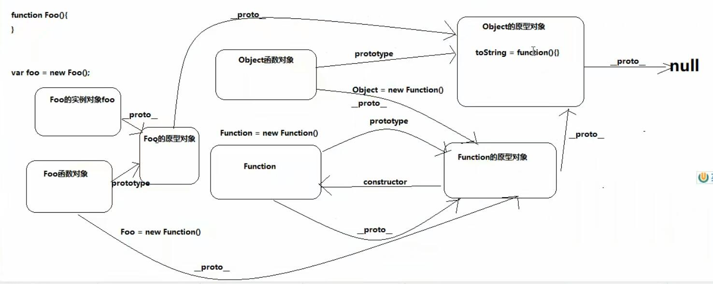

# 函数进阶

# 一、原型

## 1.原型对象（重点！）

1.每个函数都有一个prototype属性，该属性指向的显示原型对象

2.每一个实例对象身上都有一个__ proto __ 属性，该属性指向的是当前实例的隐式原型对象

3.构造函数的显示原型和当前构造函数的实例的隐式原型对象是同一个对象

4.原型对象本身就是一个普通的Object实例对象，并且初始化的时候是空的对象，后期添加的constructor属性，该属性指向当前的构造函数本身。

5.实例身上的 __ proto __ 为什么叫隐式原型？

当初设计的时候规定不允许操作 __ proto __ ，所以叫隐式原型

**注:** 程序员能直接操作显式原型, 但不能直接操作隐式原型(ES6之前)

6.作用：

- 虽然构造函数的方法很好用，但是存在浪费内存的问题。

- 构造函数通过原型对象分配的函数是所有实例对象所共享的。

- 一般情况下,我们的公共属性定义到构造函数里面, 公共的方法我们放到原型对象身上！！！

```js
//举例
function Person(name, age) {
    this.name = name;
    this.age = age;
    // this.showName = function () {
    //   console.log(this.name);
    // }
}

console.log(Person.prototype);
Person.prototype.showName = function () {
    console.log(this.name);
};

var person1 = new Person('kobe', 43);
var person2 = new Person('kobe2', 44);
var person3 = new Person('kobe3', 45);
console.log(person1.name);
person1.showName();
person2.showName();
person3.showName();
```

## 2.原型链（重点！）

1.查找对象的属性的时候先在自身找，如果自身没有沿着 __ proto __ 找原型对象

2.如果原型对象上还没有，继续沿着 __ proto __ ，直到找到Object的原型对象

3.如果还没有找到返回undefined

4.原型链: 沿着 __ proto __ 查找的这条链就是原型链

```js
//例1:
console.log(Object.prototype);
function Fn() {
    this.test1 = function () {
        console.log('test1()')
    }
}
Fn.prototype.test2 = function () {
    console.log('test2()')
};

var fn = new Fn();
fn.test1();
fn.test2();
console.log(Object.prototype);
console.log(fn.toString())
console.log(fn.test3)  //undefined
fn.test3()  // test3 is not a function
// 即undefined();

注: 对象.属性不会报错!

//例2:
function Foo() {}
var f1 = new Foo();
var f2 = new Foo();
var o1 = new Object();
var o2 = {};
console.log(Foo.toString());
```

### 图解原型链1 - 构造函数/原型/实体对象的关系


### 图解原型链2 - 终极原型链


### 手画终极原型链



1）所有函数都是new Function()出来的，包括自己（仅仅理论上为了支持原型链）。

2）所有对象都是new Object()出来的。

**注：**

- Function = new Function()

- Object = new Function()

3）这个2个关系式只是为了支持原型链出现的，但是并非真实存在的。

4）实际上 Function 和 Object 是 js引擎内置的。

## 3.原型链-属性问题

1.读取对象的属性值时: 会自动到原型链中查找

2.设置对象的属性值时: 不会查找原型链, 如果当前对象中没有此属性, 直接添加此属性并设置其值

3.方法一般定义在原型中, 属性一般通过构造函数定义在对象本身上

## 4.instanceof原理

1.instanceof是如何判断的?

* 表达式: A instanceof B
* 如果B函数的显式原型对象在A对象的原型链上, 返回true, 否则返回false

2.Function是通过new自己产生的实例

```js
//面试题
console.log(Object instanceof Function);   // true
console.log(Object instanceof Object);     // true
console.log(Function instanceof Object);   // true
console.log(Function instanceof Function); // true
function Foo() {}
console.log(Object instanceof Foo); // false
```

## 5.面试题

```js
//面试题1
var A = function() {
};
A.prototype.n = 1;
//已经实例化的对象不会受prototype改变的影响,因为__proto__指向没变
var b = new A(); // {n: 1}
A.prototype = {
    n: 2,
    m: 3
};
var c = new A();
console.log(b.n, b.m, c.n, c.m);  // 1 undefined 2 3


//面试题2
var F = function(){};  // 函数对象
Object.prototype.a = function(){
    console.log('a()')
};
Function.prototype.b = function(){
    console.log('b()')
};
var f = new F(); // 构造函数
// f就是一个普通的实例对象
f.a()  //a()   // f的隐式原型对象 == F的显示原型对象 === {constructor}
f.b()  //报错
F.a()  //a()   // 函数对象, 当把函数当做对象看待的时候，这个时候其构造函数应该是Function
F.b()  //b()
```


# 二、执行上下文

## 1.变量提升 & 函数提升

1.js引擎在js代码正式执行之前会做一些预解析的工作

2.找关键字： var， function

3.找到var以后将var后边的变量提前声明，但是不赋值，就是var a;

4.找到function以后定义对应的函数，也就是说函数在预解析的时候已经定义完毕

5.预解析:  全局预解析，局部预解析

6.**注：**

- 全局预解析在定义函数的时候不关心函数是否被使用
- 函数局部预解析的时候如果内部函数没有被使用就不会提前定义

**注：** 断点调试发现预解析。

```js
console.log(a);
console.log(b);
var a = 123;
fun();
function fun() {
    var a = 234;
    console.log('fun()');
}
fun2();
var fun2 = function(){}

//面试题
var a = 4
function fn () {
    console.log(a)  // undefined
    var a = 5
}
fn()
```

## 2.调试练习（浏览器控制台）

```js
console.log('程序开始执行');
console.log('程序继续执行');
console.log(a);
console.log(b);
var a = 123;
fun();
function fun() {
    var a = 234;
    console.log('fun()');
}
fun2();
var fun2 = function(){}
console.log('程序执行完毕');
```

## 3.执行上下文（底层知识）

1.理解： 

- 执行上下文抽象的概念，代表了代码执行的环境，包含： 执行环境，变量对象，this，作用域链

2. 流程：
- js引擎在js代码正式执行之前会先创建一个执行环境(开发商批的地，工程队施工的环境)
- 进入该环境以后创建一个变量对象(打地基)，该对象用于收集当前环境下的： 变量，函数，函数的参数，this
- 找关键字var ，function
- 确认this的指向
- 创建作用域链

3. 重点：
- 执行上下文是动态创建的
- 尤其是针对函数，每调用一次函数都会创建一次执行上下文

4.执行上下文分类

* 全局执行上下文
* 函数执行上下文

**注：** 断点调试发现执行上下文。

```js
console.log(a1)
console.log(a2)
console.log(a3)
// console.log(a4)
console.log(this) // window
var a1 = 3
var a2 = function () {
    console.log('a2()')
}
function a3() {
    console.log('a3()')
}
a4 = 4
a3();
```

## 4.执行上下文栈

用于保存执行上下文(变量对象)

1.在全局代码执行前, JS引擎就会创建一个栈来存储管理所有的执行上下文

2.在全局执行上下文(window)确定后, 将其添加到栈中(压栈)

3.在函数执行上下文创建后, 将其添加到栈中(压栈)

4.在当前函数执行完后,将栈顶的对象移除(出栈)

5.当所有的代码执行完后, 栈中只剩下window

```js
var a = 10;                  // 全局执行上下文
var bar = function (x) {
    var b = 5;
    foo(x + b);              // 函数执行上下文
}
var foo = function (y) {
    var c = 5;
    console.log(a + c + y);
}
bar(10);                     // 函数执行上下文

//面试题
console.log('global begin: '+ i);    // 全局执行上下文
var i = 1;
foo(1);                            // 函数执行上下文
function foo(i) {
    if (i == 4) {
        return;
    }
    console.log('foo() begin:' + i);
    foo(i + 1);                      // 函数执行上下文
    console.log('foo() end:' + i);
}
console.log('global end: ' + i);

1）依次输出什么? 
undefined 1 2 3 3 2 1 1
2）整个过程中产生了几个执行上下文? 
5个
```

## 5.面试题

```js
//测试题1: 先预处理函数, 后预处理变量, 如果已经存在就会被忽略
console.log(typeof a);  // function
var a;
function a() {}
//1.预解析时，函数优先级更好(通常说法)
//2.a开始undefined，后来里面放函数


//测试题2: 变量预处理, in操作符
if (!(b in window)) {
    var b = 1; //此处有预解析，没有块级作用域
}
console.log(b);  // undefined


//测试题3: 预处理, 顺序执行
//预解析结果 c = function(){}
var c = 1;
function c(c) {
    console.log(c);
    var c = 3;
}
c(2);  //报错, c is not function, c为1
```


# 三、作用域与作用域链（重点！！）

## 1.作用域

1.抽象的概念

2.用来决定代码执行的范围，变量所属的范围

3.它是静态的(相对于执行上下文对象)，作用域是代码定义的时候决定的

4.作用域作用:

- 隔离变量
- 规定其之后的作用域链是什么样的，体现： [[scopes]]: 上一级作用域链

5.作用域分类

* 全局作用域
* 函数作用域
* eval作用域

6.作用域与执行上下文的区别和联系

区别1：

* 全局作用域之外，每个函数都会创建自己的作用域，作用域在函数定义时就已经确定了，而不是在函数调用时。
* 全局执行上下文环境是在全局作用域确定之后, js代码马上执行之前创建
* 函数执行上下文环境是在调用函数时, 函数体代码执行之前创建

区别2：

* 作用域是静态的, 只要函数定义好了就一直存在, 且不会再变化
* 上下文环境是动态的, 调用函数时创建, 函数调用结束时上下文环境就会被释放

7.联系

* 上下文环境(对象)是从属于所在的作用域
* 全局上下文环境 ==> 全局作用域
* 函数上下文环境 ==> 对应的函数作用域

```js
var a = 10,
    b = 20;
function fn(x) { // 隐式变量
    var a = 100,
        c = 300;
    console.log('fn()', a, b, c, x);  // 100, 20, 300, 10
    function bar(x) {
        var a = 1000,
            d = 400;
        console.log('bar()', a, b, c, d, x);  // 1000, 20, 300, 400, 100 || 200
    }
    bar(100);
    bar(200);
}
fn(10);

/*
   问题:
   1. 有几个作用域?   3个
   2. 产生过几个上下文环境对象?   4个
*/
```

## 2.作用域链

1.**作用域链是一个数组结构**

2.该结构内保存的是一个个的变量对象, 即保存着当前作用域的变量对象及其上级作用域的变量对象，直到全局的变量对象

3.作用域链什么时候创建的：在js代码正式执行之前创建的

4.查找变量时就是沿着作用域链来查找的

5.作用域链如何产生

* 函数在定义的时候自动添加一个属性 ‘[[Scopes]]’, 该属性保存的是其上级作用域链
* 当函数执行的时候，进入执行上下文环境，将创建的变量对象添加到‘[[Scopes]]’数组的第一个位置，形成新的数组，该数组就是当前函数拥有的作用域链

6.查找一个变量的查找规则

* 先在当前作用域的变量对象中查找，如果有就使用
* 如果没有就会沿着作用域链的数组去上级作用域中的变量对象中查找
* 找到就返回对应的值，如果没有继续向上查找，直到找到最后一个变量对象(全局的变量对象)，如果还没有就会报错

**注：** 浏览器断点调试处显示作用域链与发现‘[[Scopes]]’属性

```js
var a = 2;
function fn1() {
    var b = 3;
    function fn2() {
        var c = 4;
        console.log(c);  //4
        console.log(b);  //3
        console.log(a);  //2
        console.log(d);  //报错
    }
    fn2();
}
fn1();


//详解
// 创建全局作用域 ---> 预解析工作 ---> 创建全局的执行上下文 ---> 执行上下文环境 ---> 全局变量对象{a: undefined, this: window， fun:function} ---> 作用域链[全局变量对象]
var a = 123;
var b = 'abc'
// 先定义---> 创建局部作用域---> 函数自身有一个[[scopes]]: 上一级作用域链(global)
function fun() {
    // 创建局部执行上下文 ---> 局部变量对象{a: undefined, fun2: function, this: window} ---> 创建作用域链[局部变量对象, Global]
    var a = 234;
    var c = 345;
    console.log(a);
    console.log(b);
    // fun2函数已经定义了 ---> 创建局部作用域(fun2)---> 函数自身有一个[[scopes]]: 上一级作用域链[fun的变量对象， Global]
    function fun2() {
        // 创建局部执行上下文 ---> 局部变量对象{this: window} ---> 创建作用域链: [fun2的局部变量对象，fun的变量对象， Global]
        console.log(c);
        console.log(d);
    }
    fun2();
}
fun();
```

## 3.面试题

```js
//1
//问题: 结果输出多少?
var x = 10;
function fn() {
    console.log(x);  //10
}
function show(f) {
    var x = 20;
    f();
}
show(fn);

//2
console.log(fn); // var fn;
var fn = function () { // fn = function
    console.log(fn);
}
fn();

//3
var obj = {
    fn2: function () {
        console.log(fn2); // 报错
    }
}
obj.fn2();
```


# 四、闭包（重难点！！！）

## 1.引入

```js
//需求: 点击某个按钮, 提示"点击的是第n个按钮"
<button>测试1</button>
<button>测试2</button>
<button>测试3</button>

var btns = document.getElementsByTagName('button');
//有问题-循环早已结束，始终i=3
for(var i = 0; i < btns.length; i++) {
    var btn = btns[i];
    btn.onclick = function () {
        alert('第' + (i + 1) + '个');
    }
}

//解决一: 保存下标
for(var i = 0; i < btns.length; i++) {
    var btn = btns[i];
    btn.index = i;
    btn.onclick = function () {
        alert('第' + (this.index + 1) + '个');
    }
}

//解决二: 利用闭包
for(var i=0,length=btns.length;i<length;i++) {
    (function (i) {
        var btn = btns[i];
        btn.onclick = function () {
            alert('第'+ i +'个');
        }
    })(i);
}
```

## 2.闭包形成的条件

- 函数嵌套
- 内部函数引用外部函数的局部变量
- 内部函数被使用

**注：** 函数变量提升的时候如果内部函数没有被使用，在预解析的过程中不会定义内部函数

## 3.闭包的理解

理解一: 闭包是嵌套的内部函数(绝大部分人)

理解二: 包含被引用变量(函数)的对象(极少数人)

理解三: (深入理解)：

- 闭包是一个存在内部函数的引用关系
- 该引用指向的是外部函数的局部变量对象(前提是内部函数使用了外部函数的局部变量)

```js
function fun() {
    var a = 123;
    function fun2() {  //函数预解析有性能优化，不调用是不会预解析
        console.log(a);
    }
    //直接调用，或者返回函数
    // fun2();
    return fun2;
}
var fun2 = fun();
fun2();
```

## 4.常见的闭包

1.将函数作为另一个函数的返回值 - **手写闭包**

2.将函数作为实参传递给另一个函数调用

```js
// 1. 将函数作为另一个函数的返回值 - 手写闭包（必须会）！
function fn1() {
    var a = 2;
    function fn2() {
        a++;
        console.log(a);
    }
    return fn2;
}
var f = fn1();  //由于f引用着内部的函数-->内部函数以及闭包都没有成为垃圾对象
// f.xxx = 外部函数的变量对象 = {a: 2}
f(); // 3   //间接操作了函数内部的局部变量{a: 2}
f(); // 4
f = fn1();
f(); // 3

// 2. 将函数作为实参传递给另一个函数调用
function showMsgDelay(msg, time) {
    setTimeout(function () {
        console.log(msg);
    }, time);
}
showMsgDelay('hello', 1000);
```

## 5.闭包的作用

1.延长外部函数变量对象的生命周期

2.使用闭包能够间接的从函数外部访问函数内部的私有变量

**注意:** 浏览器为了性能，后期将外部函数中不被内部函数使用的变量清除了。

问题：

1）函数执行完后, 函数内部声明的局部变量是否还存在?

存在，因为闭包存在

2）在函数外部能直接访问函数内部的局部变量吗?

不能

## 6.闭包的生命周期

1. 产生: 在嵌套内部函数定义执行完时就产生了(不是在调用) - 跟作用域有关
2. 死亡: 在嵌套的内部函数成为垃圾对象时

```js
function fun1() {
    //此处闭包已经产生
    var a = 3;
    function fun2() {
        a++;
        console.log(a);
    }
    return fun2;
}
var f = fun1();
f();
f();
f = null //此时闭包对象死亡,注意及时清除闭包，让f变为null
```

## 7.闭包的优缺点

- 优点： 延长外部函数变量对象的生命周期

- 缺点： 延长外部函数变量对象的生命周期(占内存，如果不及时清除容易造成内存溢出，泄漏)

## 8.使用闭包的注意事项：

- 及时清除闭包
- 让内部的函数成为垃圾对象 ---> 内部函数身上没有指针指向

## 9.闭包的应用 - 模块化 - 自定义JS模块

1.定义JS模块
  * 具有特定功能的js文件
  * 将所有的数据和功能都封装在一个函数内部(私有的)
  * 只向外暴露一个包含n个方法的对象 或 函数
  * 模块的使用者, 只需要通过模块暴露的对象调用方法来实现对应的功能

```js
//方式1-使用闭包，返回对象
<script type="text/javascript" src="coolModule.js"></script>
var myModuleObj = myModule();
console.log(myModuleObj);
// 函数内部的数据(变量，方法)是私有的
myModuleObj.doSomething();
console.log(myModuleObj.doOtherthing());

//coolModule.js文件
function myModule() { // Module模块
    var msg = 'mymodule1 msg';
    var num = 123;
    function doSomething() {
        console.log(msg);
    }
    function doOtherthing() {
        return msg;
    }
    return {doSomething: doSomething, doOtherthing: doOtherthing};
}


//方式2-使用匿名函数自调用，并在window对象上挂载对象来暴露方法
<script type="text/javascript" src="coolModule2.js"></script>
console.log(window);
myModuleObj2.doSomething();
console.log(myModuleObj2.doOtherthing());

//coolModule2.js文件
(function myModule(w) {// Module模块
    var msg = 'mymodule1 msg';
    var num = 123;
    function doSomething() {
        console.log(msg);
    }
    function doOtherthing() {
        return msg;
    }
    w.myModuleObj2 = {
        doSomething: doSomething,
        doOtherthing: doOtherthing
    };
})(window);
```

## 10.面试题

```js
//1-1
var name = "The Window";
var object = {
    name: "My Object",
    getNameFunc: function () {
        return function () {
            return this.name;
        };
    }
};
//函数自调用this永远指向window
console.log(object.getNameFunc()());  //The Window

//1-2
var name2 = "The Window";
var object2 = {
    name2: "My Object",
    getNameFunc: function () {
        var that = this;  // 缓存this
        return function () {
            return that.name2;
        };
    }
};
console.log(object2.getNameFunc()()); //My Object


//2.大厂最坑闭包题目-滴滴
function fun(n, o) {
  console.log(o);
  return {
    fun: function (m) {  // 满足产生闭包的条件， 产生了一个闭包引用 ---> 外部函数fun的变量对象 === {n: 0, o:undefined }
      return fun(m, n);  // m = 1, n = 0
    }
  }
}

var a = fun(0);  // a = {fun: function(){}}
a.fun(1);  // m = 1 n = 0;
a.fun(2);
a.fun(3);
//输出：undefined,0,0,0

var c = fun(0).fun(1);  // {n: 1, o: 0}
c.fun(2);  // 1
c.fun(3);
//输出：undefined,0,1,1

var b = fun(0).fun(1).fun(2).fun(3).fun(30).fun(55);
//输出：undefined,0,1,2,3,30

//总结：看内部函数的引用的变量对象（闭包）


//3-综合题
function Foo() {
    getName = function () { alert (1); };
    return this;
}
Foo.getName = function () { alert (2);};
Foo.prototype.getName = function () { alert (3);};
var getName = function () { alert (4);};
function getName() { alert (5);}

//请写出以下输出结果
Foo.getName();  // 2
getName();  // 4
Foo().getName();  // 1
getName();  // 1
new Foo.getName();  // 2  new先找最近的()变成可执行语句
new Foo().getName();  // 3  new Foo()先执行,再.getName()
new new Foo().getName();  // 3  先执行new Foo()再.getName,最后结合new()


//扩展
console.log(1, console.log(2, console.log(3)));
//输出：3 2 undefined 1 undefined

//注:
console.log(123);  //函数返回结果为undefined
alert(123);  //函数返回结果为undefined
console.log(console.log());  //undefined
console.log(alert(123));  //undefined
```


# 五、扩展（了解！）

## 1.词法作用域 与 动态作用域

1.作用域分类：

  1）静态作用域(词法作用域):  JavaScript

  2）动态作用域:  bash

2.特征对比：

  1）词法作用域规定作用域在代码定义的时候就决定了，而不是看调用的时候

  2）动态作用域是在代码执行的时候决定的

## 2.词法作用域面试题

```js
// 考点： 词法作用域规则 / 闭包
// 重点： 词法作用域中的作用域在代码定义的时候决定而不是调用的时候决定
// 面试题1
var scope1 = "global scope";
function checkScope1() {
    var scope1 = "local scope";
    function fn() {
        return scope1;
    }
    return fn();
}
console.log(checkScope1());  //"local scope"


// 面试题2
var scope2 = "global scope";
function checkScope2() {
    var scope2 = "local scope";
    function fn() {
        return scope2;
    }
    return fn;
}
console.log(checkScope2()());  //"local scope"


//扩展
var a = 10;
function fun() {   // [[scopes]]: [Global]
    console.log(a);  //10
}
function fun2() {  // [[scopes]]: [Global]
    var a = 20;
    fun();
}
fun2();
```


