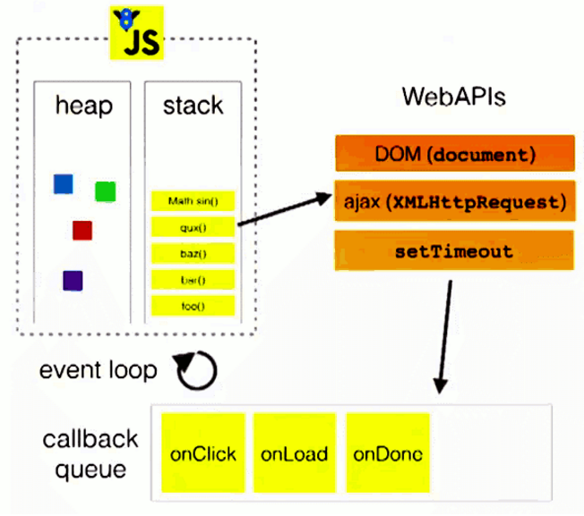

# 线程与事件循环机制

## 1.进程与线程（了解！）

1.进程： 程序的一次执行, 是系统进行资源分配的基本单位, 它占有一片独有的内存空间

2.线程： CPU的基本调度单位, 是程序执行的一个完整流程

3.进程与线程

* 一个进程中一般至少有一个运行的线程: 主线程
* 一个进程中也可以同时运行多个线程, 我们会说程序是多线程运行的
* 一个进程内的数据可以供其中的多个线程直接共享
* 多个进程之间的数据是不能直接共享的

4.浏览器运行是单进程还是多进程?

* 有的是单进程
  * firefox老版
  * 老版IE
* 有的是多进程
  * chrome
  * 新版IE

5.如何查看浏览器是否是多进程运行的呢?

* 任务管理器 ==> 进程

6.浏览器运行是单线程还是多线程?

* 都是多线程运行的

## 2.浏览器内核（了解！）

1. 什么是浏览器内核?
* 支持浏览器运行的最核心的程序

2. 不同的浏览器可能不太一样
* Chrome, Safari: webkit
* firefox: Gecko
* IE: Trident
* 360, 搜狗等国内浏览器: Trident + webkit

3. 内核由很多模块组成
* html,css文档解析模块 : 负责页面文本的解析
* dom/css模块: 负责dom/css在内存中的相关处理
* 布局和渲染模块: 负责页面的布局和效果的绘制
* JS引擎: 解析和执行 javascript 来实现网页的动态效果。
* 定时器模块: 负责定时器的管理
* 网络请求模块: 负责服务器请求(常规/Ajax)
* 事件响应模块: 负责事件的管理

## 3.JS是单线程的

JS是单线程的, 也就是说，同一个时间只能做一件事。

1.为什么js要用单线程模式, 而不用多线程模式?

* JavaScript的单线程，与它的用途有关。
* 作为浏览器脚本语言，JavaScript的主要用途是与用户互动，以及操作DOM。
* 这决定了它只能是单线程，否则会带来很复杂的同步问题。比如，假定JavaScript同时有两个线程，一个线程在某个DOM节点上添加内容，另一个线程删除了这个节点，这时浏览器应该以哪个线程为准？

2.js代码分两种: 同步任务 || 异步任务

- 同步任务： 1. 阻塞的 2. 同步是没有回调的
- 异步任务： 1. 非阻塞 2. 异步有回调(用来通知当前异步任务执行的结果)

3.如何证明js执行是单线程的?

- 使用setTimeout和alert

```js
console.log('程序开始执行');
setTimeout(function () {
    console.log('回调');
}, 2000);
//证明js是单线程的，可以使用alert
alert('---');
console.log('-----------');
console.log('程序执行结束');
```

## 4.JS事件循环(轮询)机制（重点！！！）

事件轮询机制：

1.js任务都会在js的主线程执行

2.当开启一个异步任务的时候会交给对应的管理模块去管理

3.主线程继续执行后续的任务

4.管理模块接管的对应的回调，它会在恰当的时机将对应的回调放入callback queue中

5.当主线程上的所有同步任务执行完毕会通过‘轮询’的方式询问callback queue是否有可执行的回调

6.假如没有会反复询问

7.假如有可执行的回调将对应的回调钩到主线程执行

**注：** 回调函数也叫钩子函数!

```js
function fn1() {
    console.log('fn1()')
}
fn1();

document.getElementById('btn').onclick = function () {
    console.log('处理点击事件')
};

setTimeout(function () {
    console.log('到点了')
}, 2000);

function fn2() {
    console.log('fn2()')
}
fn2()

执行结果: 
fn1()
fn2()
onclick与定时器谁先触发放入回调队列，就先执行谁。
```

## 图解：



## 4.定时器问题

1.定时器真的是定时执行的吗?

- 不一定，一般情况是，特例: 定时器任务的后边有运算量大的代码段时，会延迟很久(即定时器不准时)。因为JS是单线程的。

**注：**

- 不要在定时器任务之后放置运算量大的代码段。
- 定时器设置后就开始计时了。(可用alert验证!)

```js
console.log('程序开始执行');
var time = Date.now();
setTimeout(function () {
    console.log('定时器花费的时间： ', Date.now() - time);
}, 2000);
//用alert验证定时器设置后就开始计时了
alert('---');
//验证定时器任务的后边有运算量大的代码段时，会延迟很久(即定时器不准时)。
for (var i = 0; i < 1000000; i++) {
    console.log(i);
}
```

## 5.Web Workers（了解！）

1.H5规范提供了js分线程的实现, 取名为: Web Workers

2.相关API
* Worker: 构造函数, 加载分线程执行的js文件
* Worker.prototype.onmessage: 用于接收另一个线程的回调函数
* Worker.prototype.postMessage: 向另一个线程发送消息

3.不足

* worker内代码不能操作DOM(更新UI)
* 不能跨域加载JS
* 不是每个浏览器都支持这个新特性

```js
//  js主线程
var worker = new Worker('./work.js');
// 监听消息： 接收消息
worker.onmessage = function (msg) {// 当接收到分线程发送过来的消息自动调用
    console.log('分线程发送过来的数据： ', msg.data);
};
// 发送消息
worker.postMessage('Nba');

//work.js文件
// 模拟js分线程
// 分线程直接写onmessage即可，不用new Worker()来实例化
onmessage = function (msg) {
    console.log('主线程发送过来的数据：', msg.data);
    var result = msg.data.toLowerCase();
    // 将结果发送主线程
    postMessage(result);
};
```

## 6.Web Workers应用-使用分线程计算斐波那契 (fibonacci) 数列（了解！）

```js
//  js主线程
var worker = new Worker('./work2.js');
// 监听消息： 接收消息
worker.onmessage = function (msg) {// 当接收到分线程发送过来的消息自动调用
    console.log('斐波那契数列计算结果： ', msg.data);
};
// 发送消息
worker.postMessage(8);


//work2.js文件
// 模拟js分线程
// 分线程直接写onmessage即可，不用new Worker()来实例化
onmessage = function (msg) {
    console.log('要计算的斐波那契数列：', msg.data);

    function fibonacci(n) {
        return n >= 3 ? fibonacci(n - 1) + fibonacci(n - 2) : 1;
    }
    var result = fibonacci(msg.data);
    // 将结果发送主线程
    postMessage(result);
};
```


