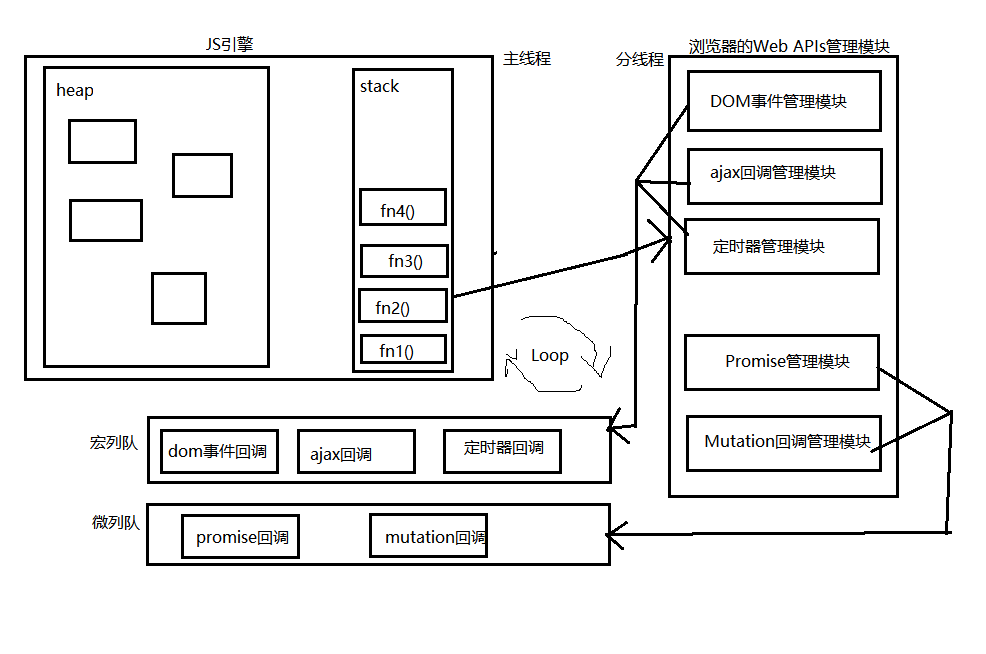

# Promise入门到自定义

## 1.前置知识

### 1.1 函数对象与实例对象

1.函数对象：将函数作为对象使用时, 简称为函数对象

2.实例对象：new 函数产生的对象, 简称为对象

**实例：**

```js
function Fn() {  // Fn是函数
}
const fn = new Fn()  // Fn是构造函数  new返回的是实例对象
console.log(Fn.prototype)  // Fn是函数对象
console.log(Fn.call({}))   // Fn是函数对象

$('#test')  // $是函数
$.ajax()   // $是函数对象
```

**总结**

点的左边：对象
()的左边：函数

**扩展**

```
a()[0]()()
a函数返回的数组中第一个元素是函数，且调用了它，返回的还是函数，再调用它
```

### 1.2 回调函数的分类

1) 同步回调:

1.理解: 立即执行, 完全执行完了才结束, 不会放入回调队列中

2.例子: 数组遍历相关的回调函数 / Promise的excutor函数

2). 异步回调:

1.理解: 不会立即执行, 会放入回调队列中将来执行

2.例子: 定时器回调 / ajax回调 / Promise的成功|失败的回调

**实例：**

```javascript
const arr = [1, 2, 3]
arr.forEach(item => {  // 同步执行的回调函数, 不会放入回调队列, 只有当回调函数都执行完后forEach()才执行结束
  console.log('forEach callback()', item)
})
console.log('forEach()之后')

setTimeout(() => {  // 异步执行的回调函数, 会放入回调队列中后面才执行, 在回调执行前setTimeout()执行结束
  console.log('setTimeout callback()')
}, 0)
console.log('setTimeout()之后')
```

**附：**

- 判断回调函数的三大条件：

  1.自己定义的

  2.无手动调用

  3.最终却执行了

### 1.3 JS中的Error

1.错误的类型

Error: 所有错误的父类型

ReferenceError: 引用的变量不存在

TypeError: 数据类型不正确的错误

RangeError: 数据值不在其所允许的范围内

SyntaxError: 语法错误

2.错误处理

捕获错误: try ... catch

抛出错误: throw error

3.错误对象

message属性: 错误相关信息

stack属性: 函数调用栈记录信息

**实例：**

1. 常见的内置error

```javascript
// ReferenceError: 引用的变量不存在
console.log(a) // ReferenceError: a is not defined
console.log('出错之后')

// TypeError: 数据类型不正确的错误
let b = null
console.log(b.xxx) // TypeError: Cannot read property 'xxx' of null
let b = {}
console.log(b.xxx) // undefined
b.xxx() // TypeError: b.xxx is not a function
b()

// RangeError: 数据值不在其所允许的范围内
function fn() { // 无限的递归
  fn()
} // RangeError: Maximum call stack size exceeded
fn()

// SyntaxError: 语法错误
const c = """" //  SyntaxError: Unexpected string

let d = 3
console.log(d.xxx)  // new Number(d).xxx  输出undefined
```

2.错误的处理

```js
/* 捕获error */
try {
  const e = {}
  e()
} catch (error) {
  console.log(error.message)
  console.log(error.stack)
}


/* 抛出error */
function doThing() {  // 当前时间如果为奇数就能正常干活, 否则不能干
  const time = Date.now()
  if (time % 2 == 1) {
    console.log('当前时间为奇数, 可以正常工作....' + time)
  } else {  // 不能干活, 得告诉调用者
    throw new Error('当前时间为偶数, 干不了 ' + time)  // 抛出错误
  }
}

try {  // 捕获错误
  doThing()
} catch (error) {
  alert(error.message)
}
```

## 2.Promise的理解和使用

### 2.1 Promise是什么（重点！）

1.抽象表达:

1) Promise是一门新的技术(ES6规范)

2) Promise是JS中进行异步编程的新解决方案(旧的是谁? 纯回调函数)

2.具体表达:

1) 从语法上来说: Promise是一个构造函数

2) 从功能上来说: Promise对象用来封装一个异步操作并可以获取其成功/失败的结果值

### 2.2. 为什么要用Promise

1.指定回调函数的方式更加灵活:

旧的: 必须在启动异步任务前指定

promise: 启动异步任务 => 返回promie对象 => 给promise对象绑定回调函数(甚至可以在异步任务结束后指定)，

即可以在启动异步任务后甚至在异步任务执行结束后指定回调函数

2.支持链式调用，可以解决回调地狱问题

1）什么是回调地狱?  回调函数嵌套调用，外部回调函数异步执行的结果是嵌套的回调函数执行的条件

2）回调地狱的缺点?  不便于阅读 / 不便于异常处理

3）解决方案?  promise链式调用

4）终极解决方案?  async / await

**实例：**

```javascript
// 成功的回调函数
function successCallback(result) {
    console.log("声音文件创建成功: " + result);
}
// 失败的回调函数
function failureCallback(error) {
    console.log("声音文件创建失败: " + error);
}

/* 1.1 使用纯回调函数封装异步操作 */
createAudioFileAsync(audioSettings, successCallback, failureCallback)  // 必须在异步任务启动指定回调函数

/* 1.2. 使用Promise封装异步操作 */
const promise = createAudioFileAsync(audioSettings);
setTimeout(() => {  // 即使在异步任务完成后指定回调也可以得到结果值
    promise.then(successCallback, failureCallback);
}, 3000);


/* 2.1. 回调地狱 */
doSomething(function(result) {
    // 第一个异步任务成功启动第二个异步任务
    doSomethingElse(result, function(newResult) {
        // 第二个异步任务成功启动第三个异步任务
        doThirdThing(newResult, function(finalResult) {
            // 第三个异步任务成功了
            console.log('Got the final result: ' + finalResult)
        }, failureCallback)
    }, failureCallback)
}, failureCallback)
    
/* 2.2. 使用promise的then()链式调用解决回调地狱 */
doSomething()
    .then(function(result) {
    	return doSomethingElse(result)
	})
    .then(function(newResult) {
    	return doThirdThing(newResult)
	})
    .then(function(finalResult) {
    	console.log('Got the final result: ' + finalResult)
	})
    .catch(failureCallback)
    
/* 2.3. async/await: 回调地狱的终极解决方案 */
async function request() {
    try {
        const result = await doSomething()
        const newResult = await doSomethingElse(result)
        const finalResult = await doThirdThing(newResult)
        console.log('Got the final result: ' + finalResult)
    } catch (error) {
        failureCallback(error)
    }
}
```

### 2.3 Promise的基本使用和API

#### 1.基本语法

1）Promise(excutor)构造函数

2）Promise.prototype.then方法

#### 2.基本编码流程

1) 创建 promise 对象( pending 状态), 指定执行器函数

2) 在执行器函数中启动异步任务

3) 根据结果做不同处理：

​	1. 如果成功了, 调用 resolve(), 指定成功的 value, 变为 resolved 状态

​	2. 如果失败了, 调用 reject(), 指定失败的 reason, 变为 rejected 状态

4) 给 promise 指定成功或失败的回调函数来获取成功的 value 或失败的 reason

#### 3.promise 对象的状态

1) 三个状态:

- pending: 未确定的, 起始时的状态

- resolved: 解决/成功的, 调用 resolve()后的状态

- rejected: 拒绝/失败的, 调用 reject()后的状态

2) 2种状态改变

- pending ==> resolved

- pending ==> rejected

3) **状态只能改变一次！**

**图解：**


**实例：**

```javascript
// 1) 创建promise对象(pending状态), 指定执行器函数
const p = new Promise((resolve, reject) => { // 同步执行的执行器函数
    // 2) 在执行器函数中启动异步任务
    setTimeout(() => {
        // 3) 根据结果做不同处理
        const time = Date.now()
        // 3.1) 如果成功了, 调用resolve(), 指定成功的value, 变为resolved状态
        if (time % 2 == 1) {
            resolve('成功的数据 ' + time)
            console.log('resolve()之后')
        } else { // 3.2) 如果失败了, 调用reject(), 指定失败的reason, 变为rejected状态
            reject('失败的数据 ' + time )
        }
    }, 1000);
})

// 4) 给promise指定成功或失败的回调函数来获取成功的value或失败的reason
p.then(
    value => {
        console.log('成功', value)
    },
    reason => {
        console.log('失败', reason)
    }
)
```

##### 案例：使用 promise + xhr 封装 ajax 请求函数

```javascript
function promiseAjax(url) {
    return new Promise((resolve, reject) => {
        // 使用xhr发异步ajax请求
        const xhr = new XMLHttpRequest()
        xhr.open('GET', url)
        xhr.send()
        xhr.onreadystatechange = () => {
            // 如果请求未完成, 直接结束
            if (xhr.readyState !== 4) return
            // 如果成功了, 调用resolve(), 并指定成功的value
            if (xhr.status >= 200 && xhr.status < 300) {
                resolve(JSON.parse(xhr.response))
            } else {
                // 如果失败了, 调用reject(), 并指定失败的reason
                reject(new Error('request error status: ' + xhr.status))
            }
        }
    })
}

promiseAjax('https://api.apiopen.top/getJoke?page=1&count=2&type=video')
// promiseAjax('https://api.apiopen.top2/getJoke?page=1&count=2&type=video')
    .then(
        data => {
            console.log('请求成功', data)
        },
        error => {
            alert(error.message)
        }
    )
```

#### 4.API

1.Promise构造函数: Promise (excutor) {}

- excutor函数: 同步执行 (resolve, reject) => {}

- resolve函数: 内部定义成功时我们调用的函数 value => {}

- reject函数: 内部定义失败时我们调用的函数 reason => {}

说明: excutor会在Promise内部立即同步回调,异步操作在执行器中执行

**以下为原型对象的方法：**

2.Promise.prototype.then方法: (onResolved, onRejected) => {}

- onResolved函数: 成功的回调函数 (value) => {}

- onRejected函数: 失败的回调函数 (reason) => {}

说明: 指定用于得到成功value的成功回调和用于得到失败reason的失败回调

此方法返回一个新的promise对象

注：onResolved没传，默认value => value

3.Promise.prototype.catch方法: (onRejected) => {}

- onRejected函数: 失败的回调函数 (reason) => {}

说明: then()的语法糖, 相当于: then(undefined, onRejected)

**以下为函数对象的方法：**

4.Promise.resolve方法: (value) => {}

- value: 成功的数据或promise对象

说明: 返回一个成功/失败的promise对象

5.Promise.reject方法: (reason) => {}

- reason: 失败的原因

说明: 返回一个失败的promise对象

6.Promise.all方法: (promises) => {}

promises: 包含n个promise的数组

说明: 返回一个新的promise, 只有所有的promise都成功才成功, 只要有一个失败了就直接失败

7.Promise.race方法: (promises) => {}

promises: 包含n个promise的数组

说明: 返回一个新的promise, 第一个完成的promise的结果状态就是最终的结果状态

**实例：**

```javascript
new Promise((resolve, reject) => {
    setTimeout(() => {
        // resolve(1)
        reject(2)
    }, 1000);
}).then(value => {
    console.log('onResolved()', value)
}/* , reason => {
    console.log('onRejected()', reason)
} */).catch(reason => {
    console.log('onRejected2()', reason)
})

/* 创建一个value值为3的promise对象 */
const p1 = new Promise((resolve, reject) => {
    setTimeout(() => {
        resolve(3)
    }, 1000);
})
const p2 = Promise.resolve(5)
const p3 = Promise.reject(4)
p1.then(value => console.log('p1 value', value))
p2.then(value => console.log('p2 value', value))
p3.catch(reason => console.log('p3 value', reason))

const p4 = Promise.all([p1, p2, p3])
const p4 = Promise.all([p1, p2])
p4.then(
    values => console.log('p4 all onResolved()', values), // values数组中数据的顺序与promise数组顺序一致
    reason => console.log('p4 all onRejected()', reason),
)

const p5 = Promise.race([p1, p3, p2])
p5.then(
    value => console.log('p5 race onResolved()', value),
    reason => console.log('p5 race onRejected()', reason),
)
```

### 2.4 Promise的几个重要问题

#### 1.如何改变 promise 的状态?

(1) resolve(value): 如果当前是 pendding 就会变为 resolved

(2) reject(reason): 如果当前是 pendding 就会变为 rejected

(3) 抛出异常: 如果当前是 pendding 就会变为 rejected

#### 2.一个 promise 指定多个成功/失败回调函数, 都会调用吗?

当 promise 改变为对应状态时都会调用

**实例：**

```javascript
const p = new Promise((resolve, reject) => {
  resolve(1) // pending ==> resolved
  // reject(2) // pending ==> rejected
  // throw 3 // 执行器中抛出异常  pending ==> rejected
  // resolve(1) // pending ==> resolved
  // reject(2) // 没有任何作用，因为promise状态只能改变一次！
})

p.then(
  value => console.log('onResolved()', value),
  reason => console.log('onRejected()', reason)
)
p.then(
  value => console.log('onResolved2()', value),
  reason => console.log('onRejected2()', reason)
)
```

#### 3.改变 promise 状态和指定回调函数谁先谁后?

(1) 都有可能, 正常情况下是先指定回调再改变状态, 但也可以先改状态再指定回调

(2) 如何先改状态再指定回调?

① 在执行器中直接调用 resolve() / reject()

② 延迟更长时间才调用 then()

(3) 什么时候才能得到数据?

① 如果先指定的回调, 那当状态发生改变时, 回调函数就会调用, 得到数据

② 如果先改变的状态, 那当指定回调时, 回调函数就会调用, 得到数据

**实例：**

```javascript
/* 一、常规: 先指定回调函数, 后改变状态 */
//excutor执行器中启动异步任务
new Promise((resolve, reject) => { // 同步回调
  console.log('excutor()')
  // 启动异步任务
  setTimeout(() => {
    resolve(1)  // pending ==> resolved  value为1
    console.log('resolve()改变状态后')
    // reject()
  }, 1000)
}).then( // 先指定回调函数, 内部选将回调函数保存起来
  value => { // 成功/失败的回调函数是异步执行的, 需要放入队列将来执行
    console.log('onResolved()', value)
  }
)
console.log('new Promise()之后')

/* 二、先改变状态, 后指定回调函数 */
//1.在excutor执行器中直接调用 resolve() / reject()
new Promise((resolve, reject) => { // 同步回调
  console.log('excutor()')
  resolve(1)  // pending ==> resolved  value为1  此处先改了状态！
  console.log('resolve()改变状态后')
}).then( // 后指定的回调
  value => {
    console.log('onResolved()', value)
  }
)
console.log('new Promise()之后')

//2.延迟更长时间才调用 then()
const p = new Promise((resolve, reject) => { // 同步回调
  console.log('excutor()')
  // 启动异步任务
  setTimeout(() => {
    resolve(1)  // pending ==> resolved  value为1
    console.log('resolve()改变状态后')
    // reject()
  }, 1000)
})

setTimeout(() => {
  p.then( // 后指定回调函数
    value => { // 成功/失败的回调函数是异步执行的, 需要放入队列将来执行
      console.log('onResolved()', value)
    }
  )
}, 2000);
console.log('new Promise()之后')
```

#### 4.promise.then()返回的新promise的结果状态由什么决定?（重点！）

(1) 简单表达: 由 then() 指定的回调函数执行的结果决定

(2) 详细表达:

① 如果抛出异常, 新 promise 变为 rejected, reason 为抛出的异常

② 如果返回的是非 promise 的任意值, 新 promise 变为 resolved, value 为返回的值

③ 如果返回的是另一个新 promise, 此 promise 的结果就会成为新 promise 的结果

**实例：**

```javascript
new Promise((resolve, reject) => {
  // resolve(1)
  reject(2)
}).then(
  value => {
    console.log('onResolved1()', value)
    // throw 4
    // return 3
    // return Promise.resolve(5)
    return Promise.reject(5)
  },
  reason => console.log('onRejected1()', reason),
).then(
  value => console.log('onResolved2()', value),
  reason => console.log('onRejected2()', reason),
)
```

#### 5.promise如何串连多个操作任务?

(1) promise 的 then() 返回一个新的 promise, 可以看成 then() 的链式调用

(2) 通过 then 的链式调用串连多个同步/异步任务

**实例：**

```javascript
new Promise((resolve, reject) => {
  // 启动任务1(异步)
  console.log('启动任务1(异步)')
  setTimeout(() => {
    resolve(1)
  }, 1000)
}).then(value => {
  console.log('任务1成功的value为', value)
  // 执行任务2(同步)
  console.log('执行任务2(同步)')
  return 2
}).then(value => {
  console.log('任务2成功的value为', value)
  // 执行任务3(异步)
  return new Promise((resolve, reject) => {
    console.log('启动任务3(异步)')
    setTimeout(() => {
      resolve(3)
    }, 1000);
  })
}).then(value => {
  console.log('任务3成功的value为: ', value)
})
```

#### 6.promise错误穿透（重点！）

(1) 当使用promise的then链式调用时, 可以在最后指定失败的回调,

(2) 前面任何操作出了错误, 都会传到最后失败的回调中处理

#### 7.中断promise链

(1) 当使用promise的then链式调用时, 在中间中断, 不再调用后面的回调函数

(2) 办法: 在回调函数中返回一个pendding状态的promise对象。

**实例：**

```javascript
new Promise((resolve, reject) => {
  // resolve(1)
  reject(2)
}).then(
  value => console.log('onResolved1()', value),
  // 未写默认加上下面这句：抛出异常
  // reason => {throw reason}
).then(
  value => console.log('onResolved2()', value),
  // 或 reason => Promise.reject(reason)
).then(
  value => console.log('onResolved3()', value),
  // reason => {throw reason}
).catch(
  // 默认加上成功的回调 value => value
  reason => {
    console.log('onRejected1()', reason)
    // throw reason
    return new Promise(() => {}) // 返回一个pending状态的promise ==> 中断promise链
}).then(
  value => console.log('onResolved4()', value),
  reason => console.log('onRejected2()', reason)
)

// 扩展：返回一个对象写法  () => ({a:2})
// 箭头1行，函数体不加括号，且只有一条语句, 则函数体默认带return的作用
```

## 3. 自定义Promise - 底层实现

1) 定义整体结构

2) Promise构造函数的实现

3) promise.then() / catch()的实现

4) Promise.resolve() / reject()的实现

5) Promise.all / race()的实现

6) Promise.resolveDelay() / rejectDelay()的实现 --- 自定义新增方法（非官方）

### ES5版实现：

```javascript
/* 
	自定义Promise模块
*/
(function (window) {

  const PENDING = 'pending' // 初始未确定的状态
  const RESOLVED = 'resolved' // 成功的状态
  const REJECTED = 'rejected' // 失败的状态

  /* 
  Promise构造函数
  */
  function Promise(excutor) {
    const self = this // Promise的实例对象
    self.status = PENDING // 状态属性, 初始值为pending, 代表初始未确定的状态
    self.data = undefined // 用来存储结果数据的属性, 初始值为undefined
    self.callbacks = [] // {onResolved(){}, onRejected(){}}

    /*
    将promise的状态改为成功, 指定成功的value
    */
    function resolve(value) {
      // 如果当前不是pending, 直接结束
      if (self.status !== PENDING) return

      self.status = RESOLVED // 将状态改为成功
      self.data = value // 保存成功的value

      // 异步调用所有缓存的待执行成功的回调函数
      if (self.callbacks.length > 0) {
        // 启动一个延迟时间为0的定时器, 在定时器的回调中执行所有成功的回调
        setTimeout(() => {
          self.callbacks.forEach(cbsObj => {
            cbsObj.onResolved(value)
          })
        })
      }
    }

    /* 
    将promise的状态改为失败, 指定失败的reason
    */
    function reject(reason) {
      // 如果当前不是pending, 直接结束
      if (self.status !== PENDING) return

      self.status = REJECTED // 将状态改为失败
      self.data = reason // 保存reason数据

      // 异步调用所有缓存的待执行失败的回调函数
      if (self.callbacks.length > 0) {
        // 启动一个延迟时间为0的定时器, 在定时器的回调中执行所有失败的回调
        setTimeout(() => {
          self.callbacks.forEach(cbsObj => {
            cbsObj.onRejected(reason)
          })
        })
      }
    }

    // 调用excutor来启动异步任务
    try {
      excutor(resolve, reject)
    } catch (error) { // 执行器执行出错, 当前promise变为失败
      console.log('-----')
      reject(error)
    }

  }

  /* 
  用来指定成功/失败回调函数的方法
      1). 如果当前promise是resolved, 异步执行成功的回调函数onResolved
      2). 如果当前promise是rejected, 异步执行成功的回调函数onRejected
      3). 如果当前promise是pending, 保存回调函数
  返回一个新的promise对象
      它的结果状态由onResolved或者onRejected执行的结果决定
      2.1). 抛出error ==> 变为rejected, 结果值为error
      2.2). 返回值不是promise   ==> 变为resolved, 结果值为返回值
      2.3). 返回值是promise    ===> 由这个promise的决定新的promise的结果(成功/失败)
  */
  Promise.prototype.then = function (onResolved, onRejected) {
    const self = this

    onResolved = typeof onResolved === 'function' ? onResolved : value => value // 将value向下传递
    onRejected = typeof onRejected === 'function' ? onRejected : reason => {throw reason} // 将reason向下传递

    return new Promise((resolve, reject) => { // 什么时候改变它的状态

      /* 
      1. 调用指定的回调函数
      2. 根据回调执行结果来更新返回promise的状态
      */
      function handle(callback) {
        try {
          const result = callback(self.data)
          if (!(result instanceof Promise)) { //  2.2). 返回值不是promise   ==> 变为resolved, 结果值为返回值
            resolve(result)
          } else { // 2.3). 返回值是promise    ===> 由这个promise的决定新的promise的结果(成功/失败)
            result.then(
              value => resolve(value),
              reason => reject(reason)
            )
            // 简写：result.then(resolve, reject)
          }
        } catch (error) { // 2.1). 抛出error ==> 变为rejected, 结果值为error
          reject(error)
        }
      }

      if (self.status === RESOLVED) {
        setTimeout(() => {
          handle(onResolved)
        })
      } else if (self.status === REJECTED) {
        setTimeout(() => {
          handle(onRejected)
        })
      } else { // PENDING
        self.callbacks.push({
          onResolved(value) { // 对象方法简写 {text{}} 相当于 {text:text{}} 对象属性简写 {a} 相当于 {a:a}
            handle(onResolved)
          },
          onRejected(reason) {
            handle(onRejected)
          }
        })
      }
    })
  }


  /* 
  用来指定失败回调函数的方法
  catch是then的语法糖
  */
  Promise.prototype.catch = function (onRejected) {
    return this.then(undefined, onRejected)
  }

  /* 
  用来返回一个指定value的成功的promise
  value可能是一个一般的值, 也可能是promise对象
  */
  Promise.resolve = function (value) {
    return new Promise((resolve, reject) => {
      // 如果value是一个promise, 最终返回的promise的结果由value决定
      if (value instanceof Promise) {
        value.then(resolve, reject)
      } else { // value不是promise, 返回的是成功的promise, 成功的值就是value
        resolve(value)
      }
    })
  }

  /* 
  用来返回一个指定reason的失败的promise
  */
  Promise.reject = function (reason) {
    return new Promise((resolve, reject) => {
      reject(reason)
    })
  }

  /* 
  返回一个promise, 只有当数组中所有promise都成功才成功, 否则失败
  */
  Promise.all = function (promises) {
    return new Promise((resolve, reject) => {

      let resolvedCount = 0 // 已经成功的数量 - 计数！
      const values = new Array(promises.length) // 用来保存成功promise的value值 使用new Array(promises.length)比[]更好
      // 遍历所有promise, 取其对应的结果
      promises.forEach((p, index) => {
        p.then(
          value => {
            resolvedCount++
            values[index] = value // 这里不能直接push，要按promise的数组顺序存值
            if (resolvedCount === promises.length) { // 都成功了
              resolve(values)
            }
          },
          reason => reject(reason)
        )
      })
    })
  }

  /* 
  返回一个promise, 由第一个完成promise决定
  */
  Promise.race = function (promises) {
    return new Promise((resolve, reject) => {
      // 遍历所有promise, 取其对应的结果
      promises.forEach(p => {
        // 返回的promise由第一个完成p来决定其结果
        p.then(resolve, reject)
      })
    })
  }


  //以下为扩展练习官方没有！
  /* 
  返回一个延迟指定时间才成功(也可能失败)的promise
  */
  Promise.resolveDelay = function (value, time = 0) {
    return new Promise((resolve, reject) => {
      setTimeout(() => {
        // 如果value是一个promise, 最终返回的promise的结果由value决定
        if (value instanceof Promise) {
          value.then(resolve, reject)
        } else { // value不是promise, 返回的是成功的promise, 成功的值就是value
          resolve(value)
        }
      }, time)
    })
  }

  /* 
  返回一个延迟指定时间才失败的promise
  */
  Promise.rejectDelay = function (reason, time = 0) {
    return new Promise((resolve, reject) => {
      setTimeout(() => {
        reject(reason)
      }, time)
    })
  }

  // 向外暴露Promise
  window.Promise = Promise

})(window)
```

### ES6 class版实现：

```javascript
/* 
	自定义Promise模块
	class版本
*/
(function (window) {

  const PENDING = 'pending' // 初始未确定的状态
  const RESOLVED = 'resolved' // 成功的状态
  const REJECTED = 'rejected' // 失败的状态

  class Promise {
    /* 
    Promise构造函数
    */
    constructor (excutor) {
      const self = this // Promise的实例对象
      self.status = PENDING // 状态属性, 初始值为pending, 代表初始未确定的状态
      self.data = undefined // 用来存储结果数据的属性, 初始值为undefined
      self.callbacks = []  // {onResolved(){}, onRejected(){}}

      /* 
      将promise的状态改为成功, 指定成功的value
      */
      function resolve(value) {
        // 如果当前不是pending, 直接结束
        if (self.status !== PENDING) return

        self.status = RESOLVED // 将状态改为成功
        self.data = value // 保存成功的value

        // 异步调用所有缓存的待执行成功的回调函数
        if (self.callbacks.length > 0) {
          // 启动一个延迟时间为0的定时器, 在定时器的回调中执行所有成功的回调
          setTimeout(() => {
            self.callbacks.forEach(cbsObj => {
              cbsObj.onResolved(value)
            })
          })
        }
      }

      /* 
      将promise的状态改为失败, 指定失败的reason
      */
      function reject(reason) {
        // 如果当前不是pending, 直接结束
        if (self.status !== PENDING) return

        self.status = REJECTED // 将状态改为失败
        self.data = reason // 保存reason数据

        // 异步调用所有缓存的待执行失败的回调函数
        if (self.callbacks.length > 0) {
          // 启动一个延迟时间为0的定时器, 在定时器的回调中执行所有失败的回调
          setTimeout(() => {
            self.callbacks.forEach(cbsObj => {
              cbsObj.onRejected(reason)
            })
          })
        }
      }
      
      // 调用excutor来启动异步任务
      try {
        excutor(resolve, reject)
      } catch (error) { // 执行器执行出错, 当前promise变为失败
        console.log('-----')
        reject(error)
      }
      
    }

    /* 
    用来指定成功/失败回调函数的方法
        1). 如果当前promise是resolved, 异步执行成功的回调函数onResolved
        2). 如果当前promise是rejected, 异步执行成功的回调函数onRejected
        3). 如果当前promise是pending, 保存回调函数
    返回一个新的promise对象
        它的结果状态由onResolved或者onRejected执行的结果决定
        2.1). 抛出error ==> 变为rejected, 结果值为error
        2.2). 返回值不是promise   ==> 变为resolved, 结果值为返回值
        2.3). 返回值是promise    ===> 由这个promise的决定新的promise的结果(成功/失败)
    */
    then (onResolved, onRejected) {
      const self = this
      
      onResolved = typeof onResolved==='function' ? onResolved : value => value // 将value向下传递
      onRejected = typeof onRejected==='function' ? onRejected : reason => {throw reason} // 将reason向下传递

      return new Promise((resolve, reject) => { // 什么时候改变它的状态

        /* 
        1. 调用指定的回调函数
        2. 根据回调执行结果来更新返回promise的状态
        */
        function handle (callback) {
          try {
            const result = callback(self.data)
            if (!(result instanceof Promise)) { //  2.2). 返回值不是promise   ==> 变为resolved, 结果值为返回值
              resolve(result)
            } else { // 2.3). 返回值是promise    ===> 由这个promise的决定新的promise的结果(成功/失败)
              result.then(
                value => resolve(value),
                reason => reject(reason)
              )
              // result.then(resolve, reject)
            }
          } catch (error) { // 2.1). 抛出error ==> 变为rejected, 结果值为error
            reject(error)
          }
        }

        if (self.status===RESOLVED) {
          setTimeout(() => {
            handle(onResolved)
          })
        } else if (self.status===REJECTED) {
          setTimeout(() => {
            handle(onRejected)
          })
        } else { // PENDING
          self.callbacks.push({
            onResolved (value) {
              handle(onResolved)
            }, 
            onRejected (reason) {
              handle(onRejected)
            }
          })
        }
      })
    }

    /* 
    用来指定失败回调函数的方法
    catch是then的语法糖
    */
    catch (onRejected) {
      return this.then(undefined, onRejected)
    }

    /* 
    用来返回一个指定value的成功的promise
    value可能是一个一般的值, 也可能是promise对象
    */
    static resolve = function (value) {
      return new Promise((resolve, reject) => {
        // 如果value是一个promise, 最终返回的promise的结果由value决定
        if (value instanceof Promise) {
          value.then(resolve, reject)
        } else { // value不是promise, 返回的是成功的promise, 成功的值就是value
          resolve(value)
        }
      })
    }

      
    /* 
    用来返回一个指定reason的失败的promise
    */
    static reject = function (reason) {
      return new Promise((resolve, reject) => {
        reject(reason)
      })
    }

    /* 
    返回一个promise, 只有当数组中所有promise都成功才成功, 否则失败
    */
    static all = function (promises) {
      return new Promise((resolve, reject) => {

        let resolvedCount = 0 // 已经成功的数量 
        const values = new Array(promises.length) // 用来保存成功promise的value值
        // 遍历所有promise, 取其对应的结果
        promises.forEach((p, index) => {
          p.then(
            value => {
              resolvedCount++
              values[index] = value
              if (resolvedCount === promises.length) { // 都成功了
                resolve(values)
              }
            },
            reason => reject(reason)
          )
        })
      })
    }

    /* 
    返回一个promise, 由第一个完成promise决定
    */
    static race = function (promises) {
      return new Promise((resolve, reject) => {
        // 遍历所有promise, 取其对应的结果
        promises.forEach(p => {
          // 返回的promise由第一个完成p来决定其结果
          p.then(resolve, reject)
        })
      })
    }

    /* 
    返回一个延迟指定时间才成功(也可能失败)的promise
    */
    static resolveDelay = function (value, time) {
      return new Promise((resolve, reject) => {
        setTimeout(() => {
          // 如果value是一个promise, 最终返回的promise的结果由value决定
          if (value instanceof Promise) {
            value.then(resolve, reject)
          } else { // value不是promise, 返回的是成功的promise, 成功的值就是value
            resolve(value)
          }
        }, time)
      })
    }

    /* 
    返回一个延迟指定时间才失败的promise
    */
    static rejectDelay = function (reason, time) {
      return new Promise((resolve, reject) => {
        setTimeout(() => {
          reject(reason)
        }, time)
      })
    }
  }

  // 向外暴露Promise类
  window.Promise = Promise

})(window)
```

### 测试代码：

```js
<!-- <script src="./lib/Promise.js"></script> -->
<script src="./lib/Promise_class.js"></script>
// 测试1
const p = new Promise((resolve, reject) => {
  setTimeout(() => {
    // resolve(1)
    // console.log('resolve()之后')
    
    reject(2)
    reject(3)
  
    console.log('reject()之后')
  }, 1000)
  // resolve(1)
  // throw 4
})
p.then(
  value => {console.log('onResolved()', value)},
  reason => {console.log('onRejected()', reason)}
)
p.then(
  value => {console.log('onResolved2()', value)},
  reason => {console.log('onRejected2()', reason)}
)
console.log(p.status)

// 测试2
new Promise((resolve, reject) => {
  // resolve(1)
  // setTimeout(() => {
    reject(2)
  // }, 1000);
})
.then(value => {
  console.log('onResolve()1')
})
.then(
  value => {console.log('onResolved()2', value)},
  reason => {
    console.log('onRejected2()', reason)
    // return 3
    // throw 4
    // return new Promise((resolve, reject) =>resolve(5))
    return new Promise((resolve, reject) =>reject(6))
  }
).then(
  value => {console.log('onResolved3()', value)},
  reason => {
    console.log('onRejected3()', reason)
    // throw reason
  }
).catch(reason => {
  console.log('onRejected4()', reason)
}).then(
  value => {console.log('onResolved5()', value)},
  reason => {
    console.log('onRejected5()', reason)
  }
)

// 测试3
const p0 = Promise.resolveDelay(2, 100)
const p1 = Promise.resolve(3)
const p2 = Promise.resolve(Promise.resolve(4))
const p3 = Promise.resolve(Promise.reject(5))
const p4 = Promise.reject(6)
const p5 = Promise.rejectDelay(7, 2000)

p1.then(value => {console.log('p1 value', value)})
p2.then(value => {console.log('p2 value', value)})
p3.catch(reason => {console.log('p3 reason', reason)})
p4.catch(reason => {console.log('p4 reason', reason)})

const pRace = Promise.race([p0,p1, p4])
const pRace = Promise.race([p0, p4, p1])
pRace.then(
  value => console.log('race value', value),
  reason => console.log('race reason', reason),
)

const pAll = Promise.all([p0,p1, p4])
const pAll = Promise.all([p0,p1])
const pAll = Promise.all([p5,p1])
pAll.then(
  values => console.log('all values', values),
  reason => console.log('all reason', reason),
)
```

## 4. async与await

### 1.async 函数

- 函数的返回值为promise对象

- promise对象的结果由async函数执行的返回值决定

### 2.await 表达式

- await右侧的表达式一般为promise对象, 但也可以是其它的值

- 如果表达式是promise对象, await返回的是promise成功的值

- 如果表达式是其它值, 直接将此值作为await的返回值

### 3.注意：

- await 必须写在 async 函数中, 但 async 函数中可以没有 await

- 如果 await 的 promise失败了, 就会抛出异常, 需要通过 try...catch 来捕获处理

### 4.为什么用 async 和 await (重点！)

- 简化 promise 对象的使用, 不用再通过 then 指定回调函数取结果数据

- 回调地狱的终极解决方案

**实例：**

```javascript
// async函数的返回值为promise对象
async function fn1() {
  // return 1
  // throw 2
  // return Promise.reject(3)
  return Promise.resolve(4)
}

// const result = fn1()
// console.log(result)

function fn3() {
  // return 3
  // return Promise.resolve(5)
  return new Promise((resolve, reject) => {
    setTimeout(() => {
      resolve(6)
    }, 2000);
  })
}

// async函数会立即执行结束返回一个pending状态的promise对象
async function fn2() {
  // await后面的代码会放入then()的成功回调中执行的
  const result = await fn3()
  console.log(result)
}
fn2()
console.log('fn2()之后')

// 与上面async + await的效果是一样的
function fn4() {
  return fn3().then(result => {
    console.log(result)
  })
}
// fn4()
// console.log('fn4()之后')

async function fn5() {
  throw 6
}

async function fn6() {
  try {  // 使用try...catch来处理await后的promise的失败
    const result = await fn5()
    console.log('fn6 result=', result)
  } catch (error) {
    console.log('error', error)
  }
}

fn6()
```

## 5.宏队列与微队列（重点！）

1.宏队列: 用来保存待执行的宏任务(回调), 比如: 定时器回调 / DOM事件回调 / ajax回调

2.微队列: 用来保存待执行的微任务(回调), 比如: promise的回调 / MutationObserver的回调

3.JS执行时会区别这2个队列

4.JS事件循环机制 - 进阶

1）JS引擎首先必须先执行所有的初始化同步任务代码

2）每次准备取出第一个宏任务执行前, 都要将所有的微任务一个一个取出来执行



**实例：**

```javascript
/*
 宏队列: []   宏任务
 微队列: []   微任务
 执行结果：3 4 1 5 2
 在准备取出每个宏任务准备执行前要执行完所有的微任务
*/
setTimeout(() => {
  console.log('setTimeout callback()', 1)
  Promise.resolve(5).then(value => {
    console.log('onResolved3()', value)
  })
}, 0)
setTimeout(() => {
  console.log('setTimeout callback()', 2)
}, 0)
Promise.resolve(3).then(value => {
  console.log('onResolved()', value)
})
Promise.resolve(4).then(value => {
  console.log('onResolved2()', value)
})
```

**面试题练习：**

```javascript
// 1
setTimeout(() => {
  console.log(1)
}, 0)
Promise.resolve().then(() => {
  console.log(2)
})
Promise.resolve().then(() => {
  console.log(4)
})
console.log(3)
// 3 2 4 1

// 2
setTimeout(() => {
  console.log(1)
}, 0)
new Promise((resolve) => {
  console.log(2)
  resolve()
}).then(() => {
  console.log(3)
}).then(() => {
  console.log(4)
})
console.log(5)
// 2 5 3 4 1
/* 
 宏: []
 微: []
*/

//3
const first = () => (new Promise((resolve, reject) => {
  console.log(3)
  let p = new Promise((resolve, reject) => {
    console.log(7)
    setTimeout(() => {
      console.log(5)
      resolve(6)
    }, 0)
    resolve(1)
  })
  resolve(2)
  p.then((arg) => {
    console.log(arg)
  })

}))

first().then((arg) => {
  console.log(arg)
})
console.log(4)
// 3 7 4 1 2 5
/* 
 宏: []
 微: []
*/

//4
setTimeout(() => {
  console.log("0")
}, 0)
new Promise((resolve, reject) => {
  console.log("1")
  resolve()
}).then(() => {
  console.log("2")
  new Promise((resolve, reject) => {
    console.log("3")
    resolve()
  }).then(() => {
    console.log("4")
  }).then(() => {
    console.log("5")
  })
}).then(() => {
  console.log("6")
})

new Promise((resolve, reject) => {
  console.log("7")
  resolve()
}).then(() => {
  console.log("8")
})
/*
  1 7 2 3 8 4 6 5 0
  宏: []
  微: []
*/

//5
async function async1() {
  console.log('async1 start')
  await async2() // async2().then(() => {})
  console.log('async1 end')
}

async function async2() {
  console.log('async2')
}

console.log('script start')

setTimeout(() => {
  console.log('setTimeout')
}, 0)

async1()

new Promise(function (resolve) {
  console.log('promise1')
  resolve()
}).then(function () {
  console.log('promise2')
})
console.log('script end')
/*
  宏: []
  微: []
*/
/*
输出: 
  script start
  async1 start
  async2
  promise1
  script end
  async1 end
  promise2
  setTimeout
*/
```

