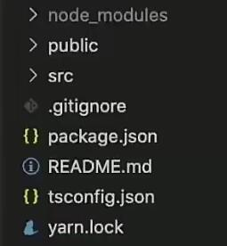

# React+TS 最佳实践

#### 1.使用脚手架搭建React + TS项目命令

```
npx create-react-app my-app --template typescript
```

生成的项目结构只比JS项目多了一个 tsconfig.json 的TS配置文件。

**具体配置项见TS笔记！**



#### 2.TS编译器是babel-loader（基于react脚手架（webpack））

#### 3.启用 esModule方式import React

```
// 允许使用esModule方式import commonjs规范的库，ts为了对commonjs语法进行兼容
"esModuleInterop": true, 使用 import React from 'react'
"esModuleInterop": false, 则使用 import * as React from 'react'
// 开启esModuleInterop后会默认开启allowSyntheticDefaultImports选项

"allowSyntheticDefaultImports": true, // 允许从没有默认导出的模块进行默认导入，去除类型检查
```

#### 4.所有用到`jsx`语法的文件都需要以`tsx`后缀命名

#### 5.全局变量或者自定义的window对象属性，统一在项目根下的`global.d.ts`中进行声明定义

#### 6.`react-app-env.d.ts`：`TypeScript` 声明文件，可以进行允许引用 `SVG` 这样的配置

#### 7.对于项目中常用到的接口数据对象，在`types`目录下定义好其结构化类型声明

#### 8.引入json文件作为TS对象使用需要在tsconfig配置以下两项：

```
"moduleResolution": "node", // 使用 Node.js 风格解析模块
"resolveJsonModule": true, // 允许使用 .json 扩展名导入的模块
```

**实例：** 遍历显示json数组

```tsx
import React from "react";
import robots from "./mockdata/robots.json";
import Robot from "./components/Robot";

function App() {
  return (
    <ul>
      {robots.map((r) => (
        <Robot id={r.id} email={r.email} name={r.name} />
      ))}
    </ul>
  );
}

export default App;
```

#### 9.使用TS进行组件声明

##### 1）函数式组件（重点！）

- 普通声明

```tsx
interface IProps {
  name: string
}

const App = (props: IProps) => {
  const {name} = props;
  return (
    <div className="App">
      <h1>hello world</h1>
      <h2>{name}</h2>
    </div>
  );
}

export default App;
```

- 使用`React.FunctionComponent<P={}>`来定义，其简写`React.FC<P={}>`

两者效果是一样的。它是一个泛型接口，可以接收一个参数，参数表示props的类型，这个参数不是必须的。

```tsx
interface IProps {
  name: string
}

const App: React.FC<IProps> = (props) => {
  const {name} = props;
  return (
    <div className="App">
      <h1>hello world</h1>
      <h2>{name}</h2>
    </div>
  );
}

export default App;
```

当使用这种形式来定义函数组件时，props中默认会带有`children`属性，它表示该组件在调用时，其内部的元素。

**实例：** 定义一个组件，组件中引入了Child1和Child2组件：

```tsx
import Child1 from "./child1";
import Child2 from "./child2";

interface IProps {
  name: string;
}
const App: React.FC<IProps> = (props) => {
  const { name } = props;
  return (
    <Child1 name={name}>
      <Child2 name={name} />
      TypeScript
    </Child1>
  );
};

export default App;
```

**Child1组件：**

```tsx
interface IProps {
  name: string;
}
const Child1: React.FC<IProps> = (props) => {
  const { name, children } = props;
  console.log(children);
  return (
    <div className="App">
      <h1>hello child1</h1>
      <h2>{name}</h2>
    </div>
  );
};
export default Child1;
```

在Child1组件中打印了children属性，它的值是一个数组，包含Child2对象和后面的文本：


使用 **React.FC** 声明函数组件和 **普通声明** 的区别如下：

- React.FC 显式地定义了返回类型，其他方式是隐式推导的；
- React.FC 对静态属性：displayName、propTypes、defaultProps 提供了类型检查和自动补全；
- React.FC 为 children 提供了隐式的类型（ReactElement | null）

##### 2）class组件

类组件的定义形式有两种：`React.Component<P, S={} SS={}>` 和 `React.PureComponent<P, S={} SS={}>`，它们都是泛型接口。

它们接收三个参数，第一个是props类型的定义，第二个是state类型的定义，这两个参数都不是必须的，没有时可以省略，第三个它表示`getSnapshotBeforeUpdate`的返回值。

```tsx
//子组件
import React from 'react'

interface IState {
	title:string
}

interface Iprops {
    count: number
}

class Child extends React.PureComponent<Iprops, IState> {
	state = {
    	title: 'ts'
	}
	render(){
        return <div>
            {this.state.title}
        	{this.props.count}
        </div>
    }
}
export default Child

//父组件
import React from 'react'
import Child from './child'

interface IState {
	count: number
}

interface Iprops {}

class Parents extends React.PureComponent<Iprops, IState> {
	state = {
		count: 0
	}
	render(){
        return <Child count={count} />
    }
}
```

**注：** 组件声明时的`Component<P, S>` 或 `FC<P, S>` 泛型参数声明，来代替PropTypes！

#### 10.hooks

##### 1）useState

默认情况下，TS 会自动为你推导 state 的类型：

```ts
const [count, setCount] = useState<number>(1)
```

如果初始值为null，需要显式地声明 state 的类型：

```tsx
type User = {
  name: string
  age: number
}
const [user, setUser] = React.useState<User | null>(null)
```

如果state是一个对象，想要初始化一个空对象，可以使用类型断言来处理：

```tsx
interface IUser {
	name: string
    age: number
}
const [user, setUser] = React.useState<IUser>({} as IUser);
```

实际上，这里将空对象{}断言为IUser接口就是欺骗了TypeScript的编译器，由于后面的代码可能会依赖这个对象，所以应该在使用前及时初始化 user 的值。

##### 2）useEffect

useEffect的使用方式跟JS一样，只需要注意回调函数的返回值只能是函数 或者 默认返回 undefined

**实例：** useEffect里使用async和await，并设置Loading提示

```tsx
 useEffect(() => {
    const fetchData = async () => {
      setLoading(true);
      try {
        const responses = await fetch(
          "https://jsonplaceholder.typicode.com/users"
        );
        // .then(response => response.json())
        // .then(data => setRobotGallery(data))
        const data = await responses.json();
        setRobotGallery(data);
      } catch (e) {
        setError(e.message);
      }
      setLoading(false);
    };
    fetchData();
  }, []);
```

##### 3）useRef

当初始值为 null 时，有两种创建方式：

```tsx
const ref1 = React.useRef<HTMLInputElement>(null)
//会报错。ref1.current是只读的（read-only）
ref1.current.innerText = "hello world"

const ref2 = React.useRef<HTMLInputElement | null>(null)
//ref2.current就是可写的。不过两种类型在使用时都需要做类型检查
ref2.current?.innerText = "hello world"
```

两种的区别：

- 第一种方式的 ref1.current 是 **只读的（read-only）** ，并且可以传递给内置的 ref 属性，绑定 DOM 元素 

- 第二种方式的 ref2.current 是 **可变的** （类似于声明类的成员变量）

##### 4）useMemo / useCallback

**useMemo** 和 **useCallback** 都可以直接从它们返回的值中推断出它们的类型

**注：** **useCallback** 的参数必须指定类型，否则ts默认指定为 **any**，且不会报错

```tsx
const value = 10
// 自动推断返回值为 number
const result = React.useMemo(() => value * 2, [value])

// 自动推断 (value: number) => number
const multiply = React.useCallback((value: number) => value * multiplier, [
  multiplier,
])
```

同时也支持传入泛型， **useMemo** 的泛型指定了返回值类型，**useCallback** 的泛型指定了参数类型

```tsx
// 也可以显式的指定返回值类型，返回值不一致会报错
const result = React.useMemo<string>(() => 2, [])

// 类型“() => number”的参数不能赋给类型“() => string”的参数
const handleChange = React.useCallback<
  React.ChangeEventHandler<HTMLInputElement>
>(evt => {
  console.log(evt.target.value)
}, [])
```

##### 5）useContext

useContext需要提供一个上下文对象，并返回所提供的上下文的值，当提供者更新上下文对象时，引用这些上下文对象的组件就会重新渲染：

```tsx
const ColorContext = React.createContext({ color: "green" });

const Welcome = () => {
  const { color } = useContext(ColorContext);
  return <div style={{ color }}>hello world</div>;
};
```

在使用useContext时，会自动推断出提供的上下文对象的类型，所以并不需要我们手动设置context的类型。但是，我们也可以使用泛型来设置context的类型：

```tsx
interface IColor {
	color: string;
}

const ColorContext = React.createContext<IColor>({ color: "green" });
```

##### 6）useReducer

使用泛型的形式来实现reducer函数参数的类型约束，同时对初始化state进行类型定义。

```tsx
import React, { useReducer } from "react";

type ActionType = {
  type: "increment" | "decrement";
};

type State = { count: number };

const Counter: React.FC = () => {
  const reducer: React.Reducer<State, ActionType> = (state, action) => {
    switch (action.type) {
      case "increment":
        return { count: state.count + 1 };
      case "decrement":
        return { count: state.count - 1 };
      default:
        throw new Error();
    }
  };

  const initialState: State = {count: 0}
  const [state, dispatch] = useReducer(reducer, initialState);

  return (
    <>
      Count: {state.count}
      <button onClick={() => dispatch({ type: "increment" })}>+</button>
      <button onClick={() => dispatch({ type: "decrement" })}>-</button>
    </>
  );
};

export default Counter;
```

#### 11.事件处理

##### 1）Event 事件类型

这里就给onChange方法的事件对象定义为了FormEvent类型，并且作用的对象时一个HTMLInputElement类型的标签（input标签）。其他事件对象的声明也类似。

```tsx
const App: React.FC = () => {  
  const [text, setText] = useState<string>("")

  const onChange = (e: React.FormEvent<HTMLInputElement>): void => {
    setText(e.currentTarget.value);
  };
  
  return (
    <div>
      <input type="text" value={text} onChange={onChange} />
    </div>
  );
}
```

##### 2）事件处理函数类型

给onChange方法定义了方法的类型，它是一个ChangeEventHandler的类型，并且作用的对象时一个HTMLImnputElement类型的标签（input标签）。

```tsx
const App: React.FC = () => {  
  const [text, setText] = useState<string>("")

  const onChange: React.ChangeEventHandler<HTMLInputElement> = (e) => {
    setText(e.currentTarget.value);
  };
  
  return (
    <div>
      <input type="text" value={text} onChange={onChange} />
    </div>
  );
}
```

#### 12.interface与type

常用规则：

- 在定义公共 API 时(比如编辑一个库）使用 interface，这样可以方便使用者继承接口

- 在定义组件属性（Props）和状态（State）时，建议使用 type，因为 type 的约束性更强。

interface 和 type 在 ts 中是两个不同的概念，但在 React 大部分使用的 场景中，interface 和 type 可以达到相同的功能效果，type 和 interface 最大的区别是：

- type 类型不能二次定义，而 interface 可以随时扩展（即 同名的 interface 能够声明合并）

```ts
interface Animal {
  name: string
}
// 可以继续在原有属性基础上，添加新属性：color
interface Animal {
  color: string
}
//实际的Animal接口
interface Animal {
  name: string
  color: string
}

type Animal = {
  name: string
}
// type类型不支持属性扩展
// Error: Duplicate identifier 'Animal'
type Animal = {
  color: string
}
```

- type 可以声明基本类型别名，联合类型，元组等类型，还可以使用 typeof 获取实例的类型进行赋值。

```ts
// 基本类型别名
type Name = string

// 联合类型
interface Dog {
    wong();
}
interface Cat {
    miao();
}
type Pet = Dog | Cat

// 具体定义数组每个位置的类型
type PetList = [Dog, Pet]

// 当你想获取一个变量的类型时，使用 typeof
let div = document.createElement('div');
type B = typeof div
```

- type可以计算属性，生成映射类型。

type 能使用 in 关键字生成映射类型，但 interface 不行。

```ts
type Keys = "firstname" | "surname"
type DudeType = {
  [key in Keys]: string
}

const test: DudeType = {
  firstname: "Pawel",
  surname: "Grzybek"
}
// 报错
//interface DudeType2 {
//  [key in keys]: string
//}
```

##### 总结：

**不同点：**

- 扩展语法： interface使用extends，type使用‘&’
- 同名合并：interface支持，type不支持。
- 描述类型：对象、函数两者都适用，但是 type 可以用于基础类型、联合类型、元组。
- 计算属性：type 支持计算属性，生成映射类型；interface 不支持。

**相同点：**

- 两者都可以用来描述对象或函数的类型
- 两者都可以实现继承

#### 13.使用默认参数值来代替默认属性defaultProps

```ts
type GreetProps = { age?: number }
const Greet = ({ age = 21 }: GreetProps) => {
  /* ... */
}
```

#### 14.懒加载类型

React也为我们提供了懒加载方法的类型LazyExoticComponent

```ts
export interface RouteType {
    pathname: string;
    component: LazyExoticComponent<any>;
    exact: boolean;
    title?: string;
    icon?: string;
    children?: RouteType[];
}
export const AppRoutes: RouteType[] = [
    {
        pathname: '/login',
        component: lazy(() => import('../views/Login/Login')),
        exact: true
    },
    {
        pathname: '/404',
        component: lazy(() => import('../views/404/404')),
        exact: true,
    },
    {
        pathname: '/',
        exact: false,
        component: lazy(() => import('../views/Admin/Admin'))
    }
]
```

#### 15.使用react-router

引入路由组件props的RouteComponentProps类型

```tsx
import React from 'react'
import { withRouter, RouteComponentProps } from 'react-router-dom'

interface Iprops extends RouteComponentProps{}

const App:React.FC<Iprops> = props => {
    console.log(props.pathname) // 有提示,并且props有他的类型规定
    return <div></div>
}

export default withRouter(App)
```

#### 16.Promise 类型

在做异步操作时我们经常使用 **async** 函数，函数调用时会 **return** 一个 **Promise** 对象，可以使用 **then** 方法添加回调函数。**Promise< T >** 是一个泛型类型，**T** 泛型变量用于确定 **then** 方法时接收的第一个回调函数的参数类型。

```ts
type IResponse<T> = {
  message: string
  result: T
  success: boolean
}

async function getResponse(): Promise<IResponse<number[]>> {
  return {
    message: '获取成功',
    result: [1, 2, 3],
    success: true,
  }
}

getResponse().then(response => {
  console.log(response.result)
})
```

首先声明 **IResponse** 的泛型接口用于定义 **response** 的类型，通过 **T** 泛型变量来确定 **result** 的类型。然后声明了一个 异步函数 **getResponse** 并且将函数返回值的类型定义为 **Promise<IResponse<number[]>>** 。最后调用 **getResponse** 方法会返回一个 **promise** 类型，通过 **then** 调用，此时 **then** 方法接收的第一个回调函数的参数 **response** 的类型为，**{ message: string, result: number[], success: boolean}** 。

#### 17.自定义Hooks-返回数组

自定义 Hook 的返回值如果是**数组类型**，TS 会自动推导为 **联合** 类型，而我们实际需要的是数组里里每一项的具体类型，即元组。所以需要手动添加 **const** **断言** 进行处理：

```tsx
function useLoading() {
  const [isLoading, setState] = React.useState(false)
  const load = (aPromise: Promise<any>) => {
    setState(true)
    return aPromise.then(() => setState(false))
  }

  // 实际需要: [boolean, typeof load] 元组类型
  // 而不是自动推导的：(boolean | typeof load)[]
  return [isLoading, load] as const
}
```

如果使用 **const** 断言遇到问题，也可以直接定义返回类型：

```tsx
export function useLoading(): [
  boolean,
  (aPromise: Promise<any>) => Promise<any>
] {
  const [isLoading, setState] = React.useState(false)
  const load = (aPromise: Promise<any>) => {
    setState(true)
    return aPromise.then(() => setState(false))
  }
  return [isLoading, load]
}
```

#### 18.声明文件


#### 19.工具泛型

##### 1.Partial

Partial 作用是 **将传入的属性变为可选项** 。适用于对类型结构不明确的情况。它的原理实现使用了两个关键字：keyof 和 in。

keyof 可以用来取得接口的所有 key 值：

```ts
interface IPerson {
  name: string;
  age: number;
  height: number;
}
type T = keyof IPerson 
// T 类型为： "name" | "age" | "number"
```

in关键字可以遍历枚举类型：

```ts
type Person = "name" | "age" | "number"
type Obj =  {
  [p in Keys]: any
} 
// Obj类型为： { name: any, age: any, number: any }
```

keyof 可以产生联合类型, in 可以遍历枚举类型, 所以经常一起使用。

因此 Partial 工具泛型的定义：

```ts
/**
 * Make all properties in T optional
 * 将T中的所有属性设置为可选
 */
type Partial<T> = {
    [P in keyof T]?: T[P];
};
```

这里，keyof T 获取 T 所有属性名, 然后使用 in 进行遍历, 将值赋给 P, 最后 T[P] 取得相应属性的值。中间的?就用来将属性设置为可选。

使用示例：

```ts
interface IPerson {
  name: string;
  age: number;
  height: number;
}

const person: Partial<IPerson> = {
  name: "zhangsan";
}
```

##### 2.Required

Required 的作用是将传入的属性变为必选项，和上面的工具泛型恰好相反，其声明如下：

```typescript
/**
 * Make all properties in T required
 * 将T中的所有属性设置为必选
 */
type Required<T> = {
    [P in keyof T]-?: T[P];
};
```

可以看到，这里使用 -? 将属性设置为必选，可以理解为减去问号。适用形式和上面的Partial差不多：

```typescript
interface IPerson {
  name?: string;
  age?: number;
  height?: number;
}

const person: Required<IPerson> = {
  name: "zhangsan";
  age: 18;
  height: 180;
}
```

##### 3.Readonly

将T类型的所有属性设置为只读（readonly），构造出来类型的属性不能被再次赋值。Readonly的声明形式如下：

```typescript
/**
 * Make all properties in T readonly
 */
type Readonly<T> = {
    readonly [P in keyof T]: T[P];
};
```

使用示例如下：

```typescript
interface IPerson {
  name: string;
  age: number;
}

const person: Readonly<IPerson> = {
  name: "zhangsan",
  age: 18
}

person.age = 20;  //  Error: cannot reassign a readonly property
```

可以看到，通过 Readonly 将IPerson的属性转化成了只读，不能再进行赋值操作。

##### 4.Pick<T, K extends keyof T>

从T类型中挑选部分属性K来构造新的类型。它的声明形式如下：

```typescript
/**
 * From T, pick a set of properties whose keys are in the union K
 */
type Pick<T, K extends keyof T> = {
    [P in K]: T[P];
};
```

使用示例如下：

```typescript
interface IPerson {
  name: string;
  age: number;
  height: number;
}

const person: Pick<IPerson, "name" | "age"> = {
  name: "zhangsan",
  age: 18
}
```

##### 5.Record<K extends keyof any, T>

Record 用来构造一个类型，其属性名的类型为K，属性值的类型为T。这个工具泛型可用来将某个类型的属性映射到另一个类型上，下面是其声明形式：

```typescript
/**
 * Construct a type with a set of properties K of type T
 */
type Record<K extends keyof any, T> = {
    [P in K]: T;
};
```

使用示例如下：

```typescript
interface IPageinfo {
    title: string;
}

type IPage = 'home' | 'about' | 'contact';

const page: Record<IPage, IPageinfo> = {
    about: {title: 'about'},
    contact: {title: 'contact'},
    home: {title: 'home'},
}
```

##### 6.Exclude<T, U>

Exclude 就是从一个联合类型中排除掉属于另一个联合类型的子集，下面是其声明的形式：

```typescript
/**
 * Exclude from T those types that are assignable to U
 */
type Exclude<T, U> = T extends U ? never : T;
```

使用示例如下：

```typescript
interface IPerson {
  name: string;
  age: number;
  height: number;
}

const person: Exclude<IPerson, "age" | "sex"> = {
  name: "zhangsan";
  height: 180;
}
```

##### 7.Omit<T, K extends keyof any>

上面的Pick 和 Exclude 都是最基础基础的工具泛型，很多时候用 Pick 或者 Exclude 还不如直接写类型更直接。而 Omit 就基于这两个来做的一个更抽象的封装，它允许从一个对象中剔除若干个属性，剩下的就是需要的新类型。下面是它的声明形式：

```typescript
/**
 * Construct a type with the properties of T except for those in type K.
 */
type Omit<T, K extends keyof any> = Pick<T, Exclude<keyof T, K>>;
```

使用示例如下：

```typescript
interface IPerson {
  name: string;
  age: number;
  height: number;
}

const person: Omit<IPerson, "age" | "height"> = {
  name: "zhangsan";
}
```


#### 20.常用的操作符

- typeof / instanceof: 用于类型判断

- keyof: 获取object的所有key（返回联合类型）
- O[K]: 属性查找
- `[K in O]`: 映射类型
- `+ / - / readonly / ?`: 加法、减法、只读和可选修饰符
- x ? Y : Z: 用于泛型类型、类型别名、函数参数类型的条件类型
- !: 非空断言（加在变量后）
- as: 类型断言
- is: 函数返回类型的类型保护

- in: 可以遍历枚举类型 或 进行类型保护

