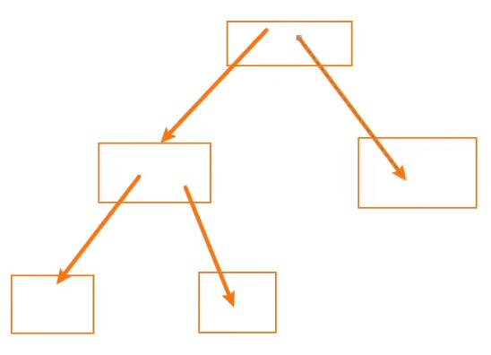
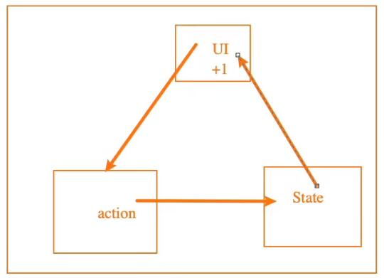
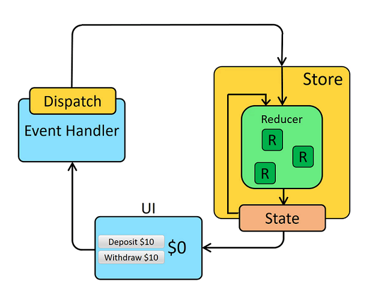
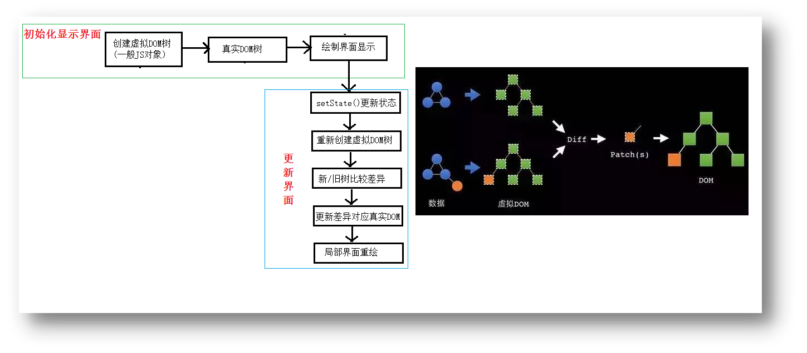

# React基础

# 一、React入门

## 1.React简介

- Facebook开源的一个js库

- 一个用来动态构建用户界面的js库(只关注于视图(View))

## 2.React的特点

- 声明式编码

- 组件化编码

- 一次学习，随处编写（React Native 编写原生应用、服务器端渲染）

- 高效（优秀的Diffing算法, 编码人员不直接操作DOM）

- 单向数据流

## 3.React高效的原因

- 使用虚拟(virtual)DOM, 不总是直接操作页面真实DOM。(减少更新的次数)

- 高效的DOM Diffing算法, 最小化页面重绘。(减小页面更新的区域)

## 4.React的初体验

1). 导入相关js库文件(react.development.js, react-dom.development.js, babel.min.js)

- 引入react核心库

- 引入react-dom, 用于支持react操作DOM

- 引入babel, 用于将jsx转为js

2). 创建虚拟DOM，然后渲染虚拟DOM到页面

```html
1). 导入相关js库文件(react.development.js, react-dom.development.js, babel.min.js)
<!-- 引入react核心库 -->
<script type="text/javascript" src="../js/react.development.js"></script>
<!-- 引入react-dom, 用于支持react操作DOM -->
<script type="text/javascript" src="../js/react-dom.development.js"></script>
<!-- 引入babel, 用于将jsx转为js -->
<script type="text/javascript" src="../js/babel.min.js"></script>

2). 创建虚拟DOM，然后渲染虚拟DOM到页面:
<!-- 准备好一个“容器” -->
<div id="test"></div>
<script type="text/babel"> /* 此处一定要写babel */
	//1.创建虚拟DOM
	const VDOM = <h1>Hello,React</h1> /* 此处一定不要写引号，因为不是字符串 */
	//2.渲染虚拟DOM到页面
	ReactDOM.render(VDOM, document.getElementById('test')); //该句话不是追加，是替换
</script>
```

- **注：** 此时只是测试语法使用, 并不是真实项目开发使用！

## 5.虚拟DOM的两种创建方式

1.纯JS方式(一般不用)

```js
React.createElement('h1',{id:'title'}, React.createElement('span',{},'Hello,React'))
```

2.JSX方式

```jsx
const VDOM = (  /* 此处一定不要写引号，因为不是字符串 */
    <h1 id="title">
        <span>Hello,React</span>
    </h1>
)
```

**实例:**

```jsx
1.纯JS方式(一般不用)
<!-- 准备好一个“容器” -->
<div id="test"></div>
<script type="text/javascript" > 
    //1.创建虚拟DOM
    const VDOM = React.createElement('h1',{id:'title'}, React.createElement('span',{},'Hello,React'))
    //2.渲染虚拟DOM到页面
    ReactDOM.render(VDOM,document.getElementById('test'))
</script>

2.JSX方式
<!-- 准备好一个“容器” -->
<div id="test"></div>
<script type="text/babel" > /* 此处一定要写babel */
	//1.创建虚拟DOM
	const VDOM = (  /* 此处一定不要写引号，因为不是字符串 */
		<h1 id="title">
			<span>Hello,React</span>
    	</h1>
	)
	//2.渲染虚拟DOM到页面
	ReactDOM.render(VDOM,document.getElementById('test'))
</script>
```

## 6.虚拟DOM与真实DOM

关于虚拟DOM：

1.本质是Object类型的对象（一般对象），React源码里称 ReactElement 对象。

2.虚拟DOM比较“轻”，真实DOM比较“重”，因为虚拟DOM是React内部在用，无需真实DOM上那么多的属性。

3.虚拟DOM最终会被React转化为真实DOM，呈现在页面上。

**实例:**

```jsx
<div id="test"></div>
<div id="demo"></div>
<script type="text/babel" > /* 此处一定要写babel */
    //1.创建虚拟DOM
    const VDOM = (  /* 此处一定不要写引号，因为不是字符串 */
        <h1 id="title">
            <span>Hello,React</span>
        </h1>
    )
    //2.渲染虚拟DOM到页面
    ReactDOM.render(VDOM,document.getElementById('test'));
    //真实DOM
    const TDOM = document.getElementById('demo');
    console.log('虚拟DOM',VDOM);
    console.log('真实DOM',TDOM);
    // debugger;
    console.log(typeof VDOM);  //object
    console.log(VDOM instanceof Object);  //true
</script>
```

## 7.JSX的理解和使用

**1) 理解**

​    1.全称:  JavaScript XML

​    2.react定义的一种类似于XML的JS扩展语法: JS + XML

​	3.**JSX本质** 是React. **createElement** (component, props, ...children)方法的 **语法糖**

​    4.作用: 用来简化创建虚拟DOM

​        1) 写法:

``` jsx
var ele = <h1>Hello JSX!</h1>
```

​        2) 注1: 它不是字符串, 也不是HTML/XML标签

​        3) 注2: 它最终产生的就是一个JS对象（ReactElement对象）

**2) jsx语法规则:**

​    1.定义虚拟DOM时，不要写引号。

​    2.JSX中嵌入 变量 时要用{}。

- 当变量是Number、String、Array类型时，可以直接显示，数组会自动展开所有成员。

- 当变量是null、undefined、Boolean类型时，内容为空。

	- 如果希望可以显示null、undefined、Boolean，那么需要转成字符串。

	- 转换的方式有很多，比如toString方法、和空字符串拼接，String(变量)等方式。

- 对象类型不能作为React子元素放在标签体中直接显示。

```jsx
<div id="app"></div>
<script type="text/babel">
    class App extends React.Component {
      constructor(props) {
        super(props);

        this.state = {
          // 1.在{}中可以正常显示显示的内容
          name: "why", // String
          age: 18, // Number
          names: ["abc", "cba", "nba"], // Array

          // 2.在{}中不能显示(忽略)
          test1: null, // null
          test2: undefined, // undefined
          test3: true, // Boolean
          flag: true,

          // 3.对象不能作为jsx的子类
          friend: {
            name: "kobe",
            age: 40
          }
        }
      }

      render() {
        return (
          <div>
            <h2>{this.state.name}</h2>
            <h2>{this.state.age}</h2>
            <h2>{this.state.names}</h2>

            <h2>{this.state.test1 + ""}</h2>
            <h2>{this.state.test2 + ""}</h2>
            <h2>{this.state.test3.toString()}</h2>

            <h2>{this.state.flag ? "你好啊": null}</h2>

            <h2>{this.state.friend}</h2>
          </div>
        )
      }
    }

    ReactDOM.render(<App/>, document.getElementById("app"));
</script>
```

​    3.JSX中嵌入 表达式 时要用{}。

- 运算表达式

- 三元运算符

- 执行一个函数

```jsx
<div id="app"></div>
<script type="text/babel">
    class App extends React.Component {
      constructor(props) {
        super(props);

        this.state = {
          firstname: "kobe",
          lastname: "bryant",
          isLogin: false
        }
      }

      render() {
        const { firstname, lastname, isLogin } = this.state;

        return (
          <div>
            {/*1.运算符表达式*/}
            <h2>{ firstname + " " + lastname }</h2>
            <h2>{20 * 50}</h2>

            {/*2.三元表达式*/}
            <h2>{ isLogin ? "欢迎回来~": "请先登录~" }</h2>

            {/*3.进行函数调用*/}
            <h2>{this.getFullName()}</h2>
          </div>
        )
      }

      getFullName() {
        return this.state.firstname + " " + this.state.lastname;
      }
    }

    ReactDOM.render(<App/>, document.getElementById("app"));
</script>
```

​    4.jsx绑定元素属性

- 比如元素都会有title属性

- 比如img元素会有src属性

- 比如a元素会有href属性

- 比如元素可能需要绑定class

- 比如原生使用内联样式style

- **注：**
  - 样式的类名指定不要用class，要用className。
  
  - 内联样式，要用 style={{key: value}} 的形式去写。两个单词的css样式要写 **小驼峰** 的形式。
    将样式以key: value的形式，放在对象里, 最后放入{}中。React 会在指定元素数字后自动添加 px。

```jsx
<div id="app"></div>
<script type="text/babel">
    function getSizeImage(imgUrl, size) {
      return imgUrl + `?param=${size}x${size}`
    }

    class App extends React.Component {
      constructor(props) {
        super(props);

        this.state = {
          title: "标题",
          imgUrl: "http://p2.music.126.net/L8IDEWMk_6vyT0asSkPgXw==/109951163990535633.jpg",
          link: "http://www.baidu.com",
          active: true
        }
      }

      render() {
        const { title, imgUrl, link, active } = this.state;
        return (
          <div>
            {/* 1.绑定普通属性 */}
            <h2 title={title}>我是标题</h2>
            
            <a href={link} target="_blank">百度一下</a>

            {/* 2.绑定class */}
            <div className="box title">我是div元素</div>
            {/* 动态绑定class */}
            <div className={"box title " + (active ? "active": "")}>我也是div元素</div>
            <label htmlFor=""></label>

            {/* 3.绑定style */}
            <div style={{color: "red", fontSize: "50px"}}>我是div,绑定style属性</div>
          </div>
        )
      }
    }

    ReactDOM.render(<App />, document.getElementById("app"));
</script>
```

​    5.JSX的顶层只能有一个根元素（模板），所以很多时候会在外层包裹一个div原生（或者使用Fragment）。

​    6.标签必须闭合，如果是单标签，必须以/>结尾。

​    7.jsx标签中的注释：

```
{/*注释...*/}
```

​    8.jsx标签外的注释: 

```
/*注释...*/
```

​    9.标签首字母

​        (1).若小写字母开头，则将该标签转为html中同名元素，若html中无该标签对应的同名元素，则报错。

​        (2).若大写字母开头，react就去渲染对应的组件，若组件没有定义，则报错。

​    10.每个列表的li都应该有唯一的key, key应该设置在兄弟节点，且只是在兄弟节点之间必须唯一。

​    11.JSX 防止注入攻击：使用花括号直接引用渲染内容的时候，React会自动转义

**注:**

- 一定注意区分：【js语句(代码)】与【js表达式】

​    1.表达式：一个表达式会产生一个值，可以放在任何一个需要值的地方

​        下面这些都是表达式：

​            (1). a

​            (2). a+b

​            (3). demo(1)

​            (4). arr.map() ===> 用于加工数组

​            (5). function test() {}

​    2.语句(代码)

​        下面这些都是语句：

​            (1). if(){}

​            (2). for(){}

​            (3). switch(){case:xxx}

**实例:**

```jsx
<!-- 准备好一个“容器” -->
<div id="test"></div>
<script type="text/babel">
    //准备一些数据
    const myId = 'aTgUiGu'
    const myData = 'HeLlo,rEaCt'

    //1.创建虚拟DOM
    const VDOM = (
        <div>
            <h2 className="title" id={myId.toLowerCase()}>
                <span style={{color:'white',fontSize:'29px'}}>{myData.toLowerCase()}</span>
            </h2>
            <h2 className="title" id={myId.toUpperCase()}>
                <span style={{color:'white',fontSize:'29px'}}>{myData.toLowerCase()}</span>
            </h2>
            <input type="text"/>
            <peiqi>123</peiqi>
        </div>
    )
    //2.渲染虚拟DOM到页面, 即虚拟DOM => 真实DOM，呈现在页面
    ReactDOM.render(VDOM,document.getElementById('test'))
</script>
```

### jsx练习-动态展示列表

```jsx
<div id="test"></div>
<script type="text/babel">	
	//模拟后台返回的数据
	const arr = ['Angular','React','Vue']

	//1.创建虚拟DOM
	const VDOM = (
		<div>
			<h1>前端框架列表</h1>	
			<ul>
				{
					//map方法专门用于加工数组，React中大量使用map方法
					arr.map((item,index)=>{
						return <li key={index}>{item}</li>
					})
	
					//不能使用forEach，因为返回值永远是undefined
					/* arr.forEach((item,index)=>{
						return <li key={index}>{item}</li> //这么写是错误的
					}) */
	             }
			</ul>
		</div>
	);
	
	//2.渲染虚拟DOM到页面
	ReactDOM.render(VDOM,document.getElementById('test'))
</script>
```

## 8.模块与组件、模块化与组件化的理解

### 1). 模块与组件

1.模块:

- 理解: 向外提供特定功能的js程序, 一般就是一个js文件
  
- 为什么要拆成模块: 随着业务逻辑增加，js代码更多更复杂
  
- 作用: 复用js, 简化js的编写, 提高js运行效率

2.组件: 

- 理解: 用来实现特定(局部)界面功能效果的代码集合(html/css/js/img)
	
- 为什么要用组件: 一个界面的功能太复杂了
	
- 作用: 复用编码, 简化项目界面编码, 提高运行效率

### 2). 模块化与组件化

1.模块化:

- 当应用的js都以模块来编写的, 这个应用就是一个模块化的应用

2.组件化:

- 当应用是以多组件的方式实现, 这个应用就是一个组件化的应用

## 9.命令式编程与声明式编程

1.声明式编程

- 只关注做什么，而不关注怎么做(流程)，类似于填空题。每做一个操作，都是给计算机(浏览器)一步步命令。

2.命令式编程

- 要关注做什么和怎么做(流程)，类似于问答题

3.虚拟DOM帮助我们从命令式编程转到了声明式编程的模式

4.声明式编程的方式赋予了React声明式的API：

- 你只需要告诉React希望让UI是什么状态；

- React来确保DOM和这些状态是匹配的；

- 你不需要直接进行DOM操作，只可以从手动更改DOM、属性操作、事件处理中解放出来；

**需求:**

原数组：[1, 3, 5, 7]，得到一个新的数组, 数组中每个元素都比原数组中对应的元素大10: [11, 13, 15, 17]

```js
var arr = [1, 3, 5, 7];
// 1-命令式编程
var arr2 = [];
for(var i = 0;i<arr.length;i++) {
	arr2.push(arr[i] + 10);
}
console.log(arr2);

// 2-声明式编程
var arr3 = arr.map(function(item){
	return item + 10;
})
```

**注：**

- 声明式编程是建立命令式编程的基础上

- 数组中常见声明式方法：map() / filter() / reduce() / forEach() / find() / findIndex()

## 10.单向数据流

1.react官网中有提到单向数据流

- 指的就是通过props进行数据的传递，只能由父组件传向子组件



2.Vue和React中组件内部数据传递都有单向数据流的概念



3.Redux中数据管理



# 二、React组件化开发

## 1.组件的创建与使用

1). 组件分类: 函数式组件 / 类式组件

2). 创建组件(标签)的方式

**方式1:** 函数式组件(简单组件/无状态组件)

```jsx
function MyComponent1(props) {
    return <h1>自定义组件标题11111</h1>;
}
```

**注：**

- 没有生命周期，也会被更新并挂载，但是没有生命周期函数
- 没有this(组件实例）
- 没有内部状态（state）

**方式2:** 类式组件(复杂组件/有状态组件, 推荐使用！)

```jsx
class MyComponent2 extends React.Component {
    render () {
        return <h1>自定义组件标题33333</h1>;
    }
}
```

3). 渲染组件(标签)

```jsx
ReactDOM.render(<MyComponent1 />,  cotainerElement);
```

4). ReactDOM.render()渲染函数式组件(标签)的基本流程

​    1.React解析组件标签，寻找MyComponent组件:

​        (1).若找到了，则进行下一步

​        (2).若未找到，则报错：MyComponent is not defined

​    2.React发现MyComponent是用函数定义的，随后React调用该函数，将返回的虚拟DOM转为真实DOM，渲染到页面上。

5). ReactDOM.render()渲染类式组件(标签)的基本流程

​	1.React解析组件标签,寻找MyComponent组件

​        (1).若找到了，则进行下一步

​        (2).若未找到，则报错：MyComponent is not defined

​    2.React发现组件是使用类定义的，随后React帮我们去new了一个MyComponent的实例：mc，
​        并通过mc调用到了MyComponent原型上的render方法，即：mc.render()

​		备注：此处的mc只是我们分析问题时的一个代号，React底层用的是别的名字。

​    3.将render返回的虚拟DOM转为真实DOM，随后渲染到页面上。

6). render函数的返回值

- 当 render 被调用时，它会检查 this.props 和 this.state 的变化并返回以下类型之一：
- React 元素：
  - 通常通过 JSX 创建。
  - 例如，< div / > 会被 React 渲染为 DOM 节点，< MyComponent / > 会被 React 渲染为自定义组件。
  - 无论是 < div / > 还是 < MyComponent / > 均为 React 元素。
- 数组 或 fragments：使得 render 方法可以返回多个元素。
- Portals：可以渲染子节点到不同的 DOM 子树中。
- 字符串 或 数值类型：它们在 DOM 中会被渲染为文本节点。
- 布尔类型 或 null：什么都不渲染。

**注:**

​    1.组件名必须首字母大写

​    2.所谓的简单组件，就是没有状态的组件

​    3.所谓的复杂组件，就是有状态的组件

**实例:**

1.创建函数式组件

```jsx
<div id="test"></div>
<script type="text/babel">
    //1.创建函数式组件
    function MyComponent (){
        console.log(this)  //此处的this是 undefined, 因为jsx编译为js后babel开启了严格模式
        return <h2>我是用函数定义的组件（适用于：【简单组件】的定义）</h2>
    }
    //2.渲染组件到页面
    ReactDOM.render(<MyComponent/>,document.getElementById('test'));
</script>
```

2.创建类式组件

```jsx
<div id="test"></div>
<script type="text/babel">
    //1.创建类式组件
    class MyComponent extends React.Component {
        render(){
            //render是放在哪里的？—— MyComponent的原型对象上，供实例使用。
            //render中的this是谁？—— MyComponent类的实例对象 <=> MyComponent组件实例对象。
            console.log('render中的this:', this);
            return <h2>我是用类定义的组件(适用于：【复杂组件】的定义)</h2>;
        }
    }
    //2.渲染组件到页面
    ReactDOM.render(<MyComponent/>,document.getElementById('test'))
</script>
```

## 2.组件实例的3大属性1: state

1.state是组件实例对象最重要的属性, 值是对象(可以包含多个key-value的组合)

2.组件被称为"状态机", 通过更新组件的state来更新对应的页面显示(重新渲染组件)

2.构造函数初始化指定:

```js
constructor(props) {
    super(props);
    this.state = {
        stateName1 : stateValue1,
        stateName2 : stateValue2
    };
}
```

4.class里直接初始化指定( **简写方式 - 推荐！** ):

```js
class Weather extends React.Component{
    state = {
        isHot:true,
        wind:'微风'
    }
    ...
}
```

5.读取显示:

​	this.state.stateName

6.更新状态 --> 更新界面:

```js
this.setState({
    stateProp1 : value1,
    stateProp2 : value2
});
```

7.**注意**

​    1.组件中render方法中的this为组件实例对象

​    2.状态数据，不能直接修改或更新，必须调用setState()方法修改或更新

**实例:**

**需求:** 定义一个展示天气信息的组件

1.默认展示天气炎热 或 凉爽

2.点击文字切换天气

```jsx
<div id="test"></div>
<script type="text/babel">
    //1.创建组件
    class Weather extends React.Component{
        //构造器调用几次？ ———— 1次
        constructor(props){
            console.log('constructor');
            super(props);
            //初始化状态
            this.state = {isHot:false,wind:'微风'};
            //（写法1）-用bind解决changeWeather中this指向问题
            //用改变原型上changeWeather中this指向，返回的新函数添加给实例
            //官方说法-为事件处理函数绑定实例
            // this.changeWeather = this.changeWeather.bind(this);
        }

        //render调用几次？ ———— 1 + n次，1是初始化的那次 n是状态更新的次数
        render(){
            console.log('render');
            //读取状态
            const {isHot,wind} = this.state;
            //（写法2）-直接在事件绑定处用bind解决changeWeather中this指向问题，节省了在构造函数里再写代码给实例本身加changeWeather方法
            return <h1 onClick = {this.changeWeather.bind(this)}>今天天气很{isHot ? '炎热' : '凉爽'}，{wind}</h1>;
}

        //changeWeather调用几次？ ———— 点几次调几次
        changeWeather(){
            //changeWeather放在哪里？ ———— Weather的原型对象上，供实例使用
            //由于changeWeather是作为onClick的回调，所以不是通过实例调用的，是直接调用
            //类中的方法默认开启了局部的严格模式，以及babel编译后全局开启了严格模式，所以changeWeather中的this为undefined
    
            console.log('changeWeather');
            //获取原来的isHot值
            const isHot = this.state.isHot;
            //严重注意：状态必须通过setState进行更新,且更新是一种合并，不是替换。
            this.setState({isHot:!isHot});  //setState干了两件事：1.帮你更改状态 2.重新调用render
            console.log(this);

            //严重注意：状态(state)不可直接更改，下面这行就是直接更改！！！
            //this.state.isHot = !isHot //这是错误的写法
        }
    }
    //2.渲染组件到页面
    ReactDOM.render(<Weather/>,document.getElementById('test'));
</script>
```

**1) state的简写方式**

```jsx
<div id="test"></div>
<script type="text/babel">
    //1.创建组件
    class Weather extends React.Component{
        //初始化状态
        state = {isHot:false,wind:'微风'};

        render(){
            const {isHot,wind} = this.state;
            return <h1 onClick={this.changeWeather}>今天天气很{isHot ? '炎热' : '凉爽'}，{wind}</h1>;
        }
    
        //自定义方法-类组件中事件的回调———要用赋值语句的形式+箭头函数
        changeWeather = ()=>{
            const isHot = this.state.isHot;
            this.setState({isHot:!isHot});
            this.haha();
        }
        //haha不作为事件的回调使用，那么haha就没有必要：赋值语句+箭头函数去写
        haha(){
            console.log('哈哈');
        }
    }
    //2.渲染组件到页面
    ReactDOM.render(<Weather/>,document.getElementById('test'));
</script>
```

**2) 扩展实例-天气3状态切换**

```jsx
<div id="test"></div>
<script type="text/babel" >
    //1.定义组件
    class Weather extends React.Component{
        //初始化状态
        state ={
            temp: 1  //1炎热 2温暖 3凉爽
        }
        render(){
            const {temp} = this.state
            return (
                <div>
                    <h2>
                        今天天气很{
                        temp === 1 ? '炎热' :
                        temp === 2 ? '温暖' :
                        temp === 3 ? '凉爽' : '未知'
                        }
                    </h2>
                    <button onClick={this.changeWeather}>点我切换天气</button>
                </div>
            )
        }
        changeWeather = ()=>{
            //获取原状态
            let {temp}  = this.state
            //自增
            temp += 1
            //校验数据
            if(temp>3) temp = 1
            //更新状态
            this.setState({temp})
        }
    }
    //2.渲染组件
    ReactDOM.render(<Weather/>,document.getElementById('test'))
</script>
```

## 3.组件实例的3大属性2: props

1.每个组件实例对象都会有props(properties的简写)属性

2.组件标签的所有属性都保存在props中

3.在组件内部读取属性: this.props.propertyName

4.props是只读的

5.作用：

​    1) 通过标签属性从组件外向组件内传递变化的数据(父传子)

​    2) **注意:** 组件内部不要修改props数据

6.对props中的属性值进行类型限制和必要性限制

​	1) 使用prop-types库进限制（需要引入prop-types库）

```js
Person.propTypes = {
    name: PropTypes.string.isRequired, //限制name必传，且为字符串
    age: PropTypes.number, //限制age为数值
    speak:PropTypes.func, //限制speak为函数
}
```

- isRequired为必传属性

​    2) 简写方式

```js
//对标签属性进行类型、必要性的限制
static propTypes = {
    name:PropTypes.string.isRequired, //限制name必传，且为字符串
    sex:PropTypes.string, //限制sex为字符串
    age:PropTypes.number, //限制age为数值
}
```

**7.属性展开** （组件传参简写）- 将对象的所有属性通过props传递，即批量传递props(标签属性)

```jsx
//在react和babel作用下,对象可以用...拆对象，但只能用于组件传参！
<Person {...person}/>
```

8.默认属性值

```js
Person.defaultProps = {
    sex:'男', //sex默认值为男
    age:18 //age默认值为18
}
```

简写方式：

```js
static defaultProps = {
    sex:'男', //sex默认值为男
    age:18 //age默认值为18
}
```

9.类式组件的构造函数接收props

```js
constructor(props){
    super(props);
    console.log(props); //打印所有属性
}
```

**注：** 可以不写构造函数，源码默认给实例对象加上了props，即可以直接使用this.props.xxx获取。

10.函数式组件使用props

- 函数式组件只能通过传参使用props属性

```jsx
<div id="test"></div>
<script type="text/babel">
    //创建组件
    //函数式组件只能通过传参使用props属性
    function Person (props){
        const {name,age,sex} = props
        return (
            <ul>
                <li>姓名：{name}</li>
                <li>性别：{sex}</li>
                <li>年龄：{age}</li>
        	</ul>
    	)
    }
    Person.propTypes = {
        name:PropTypes.string.isRequired, //限制name必传，且为字符串
        sex:PropTypes.string, //限制sex为字符串
        age:PropTypes.number, //限制age为数值
    }
    //指定默认标签属性值
    Person.defaultProps = {
        sex:'男', //sex默认值为男
        age:18 //age默认值为18
    }
    //渲染组件到页面
    ReactDOM.render(<Person name="jerry"/>,document.getElementById('test'))
</script>
```

**实例:**

**需求:** 自定义用来显示一个人员信息的组件

1)姓名必须指定，且为字符串类型

2)性别为字符串类型，如果性别没有指定，默认为男

3)年龄为字符串类型，且为数字类型，默认值为18

```jsx
//1.props基本使用
<div id="test1"></div>
<div id="test2"></div>
<div id="test3"></div>
<script type="text/babel">
    //创建组件
    class Person extends React.Component{
        render(){
            // console.log(this);
            const {name,age,sex} = this.props
            return (
                <ul>
                    <li>姓名：{name}</li>
                    <li>性别：{sex}</li>
                    <li>年龄：{age+1}</li>
                </ul>
			)
    	}
    }
    //渲染组件到页面
    ReactDOM.render(<Person name="jerry" age={19}  sex="男"/>,document.getElementById('test1'))
    ReactDOM.render(<Person name="tom" age={18} sex="女"/>,document.getElementById('test2'))

    //模拟一个人的信息（真实项目开发中，一定是从服务器获取到的）
    const p = {name:'老刘',age:18,sex:'女'}
    // console.log('@',...p); //此处的...p不奏效
    // ReactDOM.render(<Person name={p.name} age={p.age} sex={p.sex}/>,document.getElementById('test3'))
    
    //组件传参简写-即批量传递props(标签属性)
    //在react库和babel作用下可以对象可以用...拆对象，但只能用于组件传参！
    ReactDOM.render(<Person {...p}/>,document.getElementById('test3'))
</script>


//2.对props进行限制
<div id="test1"></div>
<div id="test2"></div>
<div id="test3"></div>
<script type="text/babel">
	//创建组件
    class Person extends React.Component{
    	render(){
            // console.log(this);
            const {name,age,sex} = this.props
            //props是只读的
            //this.props.name = 'jack' //此行代码会报错，因为props是只读的
            return (
                <ul>
                    <li>姓名：{name}</li>
                    <li>性别：{sex}</li>
                    <li>年龄：{age+1}</li>
                </ul>
    		)
    	}
    }
    //对标签属性进行类型、必要性的限制
    Person.propTypes = {
        name:PropTypes.string.isRequired, //限制name必传，且为字符串
        sex:PropTypes.string, //限制sex为字符串
        age:PropTypes.number, //限制age为数值
        //限制函数用func
        speak:PropTypes.func, //限制speak为函数
    }
    //指定默认标签属性值
    Person.defaultProps = {
        sex:'男', //sex默认值为男
        age:18 //age默认值为18
    }
	//渲染组件到页面
    ReactDOM.render(<Person name="jack" speak={speak}/>,document.getElementById('test1'))
    ReactDOM.render(<Person name="tom" age={18} sex="女"/>,document.getElementById('test2'))

    const p = {name:'老刘',age:18,sex:'女'}
    // console.log('@',...p);
    // ReactDOM.render(<Person name={p.name} age={p.age} sex={p.sex}/>,document.getElementById('test3'))
    ReactDOM.render(<Person {...p}/>,document.getElementById('test3'))
    
    function speak(){
        console.log('我说话了');
    }
</script>


//3.props的简写方式
<div id="test1"></div>
<script type="text/babel">
	//创建组件
    class Person extends React.Component{
        //构造器一般能省则省
        constructor(props){
            //注意：构造器是否接收props，是否传递给super，取决于：是否希望在构造器中通过this访问props
            // console.log(props);
            super(props);
            //这种写法很少
            console.log('constructor',this.props);
        }

        //对标签属性进行类型、必要性的限制
        static propTypes = {
            name:PropTypes.string.isRequired, //限制name必传，且为字符串
            sex:PropTypes.string, //限制sex为字符串
            age:PropTypes.number, //限制age为数值
        }
    
        //指定默认标签属性值
        static defaultProps = {
            sex:'男', //sex默认值为男
            age:18 //age默认值为18
        }
    
        render(){
            // console.log(this);
            const {name,age,sex} = this.props
            //props是只读的
            //this.props.name = 'jack' //此行代码会报错，因为props是只读的
            return (
                <ul>
                    <li>姓名：{name}</li>
                    <li>性别：{sex}</li>
                    <li>年龄：{age+1}</li>
                </ul>
            )
    	}
    }
    
    //渲染组件到页面
    ReactDOM.render(<Person name="jerry"/>,document.getElementById('test1'))
</script>
```

**11.子组件传父组件数据** - 通过**传递函数属性**的props实现

- 某些情况，我们也需要子组件向父组件传递消息：
  - 在vue中是通过自定义事件来完成的；
  - 在React中同样是通过props传递消息，只是让父组件给子组件传递一个回调函数，在子组件中调用这个函数即可；

**实例：**

```jsx
import React, { Component } from 'react';

class CounterButton extends Component {
  render() {
    const {onClick} = this.props;
    return <button onClick={onClick}>+1</button>
  }
}

export default class App extends Component {
  constructor(props) {
    super(props);

    this.state = {
      counter: 0
    }
  }

  render() {
    return (
      <div>
        <h2>当前计数: {this.state.counter}</h2>
        <button onClick={e => this.increment()}>+</button>
        {/* 父传给子函数，子调用，即可实现子传父 */}
        <CounterButton onClick={e => this.increment()} name="why"/>
      </div>
    )
  }

  increment() {
    this.setState({
      counter: this.state.counter + 1
    })
  }
}
```

**父子通信案例：tab切换**

```jsx
//TabControl.js
import React, { Component } from 'react';
import PropTypes from 'prop-types';

export default class TabControl extends Component {
  constructor(props) {
    super(props);

    this.state = {
      currentIndex: 0
    }
  }

  render() {
    const { titles } = this.props;
    const {currentIndex} = this.state;

    return (
      <div className="tab-control">
        {
          titles.map((item, index) => {
            return (
              <div key={item} 
                   className={"tab-item " + (index === currentIndex ? "active": "")}
                   onClick={e => this.itemClick(index)}>
                <span>{item}</span>
              </div>
            )
          })
        }
      </div>
    )
  }

  itemClick(index) {
    this.setState({
      currentIndex: index
    })

    const {itemClick} = this.props;
    itemClick(index);
  }
}

TabControl.propTypes = {
  titles: PropTypes.array.isRequired
}


//app.js
import React, { Component } from 'react';
import TabControl from './TabControl';

export default class App extends Component {
  constructor(props) {
    super(props);

    this.titles = ['新款', '精选', '流行'];

    this.state = {
      currentTitle: "新款",
      currentIndex: 0
    }
  }

  render() {
    const {currentTitle} = this.state;

    return (
      <div>
        <TabControl itemClick={index => this.itemClick(index)} titles={this.titles} />
        <h2>{currentTitle}</h2>
      </div>
    )
  }

  itemClick(index) {
    this.setState({
      currentTitle: this.titles[index]
    })
  }
}
```

**注意：css类的动态绑定-字符串拼接！**

**12.children props 与 jsx props - 传入结构（标签）**

1）children props：

- 传入 - 多个则以数组保存

```jsx
<NavBar name="" title="" className="">
    <span>aaa</span>
    <strong>bbb</strong>
    <a href="/#">ccc</a>
</NavBar>
```

- 读取 - 多个以数组下标读取

```jsx
<div className="nav-left">
    {this.props.children[0]}
</div>
<div className="nav-item nav-center">
    {this.props.children[1]}
</div>
<div className="nav-item nav-right">
    {this.props.children[2]}
</div>
```

2）jsx props**（推荐！）**

- 传入 - 多个保存到对象

```jsx
<NavBar2 leftSlot={<span>aaa</span>}
         centerSlot={<strong>bbb</strong>}
         rightSlot={<a href="/#">ccc</a>}/>
```

- 读取 - 多个以key获取

```jsx
<div className="nav-left">
    {this.props.leftSlot}
</div>
<div className="nav-item nav-center">
    {this.props.centerSlot}
</div>
<div className="nav-item nav-right">
    {this.props.rightSlot}
</div>
```

**注：**

- react 实现 vue 的插槽
- 缺点：不能携带数据

**案例：app顶部导航条**

```jsx
//app.js
import React, { Component } from 'react';
import NavBar from './NavBar';
import NavBar2 from './NavBar2';

export default class App extends Component {

  render() {
    const leftJsx = <span>aaa</span>;
    return (
      <div>
        <NavBar name="" title="" className="">
          <span>aaa</span>
          <strong>bbb</strong>
          <a href="/#">ccc</a>
        </NavBar>

        <NavBar2 leftSlot={leftJsx}
                 centerSlot={<strong>bbb</strong>}
                 rightSlot={<a href="/#">ccc</a>}/>
      </div>
    )
  }
}

//NavBar.js
import React, { Component } from 'react'

export default class NavBar extends Component {
  render() {
    // this.props.children;
    return (
      <div className="nav-item nav-bar">
        <div className="nav-left">
          {this.props.children[0]}
        </div>
        <div className="nav-item nav-center">
          {this.props.children[1]}
        </div>
        <div className="nav-item nav-right">
          {this.props.children[2]}
        </div>
      </div>
    )
  }
}

//NavBar2.js
import React, { Component } from 'react'

export default class NavBar2 extends Component {
  render() {
    const {leftSlot, centerSlot, rightSlot} = this.props;

    return (
      <div className="nav-item nav-bar">
        <div className="nav-left">
          {leftSlot}
        </div>
        <div className="nav-item nav-center">
          {centerSlot}
        </div>
        <div className="nav-item nav-right">
          {rightSlot}
        </div>
      </div>
    )
  }
}
```

**13.render props**

- 通过组件标签属性传入结构，而且可以携带数据，一般用render函数属性

```jsx
<A render={(data) => <C data={data}></C>}></A>
```

A组件:  {this.props.render(内部state数据)}

C组件:  读取A组件传入的数据显示 {this.props.data} 

**实例**

```jsx
import React, { Component } from 'react'
import './index.css'
import C from '../1_setState'

export default class Parent extends Component {
	render() {
		return (
			<div className="parent">
				<h3>我是Parent组件</h3>
				<A render={(name)=><C name={name}/>}/>
			</div>
		)
	}
}

class A extends Component {
	state = {name:'tom'}
	render() {
		console.log(this.props);
		const {name} = this.state
		return (
			<div className="a">
				<h3>我是A组件</h3>
				{this.props.render(name)}
			</div>
		)
	}
}

class C extends Component {
	render() {
		console.log('C--render');
		return (
			<div className="c">
				<h3>我是C组件,{this.props.name}</h3>
			</div>
		)
	}
}
```

## 4.组件实例的3大属性3: refs

1.组件内包含ref属性的标签元素的集合对象

2.组件内的标签可以定义ref属性来标识自己

3.作用: 找到组件内部的真实dom元素对象, 进而操作它

4.ref分类

​	1) 字符串形式的ref **(即将被弃用！)**

```jsx
<input ref="input1"/>
```

- 在组件内部获得标签对象: this.refs.refName(只是得到了标签元素对象)

​	2) 回调形式的ref

```jsx
<input ref={(c) => {this.input1 = c}}/>
```

- 在组件内部获得标签节点: this.input1

​	3) createRef创建ref容器 **（推荐！）**

```jsx
myRef = React.createRef()
<input ref={this.myRef}/>
```

- 在组件内部获得标签节点: this.myRef.current

**实例:**

**需求:** 自定义组件, 功能说明如下:

1.点击按钮, 提示第一个输入框中的值

2.当第2个输入框失去焦点时, 提示这个输入框中的值

```jsx
//1.字符串形式的ref(即将被弃用！)
<div id="test"></div>
<script type="text/babel">
	//字符串形式的ref有效率问题，即将被弃用！
    //创建组件
    class Demo extends React.Component{
        //展示左侧输入框的数据
        showData = ()=>{
            //refs通过ref收集的是真实的DOM！
            const {input1} = this.refs;
            alert(input1.value);
        }
        //展示右侧输入框的数据
        showData2 = ()=>{
            const {input2} = this.refs;
            alert(input2.value);
        }
        render(){
            return(
                <div>
                    <input ref="input1" type="text" placeholder="点击按钮提示数据"/>&nbsp;
                    <button onClick={this.showData}>点我提示左侧的数据</button>&nbsp;
                    <input ref="input2" onBlur={this.showData2} type="text" placeholder="失去焦点提示数据"/>
    			</div>
			)
		}
	}
    //渲染组件到页面
    ReactDOM.render(<Demo a="1" b="2"/>,document.getElementById('test'))
</script>


//2.回调形式的ref
<div id="test"></div>
<script type="text/babel">
    //创建组件
    class Demo extends React.Component{
        //展示左侧输入框的数据
        showData = ()=>{
            const {input1} = this;
            alert(input1.value);
        }
        //展示右侧输入框的数据
        showData2 = ()=>{
            const {input2} = this;
            alert(input2.value);
        }
        render(){
            return(
                <div>
                	<input ref={c => this.input1 = c} type="text" placeholder="点击按钮提示数据"/>&nbsp;
                    <button onClick={this.showData}>点我提示左侧的数据</button>&nbsp;
                    <input onBlur={this.showData2} ref={c => this.input2 = c} type="text" placeholder="失去焦点提示数据"/>&nbsp;
				</div>
			)
		}
	}
    //渲染组件到页面
    ReactDOM.render(<Demo a="1" b="2"/>,document.getElementById('test'))
</script>


//3.回调ref中回调执行次数的问题
<div id="test"></div>
<script type="text/babel">
    //关于回调 refs 的说明
    //如果 ref 回调函数是以内联函数的方式定义的，在更新过程中它会被执行两次，
    //第一次传入参数 null，然后第二次会传入参数 DOM 元素。
    //这是因为在每次渲染时会创建一个新的函数实例，所以 React 清空旧的 ref 并且设置新的。
    //通过将 ref 的回调函数定义成 class 的绑定函数的方式可以避免上述问题，但是大多数情况下它是无关紧要的。

    //创建组件
    class Demo extends React.Component{
        state = {isHot:false};
    
        showInfo = ()=>{
            const {input1} = this;
            alert(input1.value);
        }
    
        changeWeather = ()=>{
            //获取原来的状态
            const {isHot} = this.state;
            //更新状态
            this.setState({isHot:!isHot});
        }
    
        saveInput = (c)=>{
            this.input1 = c;
            console.log('@',c);
        }
    
        render(){
            const {isHot} = this.state;
            return(
                <div>
                    <h2>今天天气很{isHot ? '炎热':'凉爽'}</h2>
                    {/*<input ref={(c)=>{this.input1 = c;console.log('@',c);}} type="text"/><br/><br/>*/}
                    <input ref={this.saveInput} type="text"/><br/><br/>
                    <button onClick={this.showInfo}>点我提示输入的数据</button>
                    <button onClick={this.changeWeather}>点我切换天气</button>
        		</div>
        	)
        }
    }
    //渲染组件到页面
    ReactDOM.render(<Demo/>,document.getElementById('test'));
</script>


//4.createRef创建ref容器
<div id="test"></div>
<script type="text/babel">
    //创建组件
    class Demo extends React.Component{
        /*
			React.createRef调用后可以返回一个容器，该容器可以存储被ref所标识的节点,该容器是“专人专用”的
		*/
        myRef = React.createRef();
        myRef2 = React.createRef();
        //展示左侧输入框的数据
        showData = ()=>{
            alert(this.myRef.current.value);
        }
        //展示右侧输入框的数据
        showData2 = ()=>{
            alert(this.myRef2.current.value);
        }
		render(){
    		return(
            	<div>
                    <input ref={this.myRef} type="text" placeholder="点击按钮提示数据"/>&nbsp;
                    <button onClick={this.showData}>点我提示左侧的数据</button>&nbsp;
                    <input onBlur={this.showData2} ref={this.myRef2} type="text" placeholder="失去焦点提示数据"/>&nbsp;
            	</div>
			)
		}
	}
    //渲染组件到页面
    ReactDOM.render(<Demo a="1" b="2"/>,document.getElementById('test'));
</script>
```

5.ref用于标识组件 - 子传父数据

- 当 ref 属性用于自定义 class 组件时，ref 对象接收组件的挂载实例作为其 current 属性
- **父子组件间通信: 父组件需要子组件数据（给子组件设置ref，获取子组件数据）**
- **父组件得到子组件对象, 从而可以读取其状态数据或调用其方法更新其状态数据**
- **你不能在函数组件上使用 ref 属性，因为他们没有实例**
- 但是某些时候，我们可能想要获取函数式组件中的某个DOM元素
- 这个时候我们可以通过 React.forwardRef ，后面也会学习 hooks 中如何使用ref

**实例：**

```jsx
import React, { PureComponent, createRef, Component } from 'react';

class Counter extends PureComponent {
  constructor(props) {
    super(props);

    this.state = {
      counter: 0
    }
  }

  render() {
    return (
      <div>
        <h2>当前计数: {this.state.counter}</h2>
        <button onClick={e => this.increment()}>+1</button>
      </div>
    )
  }

  increment() {
    this.setState({
      counter: this.state.counter + 1
    })
  }
}

export default class App extends PureComponent {

  constructor(props) {
    super(props);

    this.titleRef = createRef();
    this.counterRef = createRef();
    this.titleEl = null;
  }

  render() {
    return (
      <div>
        {/* <h2 ref=字符串/对象/函数>Hello React</h2> */}
        <h2 ref="titleRef">Hello React</h2>
        {/* 目前React推荐的方式 */}
        <h2 ref={this.titleRef}>Hello React</h2>
        <h2 ref={arg => this.titleEl = arg}>Hello React</h2>
        <button onClick={e => this.changeText()}>改变文本</button>
        <hr/>
        <Counter ref={this.counterRef}/>
        <button onClick={e => this.appBtnClick()}>App按钮</button>
      </div>
    )
  }

  changeText() {
    // 1.使用方式一: 字符串(不推荐, 后续的更新会删除)
    this.refs.titleRef.innerHTML = "Hello Admin";
    // 2.使用方式二: 对象方式
    this.titleRef.current.innerHTML = "Hello JavaScript";
    // 3.使用方式三: 回调函数方式
    this.titleEl.innerHTML = "Hello TypeScript";
  }

  appBtnClick() {
    this.counterRef.current.increment();
  }
}

class App extends Component {
  constructor(props) {
    super(props);
  }

  render() {
    return (
      <div>
        <Counter title={}></Counter>
      </div>
    )
  }
}
```

## 5.事件处理+事件处理函数中this丢失问题

1.通过onXxx属性指定事件处理函数(注意大小写)

​    1) React使用的是自定义(合成)事件, 而不是使用的原生DOM事件 —————— 为了更好的兼容性

​    2) React中的事件是通过事件委托方式处理的(委托给组件最外层的元素) ———————— 为了更高效

2.通过event.target得到发生事件的DOM元素对象 —————————— 不要过度使用ref

**3.事件处理函数中this为undefined，如何解决？**

​        a）使用bind()给事件处理函数显示绑定this

​        b）在组件中自定义事件处理函数时，使用箭头函数

​		c）**(推荐！)** 指定事件处理函数时使用箭头函数包括自己定义的函数，并在其内部调用自己定义的函数。

**示例：**

```jsx
<div id="app"></div>
<script type="text/babel">
    class App extends React.Component {
      constructor(props) {
        super(props);
        this.state = {
          message: "你好啊",
          counter: 100
        }
        // 1.方案一（写法2）: bind绑定this(显示绑定)
        // this.btnClick = this.btnClick.bind(this);
      }

      render() {
        return (
          <div>
            {/* 1.方案一（写法1）: bind绑定this(显示绑定) */}
            <button onClick={this.btnClick.bind(this)}>按钮1</button>
            <button onClick={this.btnClick.bind(this)}>按钮2</button>
            <button onClick={this.btnClick.bind(this)}>按钮3</button>

            {/* 2.方案二: 定义函数时, 使用箭头函数 */}
            <button onClick={this.increment}>+1</button>

            {/* 2.方案三(推荐): 直接传入一个箭头函数, 在箭头函数中调用需要执行的函数*/}
            <button onClick={() => { this.decrement("why") }}>-1</button>
          </div>
        )
      }

      btnClick() {
        console.log(this.state.message);
      }

      // increment() {
      //   console.log(this.state.counter);
      // }

      // 箭头函数中永远不绑定this
      increment = () => {
        console.log(this.state.counter);
      }

      decrement(name) {
        console.log(this.state.counter, name);
      }
    }

    ReactDOM.render(<App/>, document.getElementById("app"));
</script>
```

4.事件处理函数传参

**示例：**

```jsx
<div id="app"></div>
<script type="text/babel">
    class App extends React.Component {
      constructor(props) {
        super(props);

        this.state = {
          movies: ["大话西游", "海王", "流浪地球", "盗梦空间"]
        }

        this.btnClick = this.btnClick.bind(this);
      }

      render() {
        return (
          <div>
            <button onClick={this.btnClick}>按钮</button>
            
            <ul>
              {
                this.state.movies.map((item, index, arr) => {
                  return (
                    <li className="item" 
                        //使用此种定义事件处理函数的方法方便传参
                        onClick={ e => { this.liClick(item, index, e) }}
                        title="li">
                      {item}
                    </li>
                  )
                })
              }
            </ul>
          </div>
        )
      }

      btnClick(event) {
        console.log("按钮发生了点击", event);
      }

      liClick(item, index, event) {
        console.log("li发生了点击", item, index, event);
      }
    }

    ReactDOM.render(<App/>, document.getElementById("app"));
</script>
```

**实例:**

**需求:** 自定义组件, 功能说明如下:

1.点击按钮, 提示第一个输入框中的值

2.当第2个输入框失去焦点时, 提示这个输入框中的值

```jsx
<div id="test"></div>
<script type="text/babel">
    //创建组件
    class Demo extends React.Component{
        //创建ref容器
        myRef = React.createRef();
        myRef2 = React.createRef();

        //点击按钮的回调-展示左侧输入框的数据
        showData = (event)=>{
            console.log(event.target);
            alert(this.myRef.current.value);
    	}
    
        //失去焦点的回调-展示右侧输入框的数据
        showData2 = (event)=>{
            //发生事件的元素与要操作的元素相同，可不使用ref
            alert(event.target.value);
    	}
    
    	render(){
    		return(
                <div>
                    <input ref={this.myRef} type="text" placeholder="点击按钮提示数据"/>&nbsp;
                    <button onClick={this.showData}>点我提示左侧的数据</button>&nbsp;
                    <input onBlur={this.showData2} type="text" placeholder="失去焦点提示数据"/>&nbsp;
                </div>
    		)
    	}
    }
    //渲染组件到页面
    ReactDOM.render(<Demo a="1" b="2"/>,document.getElementById('test'));
</script>
```

## 6.条件渲染

1.某些情况下，界面的内容会根据不同的情况显示不同的内容，或者决定是否渲染某部分内容：

- 在vue中，我们会通过指令来控制：比如v-if、v-show
- 在React中，所有的条件判断都和普通的JavaScript代码一致

2.常见的条件渲染方式

- 方式一：条件判断语句
  - 适合逻辑较多的情况
- 方式二：三元运算符
  - 适合逻辑比较简单
- 与运算符&&
  - 适合如果条件成立，渲染某一个组件；如果条件不成立，什么内容也不渲染；
- v-show的效果
  - 主要是控制display属性是否为none

**实例:**

```jsx
<div id="app"></div>
<script type="text/babel">
    class App extends React.Component {
      constructor(props) {
        super(props);

        this.state = {
          isLogin: true
        }
      }

      render() {
        const { isLogin } = this.state;

        // 1.方案一:通过if判断: 逻辑代码非常多的情况
        let welcome = null;
        let btnText = null;
        if (isLogin) {
          welcome = <h2>欢迎回来~</h2>
          btnText = "退出";
        } else {
          welcome = <h2>请先登录~</h2>
          btnText = "登录";
        }

        return (
          <div>
            <div>我是div元素</div>

            {welcome}
            {/* 2.方案二: 三元运算符 */}
            <button onClick={e => this.loginClick()}>{isLogin ? "退出" : "登录"}</button>

            <hr />

            <h2>{isLogin ? "你好啊, admin": null}</h2>

            {/* 3.方案三: 逻辑与&& */}
            {/* 逻辑与: 一个条件不成立, 后面的条件都不会进行判断了 */}
            <h2>{ isLogin && "你好啊, admin" }</h2>
            { isLogin && <h2>你好啊, admin</h2> }
          </div>
        )
      }

      loginClick() {
        this.setState({
          isLogin: !this.state.isLogin
        })
      }
    }

    ReactDOM.render(<App />, document.getElementById("app"));
</script>
```

**v-show的效果实现：**

```jsx
<script type="text/babel">
    class App extends React.Component {
      constructor(props) {
        super(props);

        this.state = {
          isLogin: true
        }
      }

      render() {
        const { isLogin } = this.state;
        const titleDisplayValue = isLogin ? "block": "none";
        return (
          <div>
            <button onClick={e => this.loginClick()}>{isLogin ? "退出": "登录"}</button>
            <h2 style={{display: titleDisplayValue}}>你好啊, admin</h2>
          </div>
        )
      }

      loginClick() {
        this.setState({
          isLogin: !this.state.isLogin
        })
      }
    }

    ReactDOM.render(<App />, document.getElementById("app"));
</script>
```

## 7. Context（了解！）

### 7.1 理解

* 一种组件间通信方式, 常用于【祖组件】与【孙组件】（跨级组件）间通信

### 7.2 使用

1) 创建Context容器对象：

	const XxxContext = React.createContext()

- 也可以传参对象作为默认值{name: 'admin'}，name一般与传入的value对象的key相同

2) 渲染子组件时，外面包裹xxxContext.Provider, 通过value属性给孙组件传递数据：

```jsx
<xxxContext.Provider value={数据}>
	子组件
</xxxContext.Provider>
```

3) 孙组件读取数据：

1.第一种方式:仅适用于类组件 

```js
static contextType = xxxContext  // 声明接收context
this.context // 读取context中的value数据
```

2.第二种方式: 函数组件与类组件都可以

- 此方式可以使用多个context嵌套

```jsx
//一般使用
<xxxContext.Consumer>
    {
        value => ( // value就是context中的value数据
            要显示的内容
        )
    }
</xxxContext.Consumer>

//嵌套context
<xxxContext.Consumer>
    {
        value => ( // value就是context中的value数据
            <xxxContext.Consumer>
                {
                    value => ( // value就是context中的value数据
                        要显示的内容
                    )
                }
            </xxxContext.Consumer>
        )
    }
</xxxContext.Consumer>
```

**注：**

- 在应用开发中一般不用context, 一般都用它的封装react插件

**实例1：** context一般使用

```jsx
import React, { Component } from 'react'
import './index.css'

//创建Context对象
const MyContext = React.createContext()
const {Provider, Consumer} = MyContext

export default class A extends Component {

	state = {username:'tom',age:18}

	render() {
		const {username,age} = this.state
		return (
			<div className="parent">
				<h3>我是A组件</h3>
				<h4>我的用户名是:{username}</h4>
				<Provider value={{username,age}}>
					<B/>
				</Provider>
			</div>
		)
	}
}

class B extends Component {
	render() {
		return (
			<div className="child">
				<h3>我是B组件</h3>
				<C/>
			</div>
		)
	}
}

/* class C extends Component {
	//声明接收context
	static contextType = MyContext
	render() {
		const {username,age} = this.context
		return (
			<div className="grand">
				<h3>我是C组件</h3>
				<h4>我从A组件接收到的用户名:{username},年龄是{age}</h4>
			</div>
		)
	}
} */

function C(){
	return (
		<div className="grand">
			<h3>我是C组件</h3>
			<h4>我从A组件接收到的用户名:
			<Consumer>
				{value => `${value.username},年龄是${value.age}`}
			</Consumer>
			</h4>
		</div>
	)
}
```

**实例2：** 嵌套（多个）context + 设置默认值

```jsx
import React, { Component } from 'react';

// 创建Context对象
const UserContext = React.createContext({
  nickname: "aaaa",
  level: -1
})

const ThemeContext = React.createContext({
  color: "black"
})

function ProfileHeader() {
  // jsx -> 嵌套的方式
  return (
    <UserContext.Consumer>
      {
        value => {
          return (
            <ThemeContext.Consumer>
              {
                theme => {
                  return (
                    <div>
                      <h2 style={{color: theme.color}}>用户昵称: {value.nickname}</h2>
                      <h2>用户等级: {value.level}</h2>
                      <h2>颜色: {theme.color}</h2>
                    </div>
                  )
                }
              }
            </ThemeContext.Consumer>
          )
        }
      }
    </UserContext.Consumer>
  )
}

function Profile(props) {
  return (
    <div>
      <ProfileHeader />
      <ul>
        <li>设置1</li>
        <li>设置2</li>
        <li>设置3</li>
        <li>设置4</li>
      </ul>
    </div>
  )
}

export default class App extends Component {
  constructor(props) {
    super(props);

    this.state = {
      nickname: "kobe",
      level: 99
    }
  }

  render() {
    return (
      <div>
        <UserContext.Provider value={this.state}>
          <ThemeContext.Provider value={{ color: "red" }}>
            <Profile />
          </ThemeContext.Provider>
        </UserContext.Provider>
      </div>
    )
  }
}
```

## 8.收集表单数据 - 受控组件/非受控组件

1.受控组件: 表单中输入类的DOM，随着用户的输入，就会把输入的值维护到状态中。

2.非受控组件: 如果组件中的表单数据，是通过 节点.value “现用现取”那么就是非受控组件。

**实例1：** 一般input使用（受控组件/非受控组件）

**需求：** 定义一个包含表单的组件

输入用户名密码后, 点击登录提示输入信息

```jsx
//1.非受控组件
<div id="test"></div>
<script type="text/babel">
    //非受控组件：如果组件中的表单数据，是通过节点.value“现用现取”那么就是非受控组件。
    //创建组件
    class Login extends React.Component{
        handleSubmit = (event)=>{
            event.preventDefault(); //阻止表单提交-阻止默认行为
            const {username,password} = this;
            alert(`你输入的用户名是：${username.value},你输入的密码是：${password.value}`);
        }
        render(){
            return(
                <form onSubmit={this.handleSubmit}>
                	用户名：<input ref={c => this.username = c} type="text" name="username"/>
                    密码：<input ref={c => this.password = c} type="password" name="password"/>
                    <button>登录</button>
				</form>
			)
		}
	}
    //渲染组件
    ReactDOM.render(<Login/>,document.getElementById('test'));
</script>


//2.受控组件
<div id="test"></div>
<script type="text/babel">
    //受控组件：表单中输入类的DOM，随着用户的输入，就会把输入的值维护到状态中。
    //创建组件
    class Login extends React.Component{
        //初始化状态（表单收集几个数据，我就在状态中准备几组key-value）
        state = {
            username:'', //存储用户名-初始值为空
            password:'' //存储密码-初始值为空
        }

		//保存用户名到状态中-用户名发生改变的回调
		saveUsername = (event)=>{
			this.setState({username:event.target.value})
		}
	
		//保存密码到状态中-密码发生改变的回调
		savePassword = (event)=>{
			this.setState({password:event.target.value})
		}
	
		//表单提交的回调
		handleSubmit = (event)=>{
			event.preventDefault() //阻止表单提交
			const {username,password} = this.state
			alert(`你输入的用户名是：${username},你输入的密码是：${password}`)
		}
	
		render(){
			return(
	    		<form onSubmit={this.handleSubmit}>
	    			用户名：<input onChange={this.saveUsername} type="text" name="username" value={this.state.username}/>
	        		密码：<input onChange={this.savePassword} type="password" name="password" value={this.state.password}/>
	            	<button>登录</button>
				</form>
			)
		}
	}
	//渲染组件
	ReactDOM.render(<Login/>,document.getElementById('test'));
</script>
```

**实例2：** select的使用

```jsx
import React, { PureComponent } from 'react'

export default class App extends PureComponent {
  constructor(props) {
    super(props);

    this.state = {
      fruits: "orange"
    }
  }

  render() {
    return (
      <div>
        <form onSubmit={e => this.handleSubmit(e)}>
          <select name="fruits" 
                  onChange={e => this.handleChange(e)}
                  //设置默认选中的项
                  value={this.state.fruits}>
            <option value="apple">苹果</option>
            <option value="banana">香蕉</option>
            <option value="orange">橘子</option>
          </select>
          <input type="submit" value="提交"/>
        </form>
      </div>
    )
  }

  handleSubmit(event) {
    event.preventDefault();
    console.log(this.state.fruits);
  }

  handleChange(event) {
    this.setState({
      fruits: event.target.value
    })
  }
}
```

## 9.高阶函数与函数柯里化

1.高阶函数：如果一个函数符合下面2个规范中的任何一个，那该函数就是高阶函数。

​    1)若A函数，接收的参数是一个函数，那么A就可以称之为高阶函数。

​    2)若A函数，调用的返回值依然是一个函数，那么A就可以称之为高阶函数。

​    常见的高阶函数有：Promise、bind、setTimeout、数组遍历相关方法，$()等等。

2.函数的柯里化：通过函数调用继续返回函数的方式，实现多次接收参数，最后统一处理的函数编码形式。 

```js
function sum(a){
    return(b)=>{
        return (c)=>{
            return a+b+c;
        }
    }
}
```

**实例：** 改写受控组件的案例：保存表单数据到状态中的的函数2合一

```jsx
<div id="test"></div>
<script type="text/babel">
	//创建组件
	class Login extends React.Component{
        //初始化状态
        state = {
            username:'', //用户名
            password:'' //密码
        }

        //保存表单数据到状态中的函数2合一
        //减少重复代码
        saveFormData = (dataType)=>{
            return (event)=>{
                this.setState({[dataType]:event.target.value})
            }
        }
        //写法2-不用高阶函数且不传参（利用e.target.name）
        // saveFormData = (e)=>{
        // 	// console.log(e.target.value);
        //  //计算属性名
        // 	this.setState({[e.target.name]:e.target.value});
        // }
    	
        //写法3-不用高阶函数，但传2个参数
        //saveFormData = (dataType,event)=>{
        //    this.setState({[dataType]:event.target.value})
        //}
        
        //表单提交的回调
        handleSubmit = (event)=>{
            event.preventDefault(); //阻止表单提交
            const {username,password} = this.state; //不再节点.value获取输入了，去状态中获取
            alert(`你输入的用户名是：${username},你输入的密码是：${password}`)
        }

    	render(){
            return(
                // onChange={this.saveFormData('username')}
                // 此处saveFormData返回的函数作为onChange的回调
                <form onSubmit={this.handleSubmit}>
                	用户名：<input onChange={this.saveFormData('username')} type="text" name="username"/>
                    密码：<input onChange={this.saveFormData('password')} type="password" name="password"/>
                    <button>登录</button>
    			</form>
    
                //写法2
                // <form onSubmit={this.handleSubmit}>
                // 	 用户名：<input onChange={this.saveFormData} type="text" name="username"/>
                // 	 密码：<input onChange={this.saveFormData} type="password" name="password"/>
                // 	 <button>登录</button>
                // </form>
    			
    			//写法3
    			//<form onSubmit={this.handleSubmit}>
    			//	用户名：<input onChange={event => this.saveFormData('username',event)} type="text" name="username"/>
    			//	密码：<input onChange={event => this.saveFormData('password',event)} type="password" name="password"/>
    			//	<button>登录</button>
    			//</form>
    		)
    	}
    }
    //渲染组件
    ReactDOM.render(<Login/>,document.getElementById('test'));
</script>
```

## 10.高阶组件HOC

1.定义: 参数为组件，返回值为新组件的函数

2.常见的高阶组件: AntD v3 的 Form.create()(组件) / withRouter(组件) / connect()(组件)

3.组件的本质是函数

4.与高阶函数的关系? 

- 高阶组件是一个特别的高阶函数

- 接收的是组件函数, 同时返回新的组件函数

5.作用：

- React 中用于复用组件逻辑的一种高级技巧
- 对原组件进行加工处理（包裹一层），返回新组件

**实例：**antd v3 的 Form.create()(组件)

```react
//Form.create()(Login), 接收一个Login组件, 返回一个新组件
Form.create = function () {
    const form = 创建一个强大form对象
    return function (FormComponent) { //此为高阶组件
        return class WrapComponent extends Component {
            render () {
                return <Login form={form}/>
            }
        }
    }
}
const LoginWrap = Form.create()(Login)
```

6.应用

1）props的增强

- 不修改原有代码的情况下，添加新的props

```jsx
import React, { PureComponent } from 'react';

// 定义一个高阶组件
function enhanceRegionProps(WrappedComponent) {
  return props => {
    return <WrappedComponent {...props} region="中国"/>
  }
}

class Home extends PureComponent {
  render() {
    return <h2>Home: {`昵称: ${this.props.nickname} 等级: ${this.props.level} 区域: ${this.props.region}`}</h2>
  }
}


class About extends PureComponent {
  render() {
    return <h2>About: {`昵称: ${this.props.nickname} 等级: ${this.props.level} 区域: ${this.props.region}`}</h2>
  }
}


const EnhanceHome = enhanceRegionProps(Home);
const EnhanceAbout = enhanceRegionProps(About);

class App extends PureComponent {
  render() {
    return (
      <div>
        App
        <EnhanceHome nickname="admin" level={90}/>
        <EnhanceAbout nickname="kobe" level={99}/>
      </div>
    )
  }
}

export default App;
```

- 利用高阶组件来共享Context

```jsx
//1.一般写法
import React, { PureComponent, createContext } from 'react';

// 创建Context
const UserContext = createContext({
  nickname: "默认",
  level: -1,
  区域: "中国"
});
class Home extends PureComponent {
  render() {
    return (
      <UserContext.Consumer>
        {
          user => {
            return <h2>Home: {`昵称: ${user.nickname} 等级: ${user.level} 区域: ${user.region}`}</h2>
          } 
        }
      </UserContext.Consumer>
    )
  }
}

class About extends PureComponent {
  render() {
    return (
      <UserContext.Consumer>
        {
          user => {
            return <h2>About: {`昵称: ${user.nickname} 等级: ${user.level} 区域: ${user.region}`}</h2>
          } 
        }
      </UserContext.Consumer>
    )
  }
}

class App extends PureComponent {
  render() {
    return (
      <div>
        App
        <UserContext.Provider value={{nickname: "admin", level: 90, region: "中国"}}>
          <Home/>
          <About/>
        </UserContext.Provider>
      </div>
    )
  }
}

export default App;


//2.高阶组件改进写法
import React, { PureComponent } from 'react';

// 定义一个高阶组件
function enhanceRegionProps(WrappedComponent) {
  return props => {
    return <WrappedComponent {...props} region="中国"/>
  }
}

class Home extends PureComponent {
  render() {
    return <h2>Home: {`昵称: ${this.props.nickname} 等级: ${this.props.level} 区域: ${this.props.region}`}</h2>
  }
}


class About extends PureComponent {
  render() {
    return <h2>About: {`昵称: ${this.props.nickname} 等级: ${this.props.level} 区域: ${this.props.region}`}</h2>
  }
}


const EnhanceHome = enhanceRegionProps(Home);
const EnhanceAbout = enhanceRegionProps(About);

class App extends PureComponent {
  render() {
    return (
      <div>
        App
        <EnhanceHome nickname="admin" level={90}/>
        <EnhanceAbout nickname="kobe" level={99}/>
      </div>
    )
  }
}

export default App;
```

2）渲染判断鉴权

- 在开发中，我们可能遇到这样的场景：
  - 某些页面是必须用户登录成功才能进行进入；
  - 如果用户没有登录成功，那么直接跳转到登录页面；
- 这个时候，我们就可以使用高阶组件来完成鉴权操作：

```jsx
import React, { PureComponent } from 'react';

class LoginPage extends PureComponent {
  render() {
    return <h2>LoginPage</h2>
  }
}

function withAuth(WrappedComponent) {
  const NewCpn = props => {
    const {isLogin} = props;
    if (isLogin) {
      return <WrappedComponent {...props}/>
    } else {
      return <LoginPage/>
    }
  }

  //定义react浏览器调试界面的组件名称
  NewCpn.displayName = "AuthCpn"

  return NewCpn;
}

// 购物车组件
class CartPage extends PureComponent {
  render() {
    return <h2>CartPage</h2>
  }
}

const AuthCartPage = withAuth(CartPage);

export default class App extends PureComponent {
  render() {
    return (
      <div>
        <AuthCartPage isLogin={true}/>
      </div>
    )
  }
}
```

3）生命周期劫持

- 计算组件渲染的时间 - 性能优化

```jsx
//1.一般写法
import React, { PureComponent } from 'react';

class Home extends PureComponent {

  // 即将渲染获取一个时间 beginTime
  UNSAFE_componentWillMount() {
    this.beginTime = Date.now();
  }

  // 渲染完成再获取一个时间 endTime
  componentDidMount() {
    this.endTime = Date.now();
    const interval = this.endTime - this.beginTime;
    console.log(`Home渲染时间: ${interval}`)
  }

  render() {
    return <h2>Home</h2>
  }
}


class About extends PureComponent {
  // 即将渲染获取一个时间 beginTime
  UNSAFE_componentWillMount() {
    this.beginTime = Date.now();
  }

  // 渲染完成再获取一个时间 endTime
  componentDidMount() {
    this.endTime = Date.now();
    const interval = this.endTime - this.beginTime;
    console.log(`About渲染时间: ${interval}`)
  }

  render() {
    return <h2>About</h2>
  }
}

export default class App extends PureComponent {
  render() {
    return (
      <div>
        <Home />
        <About />
      </div>
    )
  }
}


//2.高阶组件写法
import React, { PureComponent } from 'react';

function withRenderTime(WrappedComponent) {
  return class extends PureComponent {
    // 即将渲染获取一个时间 beginTime
    UNSAFE_componentWillMount() {
      this.beginTime = Date.now();
    }

    // 渲染完成再获取一个时间 endTime
    componentDidMount() {
      this.endTime = Date.now();
      const interval = this.endTime - this.beginTime;
      console.log(`${WrappedComponent.name}渲染时间: ${interval}`)
    }

    render() {
      return <WrappedComponent {...this.props}/>
    }
  }
}

class Home extends PureComponent {
  render() {
    return <h2>Home</h2>
  }
}


class About extends PureComponent {
  render() {
    return <h2>About</h2>
  }
}

const TimeHome = withRenderTime(Home);
const TimeAbout = withRenderTime(About);

export default class App extends PureComponent {
  render() {
    return (
      <div>
        <TimeHome />
        <TimeAbout />
      </div>
    )
  }
}

class Person {
}
console.log(Person.name);
```

4）**ref的转发** - 函数式组件使用ref，获取组件内某个元素的DOM

- 使用React.forwardRef()高阶组件

```jsx
import React, { PureComponent, createRef, forwardRef } from 'react';

class Home extends PureComponent {
  render() {
    return <h2>Home</h2>
  }
}

// 高阶组件forwardRef
const Profile = forwardRef(function(props, ref) {
  return <p ref={ref}>Profile</p>
})

export default class App extends PureComponent {
  constructor(props) {
    super(props);

    this.titleRef = createRef();
    this.homeRef = createRef();
    this.profileRef = createRef();
  }

  render() {
    return (
      <div>
        <h2 ref={this.titleRef}>Hello World</h2>
        <Home ref={this.homeRef}/>

        <Profile ref={this.profileRef} name={"why"}/>

        <button onClick={e => this.printRef()}>打印ref</button>
      </div>
    )
  }

  printRef() {
    console.log(this.titleRef.current);
    console.log(this.homeRef.current);
    console.log(this.profileRef.current);
  }
}
```

## 11.使用ES6装饰器语法简化高阶组件的使用

1.下载插件包: @babel/plugin-proposal-decorators

2.配置插件: config-overrides.js中: addDecoratorsLegacy()

```js
const {addDecoratorsLegacy} = require('customize-cra');

module.exports = override(
	...,
  	// 添加装饰器的配置
  	addDecoratorsLegacy()
);
```

3.使用: 

​	1）装饰connect高阶组件: @connect(null, {search})

​	2）装饰withRouter高阶组件: @withRouter

​	3）装饰器语法的本质:

```javascript
//装饰器语法，让MyClass多了一个a属性
@demo
class MyClass { }
function demo(target) {
  target.a = 1;
}

等同于

//正常语法，让MyClass多了一个a属性
class MyClass { }
function demo(target) {
  target.a = 1;
}
MyClass = demo(MyClass)
```

## 12.组件的生命周期 (旧)（了解！）

1-理解

​	1)组件从创建到死亡它会经历一些特定的阶段。

​	2)React组件中包含一系列勾子函数(生命周期回调函数), 会在特定的时刻调用。

​	3)我们在定义组件时，会在特定的生命周期回调函数中，做特定的工作。

2-组件的生命周期 (旧)

1.初始化阶段: 由ReactDOM.render()触发---初次渲染

​    1)  constructor():  创建组件对象的初始化方法

​    2)  componentWillMount():  组件即将被装载、渲染到页面上

​    3)  render():  组件在这里生成虚拟的DOM节点

​    4)  componentDidMount():  组件真正在被装载之后 => 常用

​		一般在这个钩子中做一些初始化的事，例如：开启定时器、发送网络请求、订阅消息、只执行一次。 

2.更新阶段: 由组件内部this.setSate()或父组件render触发

​	1)	componentWillReceiveProps():  组件将要接收到属性的时候调用

​    2)	shouldComponentUpdate():  组件接受到新属性或者新状态的时候（可以返回false，接收数据后不更新，阻止render调用重绘）

​    3)	componentWillUpdate():  组件即将更新不能修改属性和状态

​    4)	render():  组件重新描绘 => 必须使用的一个

​    5)	componentDidUpdate():  组件已经更新

3.卸载组件: 由ReactDOM.unmountComponentAtNode()触发

​    1) componentWillUnmount():  组件即将销毁  => 常用

​    一般在这个钩子中做一些收尾的事，例如：关闭定时器、取消订阅消息、只执行一次。

### 图解：


**实例:**

**需求:** 定义一个求和的组件

点击按钮，上方显示的总和+1


```jsx
<div id="test"></div>
<script type="text/babel">
    //创建组件
    class Count extends React.Component{
        //构造器
        constructor(props){
            console.log('Count---constructor');
            super(props)
            //初始化状态
            this.state = {count:0}
        }

        //加1按钮的回调
        add = ()=>{
            //获取原状态
            const {count} = this.state
            //更新状态
            this.setState({count:count+1})
        }

        //卸载组件按钮的回调
        death = ()=>{
            ReactDOM.unmountComponentAtNode(document.getElementById('test'))
        }

        //强制更新按钮的回调
        force = ()=>{
            this.forceUpdate()
        }

        //组件将要挂载的钩子
        componentWillMount(){
            console.log('Count---componentWillMount');
        }

        //组件挂载完毕的钩子
        componentDidMount(){
            console.log('Count---componentDidMount');
        }
    
        //组件将要卸载的钩子
        componentWillUnmount(){
            console.log('Count---componentWillUnmount');
        }
    
        //控制组件更新的“阀门”
        shouldComponentUpdate(){
            console.log('Count---shouldComponentUpdate');
            return true
        }
    
        //组件将要更新的钩子
        componentWillUpdate(){
            console.log('Count---componentWillUpdate');
        }
    
        //组件更新完毕的钩子
        componentDidUpdate(){
            console.log('Count---componentDidUpdate');
        }
    
        render(){
            console.log('Count---render');
            const {count} = this.state;
            return(
                <div>
                    <h2>当前求和为：{count}</h2>
                    <button onClick={this.add}>点我+1</button>
                    <button onClick={this.death}>卸载组件</button>
                    <button onClick={this.force}>不更改任何状态中的数据，强制更新一下</button>
                </div>
        	)
        }
    }

    //测试父组件render
    //父组件A
    class A extends React.Component{
        //初始化状态
        state = {carName:'奔驰'}
    
        changeCar = ()=>{
            this.setState({carName:'奥拓'})
        }
    
        render(){
            return(
                <div>
                    <div>我是A组件</div>
                    <button onClick={this.changeCar}>换车</button>
                    <B carName={this.state.carName}/>
    			</div>
    		)
    	}
    }

    //子组件B
    class B extends React.Component{
        //组件将要接收新的props的钩子
        //此钩子有坑，第一次接收props不会调用
        componentWillReceiveProps(props){
            console.log('B---componentWillReceiveProps',props);
        }
    
        //控制组件更新的“阀门”
        shouldComponentUpdate(){
            console.log('B---shouldComponentUpdate');
            return true
        }
        //组件将要更新的钩子
        componentWillUpdate(){
            console.log('B---componentWillUpdate');
        }
    
        //组件更新完毕的钩子
        componentDidUpdate(){
            console.log('B---componentDidUpdate');
        }
    
        render(){
            console.log('B---render');
            return(
                <div>我是B组件，接收到的车是:{this.props.carName}</div>
    		)
    	}
    }

    //渲染组件
    ReactDOM.render(<Count/>,document.getElementById('test'))
    // ReactDOM.render(<A/>,document.getElementById('test'))
</script>
```

## 13.组件的生命周期 (新) - 16.4之后（重点！）

1-组件的生命周期 (新)

1.初始化阶段: 由ReactDOM.render()触发---初次渲染

​	1)	constructor()

​	2)	getDerivedStateFromProps()

​	3)	render()

​	4)	componentDidMount() => 常用
​	一般在这个钩子中做一些初始化的事，例如：开启定时器、发送网络请求、订阅消息、只执行一次。 

3.更新阶段: 由组件内部this.setSate()或父组件重新render触发

​	1)	getDerivedStateFromProps()

​	2)	shouldComponentUpdate()

​	3)	render()

​	4)	getSnapshotBeforeUpdate()

​	5)	componentDidUpdate()

4.卸载组件: 由ReactDOM.unmountComponentAtNode()触发

​	1)	componentWillUnmount()  => 常用
​	一般在这个钩子中做一些收尾的事，例如：关闭定时器、取消订阅消息、只执行一次。

2-新旧生命周期的区别

​	1) 新生命周期废弃了3个钩子(componentWillMount,componentWillUpdate,componentWillReceiveProps),

​	现在使用会出现警告，下一个大版本需要加上UNSAFE_前缀才能使用，以后可能会被彻底废弃，不建议使用。

```js
UNSAFE_componentWillMount(){
	console.log('---componentWillMount---')
}

UNSAFE_componentWillUpdate(){
	console.log('---componentWillUpdate---')
}

UNSAFE_componentWillReceiveProps(){
	console.log('---componentWillReceiveProps---')
}
```

​	2) 新提出了2个钩子 getDerivedStateFromProps 和 getSnapshotBeforeUpdate

### 图解：


**实例:**

**需求:** 定义一个求和的组件

点击按钮，上方显示的总和+1

```jsx
<div id="test"></div>
<script type="text/babel">
	//创建组件
	class Count extends React.Component{
        //构造器
        constructor(props){
            console.log('Count---constructor');
            super(props)
            //初始化状态
            this.state = {count:0}
        }

        //加1按钮的回调
        add = ()=>{
            //获取原状态
            const {count} = this.state
            //更新状态
            this.setState({count:count+1})
        }
    
        //卸载组件按钮的回调
        death = ()=>{
            ReactDOM.unmountComponentAtNode(document.getElementById('test'))
        }
    
        //强制更新按钮的回调
        force = ()=>{
            this.forceUpdate()
        }
    		
        //(了解)若state的值在任何时候都取决于props，那么可以使用getDerivedStateFromProps
        //此方法不是实例调用的,必须写static
        //此方法必须返回state对象(跟状态内容一模一样)或null
        static getDerivedStateFromProps(props,state){
            console.log('getDerivedStateFromProps',props,state);
            return null;
            //返回由props得到的state的对象
            // return props;
        }
    
        //在更新之前获取快照
        //此方法必须返回snapshot value(快照值)或null
        getSnapshotBeforeUpdate(){
            console.log('getSnapshotBeforeUpdate');
            return 'atguigu'
        }
    
        //组件挂载完毕的钩子
        componentDidMount(){
            console.log('Count---componentDidMount');
        }
    
        //组件将要卸载的钩子
        componentWillUnmount(){
            console.log('Count---componentWillUnmount');
        }
    
        //控制组件更新的“阀门”
        shouldComponentUpdate(){
            console.log('Count---shouldComponentUpdate');
            return true;
        }
    
        //组件更新完毕的钩子
        componentDidUpdate(preProps,preState,snapshotValue){
            console.log('Count---componentDidUpdate',preProps,preState,snapshotValue);
        }
    		
        render(){
            console.log('Count---render');
            const {count} = this.state
            return(
                <div>
                    <h2>当前求和为：{count}</h2>
                    <button onClick={this.add}>点我+1</button>
                    <button onClick={this.death}>卸载组件</button>
                    <button onClick={this.force}>不更改任何状态中的数据，强制更新一下</button>
                </div>
        	)
        }
    }
    	
    //渲染组件
    ReactDOM.render(<Count count={199}/>,document.getElementById('test'));
</script>
```

### 扩展：getSnapShotBeforeUpdate的使用场景

- getSnapshotBeforeUpdate有什么用？———— 在页面真正发生更新之前，保留下原来页面中DOM的信息

- 注：

  1.此方法必须配合componentDidUpdate使用。

  2.只有返回的是DOM相关的值，才有意义。

  3.componentDidUpdate会收到三个参数：preProps,preState,snapshotValue

**实例:**

```jsx
<div id="test"></div>
<script type="text/babel">
	class NewsList extends React.Component{
        state = {newsArr:[]};

        componentDidMount(){
            setInterval(() => {
                //获取原状态
                const {newsArr} = this.state;
                //模拟一条新闻
                const news = '新闻'+ (newsArr.length+1);
                //更新状态
                this.setState({newsArr:[news,...newsArr]});
            }, 1000);
        }
    
    	//获取快照在更新之前
        getSnapshotBeforeUpdate(){
            return this.refs.list.scrollHeight;
        }

        componentDidUpdate(preProps,preState,height){
            this.refs.list.scrollTop += this.refs.list.scrollHeight - height;
            // this.refs.list.scrollTop += 30;
        }

        render(){
            return(
                <div className="list" ref="list">
                {
                    this.state.newsArr.map((n,index)=>{
                        return <div key={index} className="news">{n}</div>
                    })
        		}
                </div>
        	)
    	}
    }
    ReactDOM.render(<NewsList/>,document.getElementById('test'))
</script>
```

## 14.虚拟DOM、DOM diff算法与key的作用（重难点！）

### 1) 虚拟DOM深入

1.本质是Object类型的对象（一般对象）, 准确的说是一个对象树(倒立的)。

2.虚拟DOM保存了真实DOM的层次关系和一些基本属性，与真实DOM一一对应

3.如果只是更新虚拟DOM, 页面是不会重绘的。

### 2). DOM diff算法的基本步骤（重点！）

1.用JS对象树表示DOM树的结构, 然后用这个树构建一个真正的DOM树插到文档当中。

2.当状态变更的时候，重新构造一棵新的对象树。然后用新的树和旧的树进行比较，记录两棵树差异。

3.把差异应用到真实DOM树上，视图就更新了。

### 3) 进一步理解（重点！）

- Virtual DOM 本质上就是在 JS 和 DOM 之间做了一个缓存。

- 可以类比 CPU 和 硬盘，既然硬盘这么慢，我们就在它们之间加个缓存, 既然 DOM 这么慢，我们就在它们 JS 和 DOM 之间加个缓存。

- CPU（JS）只操作内存（Virtual DOM），最后的时候再把变更写入硬盘（DOM）。

#### 图解:



### 4) 验证diff算法的存在

```jsx
<div id="test"></div>
<script type="text/babel">
	class Time extends React.Component {
		state = {date: new Date()}

        componentDidMount () {
            setInterval(() => {
                this.setState({
                    date: new Date()
                })
            }, 1000)
        }
    
        render () {
            return (
                <div>
                    <h1>hello</h1> //直接复用，不更新
                    <input type="text"/> //直接复用，不更新
                    <span>
                        现在是：{this.state.date.toTimeString()}
        				//此处的input不会更新，直接复用，因为diff比较的最小粒度是标签
    					<input type="text"/>
            		</span>
        		</div>
        	)
        }
    }
    
    ReactDOM.render(<Time/>,document.getElementById('test'))
</script>
```

### 5) React中key的作用（重点！）

1). react/vue中的key有什么作用？（key的内部原理是什么？）

2). 为什么遍历列表时，key最好不要用index?

**解答：**

1.虚拟DOM中key的作用：

​    1). 简单的说: key是虚拟DOM对象的标识, 在更新显示时key起着极其重要的作用。

​    2). 详细的说: 当状态中的数据发生变化时，react会根据【新数据】生成【新的虚拟DOM】, 

​    随后React进行【新虚拟DOM】与【旧虚拟DOM】的diff比较，比较规则如下：

​    	a. 旧虚拟DOM中找到了与新虚拟DOM相同的key：

​    		(1).若虚拟DOM中内容没变, 直接使用之前的真实DOM

​	        (2).若虚拟DOM中内容变了, 则生成新的真实DOM，随后替换掉页面中之前的真实DOM

​    	b. 旧虚拟DOM中未找到与新虚拟DOM相同的key

​	    	根据数据创建新的真实DOM，随后渲染到到页面

2.用index作为key可能会引发的问题：

​    1) 若对数据进行：逆序添加、逆序删除等破坏顺序操作:

​    	会产生没有必要的真实DOM更新 ==> 界面效果没问题, 但效率低。

​    2) 如果结构中还包含输入类的DOM:

​    	会产生错误DOM更新 ==> 界面有问题。

​    3) 注意！如果不存在对数据的逆序添加、逆序删除等破坏顺序操作，

​    	仅用于渲染列表用于展示，使用index作为key是没有问题的。

3.开发中如何选择key?

​    1) 最好使用每条数据的唯一标识作为key, 比如id、手机号、身份证号、学号等唯一值。

​    2) 如果确定只是简单的展示数据，用index也是可以的。

**扩展：**diff中key的比较过程

1.使用index索引值作为key

初始数据：

```
{id:1,name:'小张',age:18},
{id:2,name:'小李',age:19},
```

初始的虚拟DOM：

```
<li key=0>小张---18<input type="text"/></li>
<li key=1>小李---19<input type="text"/></li>
```

更新后的数据：

```
{id:3,name:'小王',age:20},
{id:1,name:'小张',age:18},
{id:2,name:'小李',age:19},
```

更新数据后的虚拟DOM：

```
<li key=0>小王---20<input type="text"/></li>
<li key=1>小张---18<input type="text"/></li>
<li key=2>小李---19<input type="text"/></li>
```

2.使用id唯一标识作为key

初始数据：

```
{id:1,name:'小张',age:18},
{id:2,name:'小李',age:19},
```

初始的虚拟DOM：

```
<li key=0>小张---18<input type="text"/></li>
<li key=1>小李---19<input type="text"/></li>
```

更新后的数据：

```
{id:3,name:'小王',age:20},
{id:1,name:'小张',age:18},
{id:2,name:'小李',age:19},
```

更新数据后的虚拟DOM：

```
<li key=3>小王---20<input type="text"/></li>
<li key=1>小张---18<input type="text"/></li>
<li key=2>小李---19<input type="text"/></li>
```

**实例**

```jsx
<div id="test"></div>
<script type="text/babel">
	class Person extends React.Component{

		state = {
			persons:[
				{id:1,name:'小张',age:18},
				{id:2,name:'小李',age:19},
			]
		}
	
		add = ()=>{
			const {persons} = this.state;
			const p = {id:persons.length+1,name:'小王',age:20};
			this.setState({persons:[p,...persons]});
		}
	
		render(){
			return (
				<div>
					<h2>展示人员信息</h2>
					<button onClick={this.add}>添加一个小王</button>
					<h3>使用index（索引值）作为key</h3>
					<ul>
						{
							this.state.persons.map((personObj,index)=>{
								return <li key={index}>{personObj.name}---{personObj.age}<input type="text"/></li>
							})
						}
					</ul>
					<hr/>
					<hr/>
					<h3>使用id（数据的唯一标识）作为key</h3>
					<ul>
						{
							this.state.persons.map((personObj)=>{
								return <li key={personObj.id}>{personObj.name}---{personObj.age}<input type="text"/></li>
							})
						}
					</ul>
				</div>
			)
		}
	}
	
	ReactDOM.render(<Person/>,document.getElementById('test'));
</script>
```

## 15.使用React开发者工具调试

- chrome应用商店安装React Developer Tools

- 浏览器调试工具在用react开发的网页中会出现Components选项，用于开发者进行组件调试

## 16.React性能优化

### 16.1组件优化 - 类组件

1.Component的2个问题

1）只要执行setState(), 即使不改变状态数据, 组件也会重新render() => 效率低

- 如：this.setState({})

2）只当前组件重新render(), 就会自动重新render子组件，即使子组件没有用到父组件的任何数据 => 效率低

2.原因

- Component中的 shouldComponentUpdate() 总是返回 true

3.效率高的做法

- 只有当组件的state或props数据发生改变时才重新render()

4.解决

**1）方法1** ：重写shouldComponentUpdate(nextProps, nextState)方法

- 比较新旧 state 或 props 数据, 如果有变化才返回 true, 如果没有返回 false

**2）方法2** ：将类继承PureComponent

- PureComponent重写了shouldComponentUpdate(), 只有state或props数据有变化才返回true

- 但只是进行state和props数据的浅比较, 如果只是数据对象内部数据变了, 返回false

- 所以不要直接修改state数据, 而是要产生新数据

**注：**

- 项目中一般使用PureComponent来优化

**实例**

```jsx
import React, { PureComponent } from 'react'
import './index.css'

export default class Parent extends PureComponent {

	state = {carName:"奔驰c36",stus:['小张','小李','小王']}

	addStu = ()=>{
		/* const {stus} = this.state
		stus.unshift('小刘')
		this.setState({stus}) */

		const {stus} = this.state
		this.setState({stus:['小刘',...stus]})
	}

	changeCar = ()=>{
		//this.setState({carName:'迈巴赫'})

		const obj = this.state
		obj.carName = '迈巴赫'
		console.log(obj === this.state);
		this.setState(obj)
	}

	/* shouldComponentUpdate(nextProps,nextState){
		// console.log(this.props,this.state); //目前的props和state
		// console.log(nextProps,nextState); //接下要变化的目标props，目标state
		return !this.state.carName === nextState.carName
	} */

	render() {
		console.log('Parent---render');
		const {carName} = this.state
		return (
			<div className="parent">
				<h3>我是Parent组件</h3>
				{this.state.stus}&nbsp;
				<span>我的车名字是：{carName}</span><br/>
				<button onClick={this.changeCar}>点我换车</button>
				<button onClick={this.addStu}>添加一个小刘</button>
				<Child carName="奥拓"/>
			</div>
		)
	}
}

class Child extends PureComponent {

	/* shouldComponentUpdate(nextProps,nextState){
		console.log(this.props,this.state); //目前的props和state
		console.log(nextProps,nextState); //接下要变化的目标props，目标state
		return !this.props.carName === nextProps.carName
	} */

	render() {
		console.log('Child---render');
		return (
			<div className="child">
				<h3>我是Child组件</h3>
				<span>我接到的车是：{this.props.carName}</span>
			</div>
		)
	}
}
```

### 16.2高阶组件memo - 函数式组件优化

1.memo()包裹函数组件，返回一个优化后的新组件

```jsx
import React, { PureComponent, memo } from 'react';

// Header
const MemoHeader = memo(function Header() {
  console.log("Header被调用");
  return <h2>我是Header组件</h2>
})

class Banner extends PureComponent {
  render() {
    console.log("Banner render函数被调用");
    return <h3>我是Banner组件</h3>
  }
}

const MemoProductList = memo(function ProductList() {
  console.log("ProductList被调用");
  return (
    <ul>
      <li>商品列表1</li>
      <li>商品列表2</li>
      <li>商品列表3</li>
      <li>商品列表4</li>
      <li>商品列表5</li>
    </ul>
  )
})

// Main
class Main extends PureComponent {
  render() {
    console.log("Main render函数被调用");
    return (
      <div>
        <Banner/>
        <MemoProductList/>
      </div>
    )
  }
}

// Footer
const MemoFooter = memo(function Footer() {
  console.log("Footer被调用");
  return <h2>我是Footer组件</h2>
})

export default class App extends PureComponent {
  constructor(props) {
    super(props);

    this.state = {
      counter: 0
    }
  }

  render() {
    console.log("App render函数被调用");
    return (
      <div>
        <h2>当前计数: {this.state.counter}</h2>
        <button onClick={e => this.increment()}>+1</button>
        <MemoHeader/>
        <Main/>
        <MemoFooter/>
      </div>
    )
  }

  increment() {
    this.setState({
      counter: this.state.counter + 1
    })
  }
}
```

## 17.Fragment

1.使用

```jsx
<Fragment><Fragment>  只能设置key属性

或

<></>  不能传任何属性
```

2.作用

* 可以不用必须有一个真实的DOM根标签了

3.特点

* 此组件不会加载到dom中

**实例**

```jsx
export default class Demo extends Component {
	render() {
		return (
			<Fragment key={1}>
				<input type="text"/>
				<input type="text"/>
			</Fragment>
		)
	}
}
```

## 18.Portals的使用

- 某些情况下，我们希望渲染的内容独立于父组件，甚至是独立于当前挂载到的DOM元素中（默认都是挂载到id为root的DOM元素上的）。
- Portal 提供了一种将子节点渲染到存在于父组件以外的 DOM 节点的优秀的方案：
  - ReactDOM.createPortal(child, container);
  - 第一个参数（child）是任何可渲染的 React 子元素，例如一个元素，字符串或 fragment；
  - 第二个参数（container）是一个 DOM 元素；
- 通常来讲，当你从组件的 render 方法返回一个元素时，该元素将被挂载到 DOM 节点中离其最近的父节点：
- 然而，有时候将子元素插入到 DOM 节点中的不同位置也是有好处的。

**实例：**

1.默认情况

```jsx
render() {
    return (
        //React挂载了一个新的div，并且把子元素渲染其中
        <div>
            {this.props.children}
        </div>
    );
}
```

2.Portals的使用

```jsx
render() {
    return ReactDOM.createPortal(
        this.props.children,
        domNode
    );
}
```

**Modal组件案例**

- 开发一个Modal组件，它可以将它的子组件渲染到屏幕的中间位置：
  - 步骤一：修改index.html添加新的节点
  - 步骤二：编写这个节点的样式
  - 步骤三：编写组件代码

```jsx
//index.css
#modal {
  position: fixed;
  left: 50%;
  top: 50%;
  transform: translate(-50%, -50%);
}

//index.html
<div id="root"></div>
<div id="modal"></div>

//app.js
import React, { PureComponent } from 'react';
import ReactDOM from 'react-dom';
import "./css/index.css";

class Modal extends PureComponent {
  render() {
    return ReactDOM.createPortal(
      this.props.children,
      document.getElementById("modal")
    )
  }
}

class Home extends PureComponent {
  render() {
    return (
      <div>
        <h2>Home</h2>
        <Modal>
          <h2>Title</h2>
        </Modal>
      </div>
    )
  }
}

export default class App extends PureComponent {
  render() {
    return (
      <div>
        <Home/>
      </div>
    )
  }
}
```

## 19.StrictMode

- StrictMode 是一个用来突出显示应用程序中潜在问题的工具。
  - 与 Fragment 一样，StrictMode 不会渲染任何可见的 UI；
  - 它为其后代元素触发额外的检查和警告；
  - 严格模式检查仅在开发模式下运行；它们不会影响生产构建；
- 可以为应用程序的任何部分启用严格模式：
  - 不会对 Header 和 Footer 组件运行严格模式检查；
  - 但是，ComponentOne 和 ComponentTwo 以及它们的所有后代元素都将进行检查；

```jsx
<Header />
<React.StrictMode>
    <div>
    	<ComponentOne />
        <ComponentTwo />
    </div>
</React.StrictMode>
<Footer />
```

- 严格模式检查的是什么？

  - 1.识别不安全的生命周期

  - 2.使用过时的ref API

  - 3.使用废弃的findDOMNode方法

    - 在之前的React API中，可以通过findDOMNode来获取DOM，不过已经不推荐使用了

  - 4.检查意外的副作用

    - 这个组件的constructor会被调用两次；

    - 这是严格模式下故意进行的操作，让你来查看在这里写的一些逻辑代码被调用多次时，是否会产生一些副作用；

    - 在生产环境中，是不会被调用两次的；

  - 5.检测过时的context API
- 早期的Context是通过static属性声明Context对象属性，通过getChildContext返回Context对象等方式来使用Context的；
  
- 目前这种方式已经不推荐使用

# 三、React中的样式

## 1.组件化天下的CSS

- 整个前端已经是组件化的天下：
  - 而CSS的设计就不是为组件化而生的，所以在目前组件化的框架中都在需要一种合适的CSS解决方案。

- 在组件化中选择合适的CSS解决方案应该符合以下条件：
  - 可以编写局部css：css具备自己的具备作用域，不会随意污染其他组件内的原生；
  - 可以编写动态的css：可以获取当前组件的一些状态，根据状态的变化生成不同的css样式；
  - 支持所有的css特性：伪类、动画、媒体查询等；
  - 编写起来简洁方便、最好符合一贯的css风格特点；
  - ...

## 2.React中的CSS

- 事实上，css一直是React的痛点，也是被很多开发者吐槽、诟病的一个点。

- 在这一点上，Vue做的要确实要好于React：
  
  - Vue通过在.vue文件中编写 < style >< /style > 标签来编写自己的样式；
  
  - 通过是否添加 scoped 属性来决定编写的样式是全局有效还是局部有效；
  
  - 通过 lang 属性来设置你喜欢的 less、sass等预处理器；
  
  - 通过内联样式风格的方式来根据最新状态设置和改变css；
  
  - ...

- Vue在CSS上虽然不能称之为完美，但是已经足够简洁、自然、方便了，至少统一的样式风格不会出现多个开发人员、多个项目采用不一样的样式风格。

- 相比而言，React官方并没有给出在React中统一的样式风格：
  
  - 由此，从普通的css，到css modules，再到css in js，有几十种不同的解决方案，上百个不同的库；
  
  - 大家一致在寻找最好的或者说最适合自己的CSS方案，但是到目前为止也没有统一的方案；

## 3.内联样式

- 内联样式是官方推荐的一种css样式的写法：
  
  - style 接受一个采用小驼峰命名属性的 JavaScript 对象，而不是 CSS 字符串；
  
  - 并且可以引用state中的状态来设置相关的样式；

- 内联样式的优点:

  - 1.内联样式, 样式之间不会有冲突

  - 2.可以动态获取当前state中的状态

- 内联样式的缺点：

  - 1.写法上都需要使用驼峰标识

  - 2.某些样式没有提示

  - 3.大量的样式, 代码混乱

  - 4.某些样式无法编写(比如伪类/伪元素)

- 所以官方依然是希望内联合适和普通的css来结合编写；

```jsx
import React, { PureComponent } from 'react'

export default class App extends PureComponent {
  constructor(props) {
    super(props);

    this.state = {
      color: "purple"
    }
  }

  render() {
    const pStyle = {
      color: this.state.color,
      textDecoration: "underline"
    }

    return (
      <div>
        <h2 style={{fontSize: "50px", color: "red"}}>我是标题</h2>
        <p style={pStyle}>我是一段文字描述</p>
      </div>
    )
  }
}
```

## 4.普通的css

- 普通的css我们通常会编写到一个单独的文件，之后再进行引入。

- 这样的编写方式和普通的网页开发中编写方式是一致的：

  - 如果我们按照普通的网页标准去编写，那么也不会有太大的问题；

  - 但是组件化开发中我们总是希望组件是一个独立的模块，即便是样式也只是在自己内部生效，不会相互影响；

  - 但是普通的css都属于全局的css，样式之间会相互影响；

- 这种编写方式最大的问题是样式之间会相互层叠掉；

```jsx
// Profile/style.css
.profile .title {
  color: yellow;
}

// Profile/index.js
import React, { PureComponent } from 'react';
import './style.css';

export default class Profile extends PureComponent {
  render() {
    return (
      <div className="profile">
          <h2 className="title">我是Profile的标题</h2>
          <ul className="settings">
            <li>设置列表1</li>
            <li>设置列表2</li>
            <li>设置列表3</li>
          </ul>
      </div>
    )
  }
}


// Home/style.css
.home .title {
  font-size: 30px;
  color: red;
}

.home .banner {
  color: orange;
}

// Home/index.js
import React, { PureComponent } from 'react';
import './style.css';

export default class Home extends PureComponent {
  render() {
    return (
      <div className="home">
        <h2 className="title">我是home的标题</h2>
        <div className="banner">
          <span>轮播图</span>
        </div>
      </div>
    )
  }
}


// App/style.css
#app > .title {
  color: blue;
}

// App/index.js
import React, { PureComponent } from 'react';
import './style.css';

import Home from '../home';
import Profile from '../profile';

export default class App extends PureComponent {
  render() {
    return (
      <div id="app">
        App
        <h2 className="title">我是App的title</h2>
        <Home/>
        <Profile/>
      </div>
    )
  }
}
```

## 5.css modules

- css modules并不是React特有的解决方案，而是所有使用了类似于webpack配置的环境下都可以使用的。

  - 但是，如果在其他项目中使用，那么我们需要自己来进行配置，比如配置webpack.config.js中的modules: true等。

- React的脚手架已经内置了css modules的配置：

  - .css/.less/.scss 等样式文件都修改成 .module.css/.module.less/.module.scss 等；

  - 之后就可以引用并且进行使用了；

- css modules确实解决了局部作用域的问题，也是很多人喜欢在React中使用的一种方案。

- 但是这种方案也有自己的缺陷：

  - 引用的类名，不能使用连接符(.home-title)，在JavaScript中是不识别的；

  - 所有的className都必须使用{style.className} 的形式来编写；

  - 不方便动态来修改某些样式，依然需要使用内联样式的方式；

- 如果你觉得上面的缺陷还算OK，那么你在开发中完全可以选择使用css modules来编写，并且也是在React中很受欢迎的一种方式。

```jsx
// Profile/style.module.css
.title {
  color: yellow;
}

.setting   {

}

.settingItem {

}

// Profile/index.js
import React, { PureComponent } from 'react';
import style from './style.module.css';

export default class Profile extends PureComponent {
  constructor(props) {
    super(props);

    this.state = {
      color: "purple"
    }
  }

  render() {
    return (
      <div className="profile">
        <h2 className={style.title} style={{color: this.state.color}}>我是Profile的标题</h2>
        <ul className={style.settings}>
          <li className={style.settingItem}>设置列表1</li>
          <li>设置列表2</li>
          <li>设置列表3</li>
        </ul>
      </div>
    )
  }
}


// Home/.module.css
.title {
  font-size: 30px;
  color: red;
}

.banner {
  color: orange;
}

// Home/index.js
import React, { PureComponent } from 'react';
import homeStyle from './style.module.css';

export default class Home extends PureComponent {
  render() {
    return (
      <div className="home">
        <h2 className={homeStyle.title}>我是home的标题</h2>
        <div className={homeStyle.banner}>
          <span>轮播图</span>
        </div>
      </div>
    )
  }
}


// App/.module.css
.title {
  color: blue;
}

// App/index.js
import React, { PureComponent } from 'react';
import appStyle from './style.module.css';

import Home from '../home';
import Profile from '../profile';

export default class App extends PureComponent {
  render() {
    return (
      <div id="app">
        App
        <h2 className={appStyle.title}>我是App的title</h2>
        <Home/>
        <Profile/>
      </div>
    )
  }
}
```

## 6.认识CSS in JS（推荐！）

- 实际上，官方文档也有提到过CSS in JS这种方案：

  - “CSS-in-JS” 是指一种模式，其中 CSS 由 JavaScript 生成而不是在外部文件中定义；

  - 注意此功能并不是 React 的一部分，而是由第三方库提供。 React 对样式如何定义并没有明确态度；

- 在传统的前端开发中，我们通常会将结构（HTML）、样式（CSS）、逻辑（JavaScript）进行分离。

  - 但是在前面的学习中，我们就提到过，**React的思想中认为逻辑本身和UI是无法分离的**，所以才会有了JSX的语法。
  
  - 样式呢？样式也是属于UI的一部分；
  
  - 事实上CSS-in-JS的模式就是一种将样式（CSS）也写入到JavaScript中的方式，并且可以方便的使用JavaScript的状态；
  
  - 所以React有被人称之为 All in JS；

- 当然，这种开发的方式也受到了很多的批评：

  - Stop using CSS in JavaScript for web development

  - https://hackernoon.com/stop-using-css-in-javascript-for-web-development-fa32fb873dcc

## 7.认识styled-components（推荐！）

- 批评声音虽然有，但是在我们看来很多优秀的CSS-in-JS的库依然非常强大、方便：

  - CSS-in-JS通过JavaScript来为CSS赋予一些能力，包括类似于CSS预处理器一样的样式嵌套、函数定义、逻辑复用、动态修改状态等等；

  - 依然CSS预处理器也具备某些能力，但是获取动态状态依然是一个不好处理的点；

  - 所以，目前可以说CSS-in-JS是React编写CSS最为受欢迎的一种解决方案；

- 目前比较流行的CSS-in-JS的库有哪些呢？

  - styled-components

  - emotion

  - glamorous

- 目前可以说styled-components依然是社区最流行的CSS-in-JS库，所以我们以styled-components的讲解为主；

- 安装styled-components：
  - yarn add styled-components

## 8.styled-components原理 - ES6标签模板字符串

- ES6中增加了模板字符串的语法，这个对于很多人来说都会使用。

- 但是模板字符串还有另外一种用法：标签模板字符串（Tagged Template Literals）。

- 一个普通的JavaScript的函数：

- 正常情况下，我们都是通过 函数名() 方式来进行调用的，其实函数还有另外一种调用方式：

```js
// 1.模板字符串的基本使用
const name = "why";
const age = 18;
const message = `my name is ${name}`;

// 2.标签模板字符串: 可以通过模板字符串的方式对一个函数进行调用
function test(...args) {
    console.log(args);
}

// test("aaa", "ccc");

// test`aaaa`;
test`my name is ${name}, age is ${age}`;

test`
    font-size: 15px;
    color: red;
`
```

- 如果我们在调用的时候插入其他的变量：

  - 模板字符串被拆分了；

  - 第一个元素是数组，是被模块字符串拆分的字符串组合；

  - 后面的元素是一个个模块字符串传入的内容；

- 在styled component中，就是通过这种方式来解析模块字符串，最终生成我们想要的样式的

## 9.styled的基本使用

- styled-components的**本质是通过函数的调用，最终创建出一个组件**：

  - 这个组件会被自动添加上一个不重复的class；

  - styled-components会给该class添加相关的样式；

- 另外，它支持类似于CSS预处理器一样的样
  式嵌套：
  - 支持直接子代选择器或后代选择器，并且直接编写样式；

  - 可以通过&符号获取当前元素；

  - 直接伪类选择器、伪元素等；

## 10.props、attrs属性

**1.props可以穿透**

```jsx
<HYInput type="password" color={this.state.color}/>
```

**2.props可以被传递给styled组件**

- 获取props需要通过${}传入一个插值函数，props会作为该函数的参数；

- 这种方式可以有效的解决动态样式的问题；

**3.添加attrs属性**

```js
const HYInput = styled.input.attrs({
  placeholder: "coderwhy",
  bColor: "red"
})`
  background-color: lightblue;
  border-color: ${props => props.bColor};
  color: ${props => props.color};
`
```

## 11.styled高级特性

1.支持样式的继承

2.styled设置主题

## 12.styled-components的综合案例

```jsx
// Profile/index.js
import React, { PureComponent } from 'react';
import styled from 'styled-components';

/**
 * 特点:
 *  1.props穿透
 *  2.attrs的使用
 *  3.传入state作为props属性
 */

//2.attrs的使用
const HYInput = styled.input.attrs({
  placeholder: "coderwhy",
  bColor: "red"
})`
  background-color: lightblue;
  border-color: ${props => props.bColor};
  color: ${props => props.color};
`

export default class Profile extends PureComponent {
  constructor(props) {
    super(props);

    this.state = {
      color: "purple"
    }
  }

  render() {
    return (
      <div>
        <input type="password"/>
        {/* 
            1.props穿透
            3.传入state作为props属性
        */}
        <HYInput type="password" color={this.state.color}/>
        <h2>我是Profile的标题</h2>
        <ul>
          <li>设置列表1</li>
          <li>设置列表2</li>
          <li>设置列表3</li>
        </ul>
      </div>
    )
  }
}


// Home/style.js
import styled from 'styled-components';

export const HomeWrapper = styled.div`
  font-size: 12px;
  color: red;

  .banner {
    background-color: blue;

    span {
      color: #fff;

      &.active {
        color: red;
      }

      &:hover {
        color: green;
      }

      &::after {
        content: "aaa"
      }
    }

    /* .active {
      color: #f00;
    } */
  }
`

export const TitleWrapper = styled.h2`
  text-decoration: underline;
  color: ${props => props.theme.themeColor};
  font-size: ${props => props.theme.fontSize};
`


// Home/index.js
import React, { PureComponent } from 'react';

import { 
  HomeWrapper,
  TitleWrapper
} from "./style";

export default class Home extends PureComponent {
  render() {
    return (
      <HomeWrapper>
        <TitleWrapper>我是home的标题</TitleWrapper>
        <div className="banner">
          <span>轮播图1</span>
          <span className="active">轮播图2</span>
          <span>轮播图3</span>
          <span>轮播图4</span>
        </div>
      </HomeWrapper>
    )
  }
}


// App/index.js
import React, { PureComponent } from 'react';
import Home from '../home';
import Profile from '../profile';
import styled, { ThemeProvider } from 'styled-components';

const HYButton = styled.button`
  padding: 10px 20px;
  border-color: red;
  color: red;
`

// const HYPrimaryButton = styled.button`
//   padding: 10px 20px;
//   border-color: red;
//   color: #fff;
//   background-color: green;
// `

//样式继承
const HYPrimaryButton = styled(HYButton)`
  color: #fff;
  background-color: green;
`

export default class App extends PureComponent {
  render() {
    return (
      //styled设置主题
      <ThemeProvider theme={{themeColor: "red", fontSize: "30px"}}>
        <Home />
        <hr />
        <Profile />
        <HYButton>我是普通的按钮</HYButton>
        <HYPrimaryButton>我是主要的按钮</HYPrimaryButton>
      </ThemeProvider>
    )
  }
}
```

## 13.React中添加class

1.React在JSX给了我们开发者足够多的灵活性，你可以像编写JavaScript代码一样，通过一些逻辑来决定是否添加某些class：

- 原生React中添加class方法

```jsx
{/* 原生React中添加class方法 */}
<h2 className={"foo bar active title"}>我是标题1</h2>
<h2 className={"title" + (isActive ? " active": "")}>我是标题2</h2>
<h2 className={["title", (isActive ? "active": "")].join(" ")}>我是标题3</h2>
```

2.使用第三方的库：classnames ，来简化写法

- 类似于vue中添加class方法

```jsx
const {isActive} = this.state;
const isBar = false;
const errClass = "error";
const warnClass = 10;

{/* classnames库添加class */}
<h2 className="foo bar active title">我是标题4</h2>
<h2 className={classNames("foo", "bar", "active", "title")}>我是标题5</h2>
<h2 className={classNames({"active": isActive, "bar": isBar}, "title")}>我是标题6</h2>
//数字和字符串会添加到className中，undefined与null，以及0不会添加到className
<h2 className={classNames("foo", errClass, warnClass, {"active": isActive})}>我是标题7</h2>
<h2 className={classNames(["active", "title"])}>我是标题8</h2>
<h2 className={classNames(["active", "title", {"bar": isBar}])}>我是标题9</h2>
```


