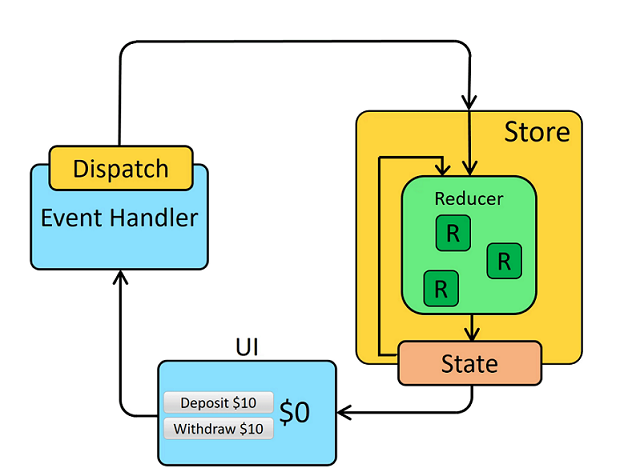
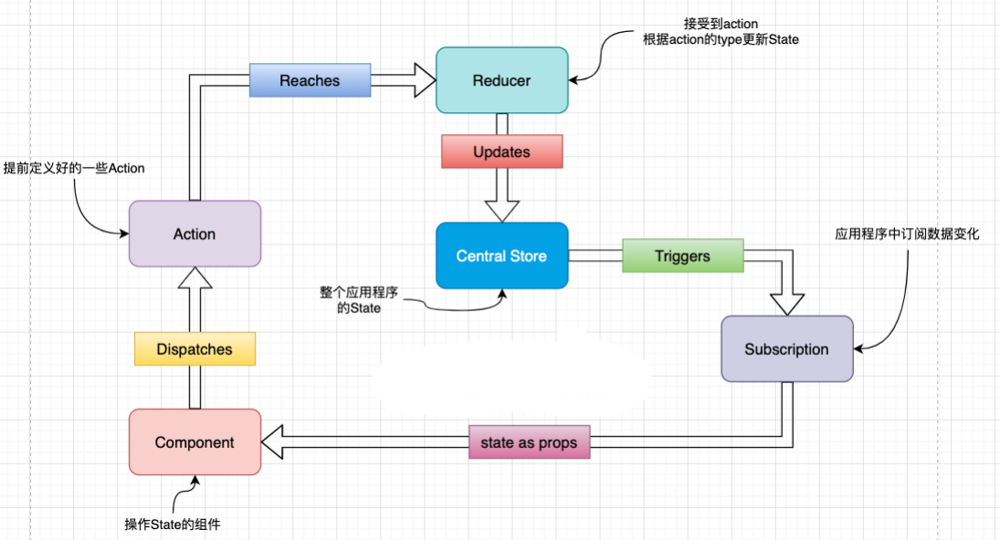
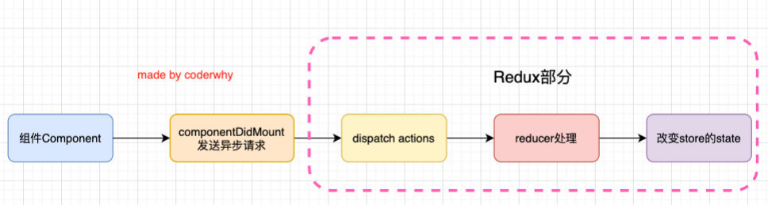
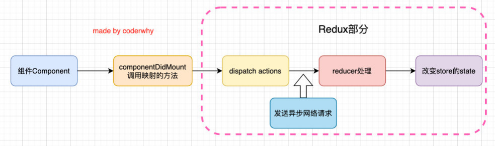

# React进阶2

# 一、React UI组件库

## 1.ant-design(国内蚂蚁金服)

### 1.1 antd的基本使用

1.安装antd

​	yarn add antd

2.导入使用的组件及antd（全部）的css文件

​	import { Button, DatePicker } from 'antd';

​	import 'antd/dist/antd.css'

3.使用组件（具体看文档案例，更多配置看选项API的内容）

```jsx
<Button type="primary" icon={<SearchOutlined />}>
    Search
</Button>
<DatePicker />
```

### 1.2 antd的按需引入

1.安装依赖：yarn add react-app-rewired customize-cra babel-plugin-import

2.修改package.json

```js
...
"scripts": {
    "start": "react-app-rewired start",
    "build": "react-app-rewired build",
    "test": "react-app-rewired test",
    "eject": "react-scripts eject"
},
...
```

3.根目录下创建config-overrides.js

```js
//配置具体的修改规则
const { override, fixBabelImports} = require('customize-cra');
module.exports = override(
  // 配置babel-plugin-import ==> 只打包import模块及css
  fixBabelImports('import', {
    libraryName: 'antd', //对哪个库进行按需引入
    libraryDirectory: 'es', //样式模块化作为ES6模块处理
    // style: 'css', // 自动打包组件对应css
    style: true, // 加载less编译
  }),
);
```

4.注：不用在组件里引入样式了，即：import 'antd/dist/antd.css'应该删掉

5.注意版本问题，此处是antd3.x的写法

### 1.3 antd自定义主题

1.安装依赖：yarn add less less-loader

2.根目录下创建config-overrides.js

```js
//配置具体的修改规则
const {addLessLoader} = require('customize-cra');
module.exports = override(
    ...,
    // 添加less-loader对应的配置  ==> 修改primary对应的颜色
    addLessLoader({
        lessOptions:{
            javascriptEnabled: true,
            modifyVars: { '@primary-color': 'green' },
        }
    }),
);
```

3.注意版本问题，此处是antd3.x，less-loader7.1的写法

### 1.4 antd自定义主题 - v4方案

1.安装依赖：yarn add @craco/craco

2.修改package.json文件

- 原本启动时，我们是通过react-scripts来管理的

- 现在启动时，我们通过craco来管理

```js
...
"scripts": {
    "start": "craco start",
    "build": "craco build",
    "test": "craco test",
    "eject": "react-scripts eject"
},
...
```

3.根目录下创建craco.config.js文件用于修改默认配置

```js
module.exports = {
	// 配置文件
}
```

4.引入 craco-less 来帮助加载 less 样式和修改变量

- 安装 craco-less：yarn add craco-less
- 修改craco.config.js中的plugins：
  - 使用modifyVars可以在运行时修改LESS变量

```js
const CracoLessPlugin = require('craco-less');
module.exports = {
    plugins: [
        {
            plugin: CracoLessPlugin,
            options: {
                lessLoaderOptions: {
                    lessOptions: {
                        modifyVars: { '@primary-color': '#1DA57A' },
                        javascriptEnabled: true,
                    },
                },
            },
        },
    ],
}
```

5.引入antd的样式时，引入antd.less文件：

import 'antd/dist/antd.less';

### 1.5 配置别名 - 使用craco

- 在项目开发中，某些组件或者文件的层级会较深

- 如果我们通过上层目录去引入就会出现这样的情况：../../../../components/button

- 如果我们可以配置别名，就可以直接从根目录下面开始查找文件：@/components/button，甚至是：components/button

- 配置别名也需要修改webpack的配置，当然我们也可以借助于 craco 来完成：

```js
...
const path = require("path");
const resolve = dir => path.resolve(__dirname, dir);
module.exports = {
    ...,
    webpack: {
        alias: {
            '@': resolve("src"),
            'components': resolve("src/components"),
        }
    }
}
```

- 在导入时就可以按照下面的方式来使用了：

```js
import CommentInput from '@/components/comment-input';
import CommentItem from 'components/comment-item';
```

**案例：** 评论留言板

```jsx
//CommentInput.js
import React, { PureComponent } from 'react';
import moment from 'moment';
import { Input, Button } from "antd";

export default class CommentInput extends PureComponent {
  constructor(props) {
    super(props);

    this.state = {
      content: ""
    }
  }

  render() {
    return (
      <div>
        <Input.TextArea rows={4} 
                        value={this.state.content}
                        onChange={e => this.handleChange(e)}/>
        <Button type="primary" onClick={e => this.addComment()}>添加评论</Button>
      </div>
    )
  }

  handleChange(event) {
    this.setState({
      content: event.target.value
    })
  }

  addComment() {
    const commentInfo = {
      id: moment().valueOf(),
      avatar: "https://upload.jianshu.io/users/upload_avatars/1102036/c3628b478f06.jpeg?imageMogr2/auto-orient/strip|imageView2/1/w/240/h/240",
      nickname: "coderwhy",
      datetime: moment(),
      content: this.state.content,
      comments: [
        
      ]
    }

    this.props.submitComment(commentInfo);

    this.setState({
      content: ""
    })
  }
}

//CommentItem.js
import React, { PureComponent } from 'react';
import {
  Comment,
  Avatar,
  Tooltip
} from "antd";
import { DeleteOutlined } from "@ant-design/icons";

export default class CommentItem extends PureComponent {
  render() {
    const { nickname, avatar, content, datetime } = this.props.comment;

    return (
      <Comment
        author={<a href="/#">{nickname}</a>}
        avatar={<Avatar src={avatar} alt={nickname} />}
        content={<p>{content}</p>}
        datetime={
          <Tooltip title={datetime.format("YYYY-MM-DD")}>
            <span>{datetime.fromNow()}</span>
          </Tooltip>
        }
        actions={[
          <span onClick={e => this.removeItem()}><DeleteOutlined />删除</span>
        ]}
      />
    )
  }

  removeItem() {
    this.props.removeItem();
  }
}

//app.js
import React, { PureComponent } from 'react';
import CommentInput from './components/CommentInput';
import CommentItem from './components/CommentItem';

export default class App extends PureComponent {
  constructor(props) {
    super(props);

    this.state = {
      commentList: []
    }
  }

  render() {
    return (
      <div style={{width: "500px", padding: "20px"}}>
        {
          this.state.commentList.map((item, index) => {
            return <CommentItem key={item.id} 
                                comment={item} 
                                removeItem={e => this.removeComment(index)}/>
          })
        }
        <CommentInput submitComment={this.submitComment.bind(this)}/>
      </div>
    )
  }

  submitComment(info) {
    this.setState({
      commentList: [...this.state.commentList, info]
    })
  }

  removeComment(index) {
    const newCommentList = [...this.state.commentList];
    newCommentList.splice(index, 1);
    this.setState({
      commentList: newCommentList
    })
  }
}
```

**注：** moment设置为中文显示

```js
//导入国际化文件（地区），设置为简体中文
import 'moment/locale/zh-cn';
```

# 二、redux

## 1.redux理解

### 1.1 redux是什么

1.redux是一个专门用于做**状态管理**的JS库(不是react插件库)。

2.它可以用在react, angular, vue等项目中, 但基本与react配合使用。

3.作用：集中式管理react应用中多个组件**共享**的**状态**。

### 1.2 什么情况下需要使用redux

1.某个组件的状态，需要让其他组件可以随时拿到（共享）。

2.一个组件需要改变另一个组件的状态（通信）。

3.总体原则：能不用就不用, 如果不用比较吃力才考虑使用。

### 1.3 redux工作原理图


### 1.3 redux官方图



### 1.5 安装redux

yarn add redux

## 2.redux的三个核心概念

### 2.1 action

1.动作的对象（一般的Object对象）

2.包含2个属性

- type：标识属性, 值为字符串, 唯一, 必要属性

- data：数据属性, 值类型任意, 可选属性

3.例子：{ type: 'ADD_STUDENT', data: {name: 'tom',age:18} }

4.Redux要求我们通过action来更新数据：

- 所有数据的变化，必须通过派发（dispatch）action来更新

### 2.2 reducer

1.将state和action联系在一起，用于初始化状态、加工状态。

2.加工时，根据旧的state和action， 产生新的state的**纯函数**。

### 2.3 store

1.redux库最核心的管理对象

2.它内部维护着：state 和 reducer

3.将state、action、reducer联系在一起的对象

4.如何得到此对象?

​	1) import {createStore} from 'redux'

​	2) import reducer from './reducers'

​	3) const store = createStore(reducer)

5.此对象的功能?

​	1) getState(): 得到state

​	2) dispatch(action): 分发action, 触发reducer调用, 产生新的state

​	3) subscribe(listener): 注册监听, 当产生了新的state时，自动调用，返回取消监听的函数

## 3.redux三大原则

1）单一数据源

- 整个应用程序只有一个store

2）State是只读的

- 唯一修改State的方法一定是触发action，不要试图在其他地方通过任何的方式来修改State

3）使用纯函数来执行修改

- 随着应用程序的复杂度增加，我们可以将reducer拆分成多个小的reducers，所有的reducer都应该是纯函数，不能产生任何的副作用

## 4.redux的核心API

### 4.1 createStore()

- 创建包含指定reducer的store对象。第一个参数为reducer或总的reducer；第二个参数为使用的中间件，要配合applyMiddleware函数传入

### 4.2 applyMiddleware()

- 应用上基于redux的中间件(插件库)。参数为使用的中间件

### 4.3 combineReducers()

- 合并多个reducer函数。参数为一个对象，key为各组件状态的名称，value是各组件的reducer
- combineReducers的原理：
  - 将我们传入的reducers合并到一个对象中，最终返回一个combination的函数
  - 在执行combination函数的过程中，它会通过判断前后返回的数据是否相同来决定返回之前的state还是新的state。
  - 新的state会触发订阅者发生对应的刷新，而旧的state可以有效的组织订阅者发生刷新。

### 4.4 redux开发流程图



## 5.求和案例-redux精简版

├─ public
│  ├─ favicon.ico
│  └─ index.html
├─ src
│  ├─ App.jsx
│  ├─ components
│  │  └─ Count
│  │     └─ index.jsx
│  ├─ index.js
│  └─ redux
│     ├─ count_reducer.js
│     └─ store.js

**总结**

(1).去除Count组件自身的状态

(2).src下建立:

​    -redux
​        -store.js
​        -count_reducer.js

(3).store.js：

​    1).引入redux中的createStore函数，创建一个store，且整个应用只有一个store对象

​    2).createStore调用时要传入一个为其服务的reducer

​    3).记得暴露store对象

(4).count_reducer.js：

​    1).reducer的本质是一个函数，接收：preState，action，返回加工后的状态

​    2).reducer有两个作用：初始化状态，加工状态

​    3).reducer被第一次调用时，是store自动触发的，

​        传递的preState是undefined,

​        传递的action是:{type:'@@REDUX/INIT_a.2.b.4}

(5).在index.js中监测store中状态的改变，一旦发生改变重新渲染< App />

- 注：redux只负责管理状态，至于状态的改变驱动着页面的展示，要靠我们自己写。

## 6.求和案例-redux完整版

├─ public
│  ├─ favicon.ico
│  └─ index.html
├─ src
│  ├─ App.jsx
│  ├─ components
│  │  └─ Count
│  │     └─ index.jsx
│  ├─ index.js
│  └─ redux
│     ├─ constant.js
│     ├─ count_action.js
│     ├─ count_reducer.js
│     └─ store.js

**总结**

新增文件：

​    1.count_action.js 专门用于创建action对象

​    2.constant.js 放置容易写错的type值

## 7.redux异步编程

### 7.1 理解

1.redux默认是不能进行异步处理的, 

2.某些时候应用中需要在**redux**中**执行异步任务**(ajax, 定时器)

3.组件中异步操作：

- 网络请求可以在class组件的componentDidMount中发送：



4.redux中异步操作

- 一般我们必须将网络请求的异步代码放到组件的生命周期中来完成

- 事实上，网络请求到的数据也属于我们状态管理的一部分，更好的一种方式应该是将其也交给redux来管理



### 7.2 redux-thunk简介

- 默认情况下的dispatch(action)，action需要是一个JavaScript的对象

- redux-thunk可以让dispatch(action函数)，action可以是一个函数

- 该函数会被调用，并且会传给这个函数一个dispatch函数和getState函数
  - dispatch函数用于我们之后再次派发action
  - getState函数考虑到我们之后的一些操作需要依赖原来的状态，用于让我们可以获取之前的一些状态

### 7.3 使用异步中间件redux-thunk

1）yarn add redux-thunk

2）import thunk from 'redux-thunk'

3）export default createStore(countReducer, applyMiddleware(thunk))

### 7.4 异步action

1.异步action，就是指action的值为 **函数** ，异步action中一般都会调用同步action，异步action不是必须要用的。

2.实现

```js
export const createIncrementAction = data => ({type:INCREMENT,data})

export const createIncrementAsyncAction = (data,time) => {
    //一般写法
	// return ()=>{
	// 	setTimeout(()=>{
	// 		store.dispatch(createIncrementAction(data))
	// 	},time)
	// }
	
	//简化写法
	return (dispatch, getState)=>{
		setTimeout(()=>{
			dispatch(createIncrementAction(data))
		},time)
	}
}
```

## 8.求和案例-redux异步action版

├─ public
│  ├─ favicon.ico
│  └─ index.html
├─ 4_src_异步action版
│  ├─ App.jsx
│  ├─ components
│  │  └─ Count
│  │     └─ index.jsx
│  ├─ index.js
│  └─ redux
│     ├─ constant.js
│     ├─ count_action.js
│     ├─ count_reducer.js
│     └─ store.js

**总结**

(1).明确：延迟的动作不想交给组件自身，想交给action

(2).何时需要异步action：想要对状态进行操作，但是具体的数据靠异步任务返回。

(3).实现：

​    1).引入redux-thunk，使用applyMiddleware函数应用中间件，并配置在createStore函数的第二个参数

​    2).创建action的函数不再返回一般对象，而是一个函数，该函数中写异步任务，即异步action

​    3).异步任务有结果后，分发一个同步的action去真正操作数据。

(4).注：异步action不是必须要写的，完全可以自己等待异步任务的结果了再去分发同步action。

## 9.react-redux

### 9.1 理解

1.一个react插件库

2.专门用来简化react应用中使用redux

3.连接redux、react的辅助工具库

### 9.2 react-redux将所有组件分成两大类

1.UI组件

​	1) 只负责 UI 的呈现，不带有任何业务逻辑

​	2) 通过props接收数据(一般数据和函数)

​	3) 不使用任何 Redux 的 API

​	4) 一般保存在components文件夹下

2.容器组件

​	1) 负责管理数据和业务逻辑，不负责UI的呈现

​	2) 使用 Redux 的 API

​	3) 一般保存在containers文件夹下

### 9.3 react-redux模型图


### 9.4 react-redux核心API

1.安装react-redux

yarn add react-redux

2.Provider：让所有容器组件都可以得到state数据

```jsx
<Provider store={store}>
  <App />
</Provider>
```

3.connect：用于包装 UI 组件生成容器组件

```react
import { connect } from 'react-redux'
connect(
    mapStateToprops,
    mapDispatchToProps
)(Counter)
```

4.mapStateToprops：将外部的数据（即state对象）转换为UI组件的标签属性

```js
const mapStateToprops = function (state) {
  return {count: state}
}
```

5.mapDispatchToProps：将分发action的函数转换为UI组件的标签属性，也可以是一个对象（简写方式）

```js
const mapDispatchToProps = function (dispatch){
	return {
		add: number => dispatch(createAddAction(number)),
		sub: number => dispatch(createSubAction(number)),
		addAsync: (number,time) => dispatch(createAddAsyncAction(number,time)),
	}
}
```

## 10.求和案例-react-redux版

├─ public
│  ├─ favicon.ico
│  └─ index.html
├─ src
│  ├─ App.jsx
│  ├─ components
│  │  └─ Count
│  │     └─ index.jsx
│  ├─ containers
│  │  └─ Count
│  │     └─ index.jsx
│  ├─ index.js
│  └─ redux
│     ├─ constant.js
│     ├─ count_action.js
│     ├─ count_reducer.js
│     └─ store.js

**总结**

(1).如何创建一个容器组件 ——— 用react-redux 的 connect函数

​    connect(mapStateToProps,mapDispatchToProps)(UI组件)

​        -mapStateToProps：映射状态，返回值是一个对象

​        -mapDispatchToProps：映射操作状态的方法，返回值是一个对象

(2).注：容器组件中的store是靠props传进去的，而不是在容器组件中直接引入

## 11.求和案例-react-redux优化版

├─ public
│  ├─ favicon.ico
│  └─ index.html
├─ src
│  ├─ App.jsx
│  ├─ containers
│  │  └─ Count
│  │     └─ index.jsx
│  ├─ index.js
│  └─ redux
│     ├─ constant.js
│     ├─ count_action.js
│     ├─ count_reducer.js
│     └─ store.js

**总结**

(1).容器组件和UI组件整合一个文件

(2).无需自己给容器组件传递store，给< App/ >包裹一个< Provider store={store} >< /Provider >即可。

(3).使用了react-redux后也不用再自己检测redux中状态的改变了，容器组件可以自动完成这个工作。

(4).mapDispatchToProps也可以简单的写成一个对象（简写方式）

(5).一个组件要和redux“打交道”要经过哪几步？

​    1.定义好UI组件 --- 不暴露

​    2.引入connect生成一个容器组件，并暴露，写法如下：

```js
connect(
    state => ({key:value}),  //映射状态
    {key:xxxAction}  //映射操作状态的方法
)(UI组件)
```

​	3.在UI组件中通过 this.props.xxx 读取和操作状态

## 12.求和案例-react-redux数据共享版

├─ public
│  ├─ favicon.ico
│  └─ index.html
├─ src
│  ├─ App.jsx
│  ├─ containers
│  │  ├─ Count
│  │  │  └─ index.jsx
│  │  └─ Person
│  │     └─ index.jsx
│  ├─ index.js
│  └─ redux
│     ├─ actions
│     │  ├─ count.js
│     │  └─ person.js
│     ├─ constant.js
│     ├─ reducers
│     │  ├─ count.js
│     │  └─ person.js
│     └─ store.js

**总结**

(1).定义一个Person组件，和Count组件通过redux共享数据。

(2).为Person组件编写：reducer、action，配置constant常量。

(3).重点：Person的reducer和Count的Reducer要使用combineReducers进行合并，

​    合并后的总状态（state）是一个对象！！！

(4).交给store的是总reducer

(5).最后注意在组件中取出状态的时候，准确提取数据。

## 13.redux调试工具的使用

1.安装chrome浏览器插件Redux DevTools

2.安装调试工具依赖包

yarn add redux-devtools-extension -D

## 14.求和案例-redux调试工具的使用

├─ public
│  ├─ favicon.ico
│  └─ index.html
├─ src
│  ├─ App.jsx
│  ├─ containers
│  │  ├─ Count
│  │  │  └─ index.jsx
│  │  └─ Person
│  │     └─ index.jsx
│  ├─ index.js
│  └─ redux
│     ├─ actions
│     │  ├─ count.js
│     │  └─ person.js
│     ├─ constant.js
│     ├─ reducers
│     │  ├─ count.js
│     │  └─ person.js
│     └─ store.js

**总结**

(1).store中进行配置

​    import {composeWithDevTools} from 'redux-devtools-extension'

​    const store = createStore(allReducer, composeWithDevTools(applyMiddleware(thunk)))

## 15.求和案例-react-redux最终版

├─ public
│  ├─ favicon.ico
│  └─ index.html
├─ src
│  ├─ App.jsx
│  ├─ containers
│  │  ├─ Count
│  │  │  └─ index.jsx
│  │  └─ Person
│  │     └─ index.jsx
│  ├─ index.js
│  └─ redux
│     ├─ actions
│     │  ├─ count.js
│     │  └─ person.js
│     ├─ constant.js
│     ├─ reducers
│     │  ├─ count.js
│     │  ├─ index.js
│     │  └─ person.js
│     └─ store.js

**总结**

(1).所有变量名字要规范，尽量触发对象的简写形式。

(2).reducers文件夹中，编写index.js专门用于汇总并暴露所有的reducer。

## 16.纯函数和高阶函数

### 16.1 纯函数

1.一类特别的函数：只要是同样的输入(实参)，必定得到同样的输出(返回)

2.必须遵守以下一些约束

​	1) 不得改写参数数据

​	2) 不会产生任何副作用，例如网络请求，输入和输出设备

​	3) 不能调用Date.now()或者Math.random()等不纯的方法 

3.redux的reducer函数必须是一个纯函数

### 16.2 高阶函数

1.理解: 一类特别的函数

​	1) 情况1: 参数是函数

​	2) 情况2: 返回是函数

2.常见的高阶函数: 

​	1) 定时器设置函数

​	2) 数组的forEach()/map()/filter()/reduce()/find()/bind()

​	3) promise

​	4) react-redux中的connect函数

3.作用: 能实现更加动态, 更加可扩展的功能


