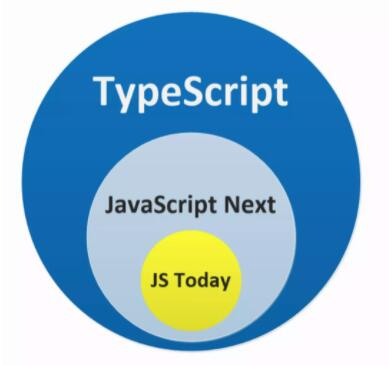
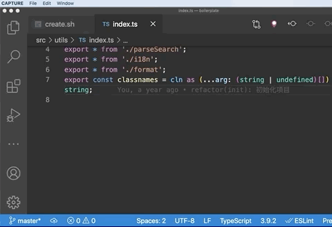

# TypeScript

# 一、TypeScript简介

## 1.TypeScript简介

1.TypeScript是JavaScript的超集。

2.TypeScript 其实就是类型化的 JavaScript，它不仅支持 JavaScript 的所有特性，还在 JavaScript 的基础上添加了静态类型注解扩展。

3.相较于JS而言，TS拥有了静态类型，更加严格的语法，更强大的功能；TS可以在代码执行前就完成代码的检查，减小了运行时异常的出现的几率；TS代码可以编译为任意版本的JS代码，可有效解决不同JS运行环境的兼容问题；同样的功能，TS的代码量要大于JS，但由于TS的代码结构更加清晰，变量类型更加明确，在后期代码的维护中TS却远远胜于JS。

4.TS代码需要通过编译器编译为JS，然后再交由JS解析器执行。



## 2.TypeScript 开发环境搭建

1.下载Node.js

- 官网下载：https://nodejs.org/zh-cn/

2.安装Node.js

- 安装后输入 node -v 查看版本信息

3.使用npm / yarn全局安装typescript

   - 打开命令行输入：npm install -g typescript / yarn global add typescript

   - 安装后输入 tsc -v 查看版本信息

4.创建一个ts文件

5.使用tsc对ts文件进行编译

   - 打开命令行，再进入ts文件所在目录

   - 执行命令：tsc xxx.ts

6.使用node命令运行ts编译后的js的文件

- node xxx.js

7.全局安装直接在node端直接运行ts代码的ts-node，简化开发操作

- npm install -g ts-node / yarn global add ts-node

- 打开命令行，再进入ts文件所在目录

- 执行命令：ts-node xxx.ts

## 3.VS Code开发TS的注意事项

1.因为 VS Code 中内置了特定版本的 TypeScript 语言服务，所以它天然支持 TypeScript 语法解析和类型检测，且这个内置的服务与手动安装的 TypeScript 完全隔离。因此，**VS Code 支持在内置和手动安装版本之间动态切换语言服务，从而实现对不同版本的 TypeScript 的支持**。

2.如果当前应用目录中安装了与内置服务不同版本的 TypeScript，我们就可以点击 VS Code 底部工具栏的版本号信息，从而实现 “use VS Code's Version” 和 “use Workspace's Version” 两者之间的随意切换。

3.**特别注意！**：VS Code 默认使用自身内置的 TypeScript 语言服务版本，而在应用构建过程中，构建工具使用的却是应用路径下 node_modules/typescript 里的 TypeScript 版本。如果两个版本之间存在不兼容的特性，就会造成开发阶段和构建阶段静态类型检测结论不一致的情况，因此，我们务必将 VS Code 语言服务配置成使用当前工作区的 TypeScript 版本。

- 工作区局部安装 typescript ：npm install typescript / yarn add typescript



## 4.TypeScript初体验

1.初始化typescript项目，生成配置文件

- 打开命令行输入：tsc --init

- 生成tsconfg.json**配置 TypeScript 的行为**

- 该配置将决定了 VS Code 语言服务如何对当前应用下的 TypeScript 代码进行类型检测。

2.编写HelloWorld.ts文件

```typescript
function say(word: string) {
  console.log(word);
}
say('Hello, World');

let str1: string
str1 = 'hello'
console.log(str1);

let str2: string = 'hello2'
console.log(str2);
```

3.执行tsc转译命令

- tsc HelloWorld.ts

**注意：** 指定转译的目标文件后，tsc 将**忽略**当前应用路径下的 tsconfig.json 配置，因此我们需要通过显式设定如下所示的参数，让 tsc 以严格模式检测并转译 TypeScript 代码。同时，我们可以给 tsc 设定一个 watch 参数监听文件内容变更，实时进行类型检测和代码转译。

- tsc HelloWorld.ts --strict --alwaysStrict false --watch

4.直接使用 ts-node 运行 HelloWorld.ts

- ts-node HelloWorld.ts

输出结果：

Hello, World

hello

hello2

5.**注意：** TypeScript 的类型注解旨在约束函数或者变量，在上面的例子中，我们就是通过约束一个示例函数来接收一个字符串类型（string）的参数。如果按如下写法，传入的参数不是string类型，则vscode会标红这个错误，并在问题（Problems）面板中显示错误信息

```typescript
function say(word: string) {
  console.log(word);
}
say(1); //变量类型不匹配错误
```

# 二、数据类型

## 1.基本语法

1.在语法层面，缺省类型注解（类型声明）的 TypeScript 与 JavaScript 完全一致。因此，我们可以把 TypeScript 代码的编写看作是为 JavaScript 代码添加类型注解（类型声明）。

- 类型声明是TS非常重要的一个特点

- 通过类型声明可以指定TS中变量（参数、形参）的类型

- 指定类型后，当为变量赋值时，TS编译器会自动检查值是否符合类型声明，符合则赋值，否则报错

- 简而言之，类型声明给变量设置了类型，使得变量只能存储某种类型的值

```typescript
//1.缺省类型声明
let num = 1;
//2.添加了类型声明
let num: number = 1;
```

2.语法：

```typescript
//1.字面量定义
let 变量名: 变量类型 = 初始化值;
//2.先声明，后赋值
let 变量名: 变量类型;
变量名 = 变量值;
```

3.**自动类型判断**

- TS拥有自动的类型判断机制

- 当对变量的声明和赋值是同时进行时，TS编译器会自动判断变量的类型

- 所以如果你的变量的声明和赋值时同时进行的，可以省略掉类型声明

```typescript
//1.缺省类型声明
let num = 1;

简化写法：

//2.添加了类型声明
let num: number = 1;
```

- 在以下代码中，x1 的类型被推断为 number，将变量赋值给 number 类型的变量 x2 后，不会出现任何错误。

```typescript
let x1 = 42; // 推断出 x1 的类型是 number
let x2: number = x1; // ok
```

- 在 TypeScript 中，具有初始化值的变量、有默认值的函数参数、函数返回的类型都可以根据**上下文推断**出来。比如我们能根据 return 语句推断函数返回的类型，如下代码所示：

```typescript
/** 根据参数的类型，推断出返回值的类型也是 number */
function add1(a: number, b: number) {
  return a + b;
}
const x1= add1(1, 1); // 推断出 x1 的类型也是 number

/** 推断参数 b 的类型是数字或者 undefined，返回值的类型也是数字 */
function add2(a: number, b = 1) {
  return a + b;
}
const x2 = add2(1);
const x3 = add2(1, '1'); // ts(2345) Argument of type '"1"' is not assignable to parameter of type 'number | undefined
```

在上述 add1 函数中，我们 return 了变量 a + b 的结果，因为 a 和 b 的类型为 number，所以函数返回类型被推断为 number。

当然，拥有默认值的函数参数的类型也能被推断出来。比如上述 add2 函数中，b 参数被推断为 number | undefined 类型，如果我们给 b 参数传入一个字符串类型的值，由于函数参数类型不一致，此时编译器就会抛出一个 ts(2345) 错误。

## 2.类型种类

|    类型    |          例子          |                         描述                         |
| :--------: | :--------------------: | :--------------------------------------------------: |
|   number   |      1, -33, 2.5       |                       任意数字                       |
|   string   | 'hi', "hi", 模板字符串 |                      任意字符串                      |
|  boolean   |      true、false       |                  布尔值true或false                   |
|    any     |           *            |                 TS新增类型，任意类型                 |
|  unknown   |           *            |              TS新增类型，类型安全的any               |
|    void    |   空值（undefined）    |          TS新增类型，没有值（或undefined）           |
|   never    |         没有值         |               TS新增类型，不能是任何值               |
|   object   |    {name:'孙悟空'}     |                     任意的JS对象                     |
|   array    |        [1,2,3]         |                      任意JS数组                      |
|   tuple    |         [4,5]          |            TS新增类型，元素，固定长度数组            |
|    enum    |       enum{A, B}       |                  TS中新增类型，枚举                  |
|  联合类型  |   boolean \| string    | TS中新增类型，为变量指定多个类型，可以是其中一种类型 |
| 字面量声明 |       let a: 10        |                  使用字面量代表类型                  |
|  交叉类型  |   Colors & Rectangle   |           通过&将两个或多个类型合并到一起            |

## 3.字符串（string）

1.使用`string`表示 JavaScript 中任意的字符串（包括模板字符串），且**所有 JavaScript 支持的定义字符串的方法，我们都可以直接在 TypeScript 中使用。**

```typescript
//先声明，后赋值
let firstname1: string;
firstname1 = 'Captain';
//字符串字面量
let firstname: string = 'Captain';
//显式类型转换
let familyname: string = String('S');
//模板字符串
let fullname: string = `my name is ${firstname}.${familyname}`;
```

## 4.数字（number）

1.使用`number`类型表示 JavaScript 已经支持或者即将支持的十进制整数、浮点数，以及二进制数、八进制数、十六进制数。

```typescript
/** 十进制整数 */
let integer: number = 6;
/** 十进制整数 */
let integer2: number = Number(42);
/** 十进制浮点数 */
let decimal: number = 3.14;
/** 二进制整数 */
let binary: number = 0b1010;
/** 八进制整数 */
let octal: number = 0o744;
/** 十六进制整数 */
let hex: number = 0xf00d;
```

## 5.布尔值（boolean）

1.使用`boolean`表示 True 或者 False

```typescript
/** TypeScript 真香 为 真 */
let TypeScriptIsGreat: boolean = true;
 /** TypeScript 太糟糕了 为 否 */
let TypeScriptIsBad: boolean = false;
```

## 6.Symbol（ES6新增）

1.可以通过`Symbol`构造函数，创建一个独一无二的标记；同时，还可以使用`symbol`表示如下代码所示的类型。

```typescript
let sym1: symbol = Symbol();
let sym2: symbol = Symbol('42');
```

## 7.any

1.any 指的是一个任意类型，它是官方提供的一个选择性绕过静态类型检测的作弊方式。

2.我们可以对被注解为 any 类型的变量进行任何操作，包括获取事实上并不存在的属性、方法，并且 TypeScript 还无法检测其属性是否存在、类型是否正确。

3.比如我们可以把任何类型的值赋值给 any 类型的变量，也可以把 any 类型的值赋值给任意类型（除 never 以外）的变量，如下代码所示：

```typescript
let anything: any = {};
anything.doAnything(); // 不会提示错误
anything = 1; // 不会提示错误
anything = 'x'; // 不会提示错误
let num: number = anything; // 不会提示错误
let str: string = anything; // 不会提示错误
```

4.如果我们不想花费过高的成本为复杂的数据添加类型注解，或者已经引入了缺少类型注解的第三方组件库，这时就可以把这些值全部注解为 any 类型，并告诉 TypeScript 选择性地忽略静态类型检测。

5.尤其是在将一个基于 JavaScript 的应用改造成 TypeScript 的过程中，我们不得不借助 any 来选择性添加和忽略对某些 JavaScript 模块的静态类型检测，直至逐步替换掉所有的 JavaScript。

6.any 类型会在对象的调用链中进行传导，即所有 any 类型的任意属性的类型都是 any，如下代码所示：

```typescript
let anything: any = {};
let z = anything.x.y.z; // z 类型是 any，不会提示错误
z(); // 不会提示错误
```

从长远来看，使用 any 绝对是一个坏习惯。如果一个 TypeScript 应用中充满了 any，此时静态类型检测基本起不到任何作用，也就是说与直接使用 JavaScript 没有任何区别。**因此，除非有充足的理由，否则我们应该尽量避免使用 any ，并且开启禁用隐式 any 的设置。**

## 8.unknown（类型安全的any）

1.主要用来描述类型并不确定的变量

2.比如在多个 if else 条件分支场景下，它可以用来接收不同条件下类型各异的返回值的临时变量，如下代码所示：

```typescript
let result: unknown;
if (x) {
  result = x();
} else if (y) {
  result = y();
}
...
```

3.与 any 不同的是，unknown 在类型上更安全。比如我们可以将任意类型的值赋值给 unknown，但 unknown 类型的值只能赋值给 unknown 或 any，如下代码所示：

```typescript
let result: unknown;
let num: number = result; // 提示 ts(2322)
let anything: any = result; // 不会提示错误
let notSure: unknown = 4;
notSure = 'hello';
```

4.使用 unknown 后，TypeScript 会对它做类型检测。但是，如果不缩小类型（Type Narrowing），我们对 unknown 执行的任何操作都会出现如下所示错误：

```typescript
let result: unknown;
result.toFixed(); // 提示 ts(2571)
```

5.**而所有的类型缩小手段对 unknown 都有效**，如下代码所示：

```typescript
let result: unknown;
if (typeof result === 'number') { //类型守卫
  result.toFixed(); // 此处 hover result 提示类型是 number，不会提示错误
}
```

## 9.void、undefined、null（用的少）

1.它仅适用于表示没有返回值的函数。即如果该函数没有返回值，那它的类型就是 void。

```typescript
function fn(): void{
}
```

2.在 strict 模式下，声明一个 void 类型的变量几乎没有任何实际用处，因为我们不能把 void 类型的变量值再赋值给除了 any 和 unkown 之外的任何类型变量。

3.undefined 类型 和 null 类型，它们是 TypeScript 值与类型关键字同名的唯二例外。

undefined 的最大价值主要体现在接口类型上，它表示一个可缺省、未定义的属性。

4.我们可以把 undefined 值或类型是 undefined 的变量赋值给 void 类型变量，反过来，类型是 void 但值是 undefined 的变量不能赋值给 undefined 类型。

```typescript
let undeclared: undefined = undefined;
let unusable: void = undefined;
unusable = undeclared; // ok
undeclared = unusable; // ts(2322)
```

## 10.never（用的少）

1.never 表示永远不会发生值的类型，这里我们举一个实际的场景进行说明。

2.首先，我们定义一个统一抛出错误的函数，代码示例如下（圆括号后 : + 类型注解 ，表示函数返回值的类型）

```typescript
function ThrowError(msg: string): never {
  throw Error(msg);
}
```

以上函数因为永远不会有返回值，所以它的返回值类型就是 never。

3.同样，如果函数代码中是一个死循环，那么这个函数的返回值类型也是 never，如下代码所示。

```typescript
function InfiniteLoop(): never {
  while (true) {}
}
```

4.never 是所有类型的子类型，它可以给所有类型赋值，但是反过来，除了 never 自身以外，其他类型（包括 any 在内的类型）都不能为 never 类型赋值。如下代码所示。

```typescript
let Unreachable: never;
Unreachable = 1; // ts(2322)
Unreachable = 'string'; // ts(2322)
Unreachable = true; // ts(2322)
let num: number = Unreachable; // ok
let str: string = Unreachable; // ok
let bool: boolean = Unreachable; // ok
```

## 11.object（用的少）

1.object 类型表示非原始类型的类型，即非 number、string、boolean、bigint、symbol、null、undefined 的类型。

示例：

```typescript
let obj: object = {};
```

2.一个应用场景是用来表示 Object.create 的类型：

```typescript
declare function create(o: object | null): any;
create({}); // ok
create(() => null); // ok
create(2); // ts(2345)
create('string'); // ts(2345)
```

## 12.数组类型（Array）

1.第一种定义方式：直接使用 [] 的形式定义数组类型，语法：类型[]

```typescript
/** 子元素是数字类型的数组 */
let arrayOfNumber: number[] = [1, 2, 3];
/** 子元素是字符串类型的数组 */
let arrayOfString: string[] = ['x', 'y', 'z'];
```

2.第二种定义方式：使用 Array 泛型定义数组类型，语法：Array<类型>

```typescript
/** 子元素是数字类型的数组 */
let arrayOfNumber: Array<number> = [1, 2, 3];
/** 子元素是字符串类型的数组 */
let arrayOfString: Array<string> = ['x', 'y', 'z'];
```

以上两种定义数组类型的方式虽然本质上没有任何区别，但是更推荐使用 [] 这种形式来定义。**一方面可以避免与 JSX 的语法冲突，另一方面可以减少不少代码量**。

3.如果我们明确指定了数组元素的类型，以下所有操作都将因为不符合类型约定而提示错误。

```typescript
let arrayOfNumber: number[] = ['x', 'y', 'z']; // 提示 ts(2322)
arrayOfNumber[3] = 'a'; // 提示 ts(2322)
arrayOfNumber.push('b'); // 提示 ts(2345)
let arrayOfString: string[] = [1, 2, 3]; // 提示 ts(2322)
arrayOfString[3] = 1; // 提示 ts(2322)
arrayOfString.push(2); // 提示 ts(2345)
```

## 13.元组类型（Tuple）

1.元组就是固定长度的数组，它最重要的特性是可以限制数组元素的个数和类型，它特别适合用来实现多值返回。应用场景如react hooks的useState。

2.语法：[类型, 类型, 类型]

```typescript
let h: [string, number];
h = ['hello', 123];
```

## 14.联合类型

1.TypeScript 中支持一个变量可以赋予多种不同的变量类型，多个变量类型使用 `|` 分隔。

2.联合类型作为函数参数时，在函数内vscode可以直接提示出共有属性，但不能提示出私有属性

```typescript
let num: number | null | undefined;
num = 3;
console.log(num);
num = null;
console.log(num);
num = undefined;
console.log(num);
num = 'ff' //报错


interface Bird {
    fly: Boolean;
    sing: () => {}
}

interface Dog {
    fly: Boolean;
    dark: () => {}
}

// animal 参数可以是 Bird 或 Dog，语法提示可以直接提示出共有属性 fly，但是不能直接提示出 sing 和 dark。
function trainAnimal(animal: Bird | Dog) {
    animal.fly
    // animal.dark() 这里直接报错，因为不能确保 animal 包含 dark 方法。
}
```

## 15.交叉类型

1.通过`'&'` 将两个或多个类型合并到一起

2.交叉类型作为函数参数时，在函数内可以获取合并类型的所有属性

```typescript
// 交叉类型
interface Colors {
    red: string
}

interface Rectangle {
    height: number
    width: number
    area: () => number
}

// param 参数可以访问类型 Colors 和 Rectangle 所有属性
function getArea(param: Colors & Rectangle) {
    param.height = 2
    param.width = 3
    param.red = 'red'
    param.area = (): number => {
        return param.height * param.width
    }
}
```

## 16.字面量声明（限制变量的范围）

1.使用字面量去指定变量的类型，通过字面量可以确定变量的取值范围

```typescript
let a: 10;
a = 10;
a = 11; //报错

let color: 'red' | 'blue' | 'black';
color = 'red';
color = 'yellow'; //报错

let num: 1 | 2 | 3 | 4 | 5;
num = 1;
num = 22; //报错
```

2.{} 用来指定对象中可以包含哪些属性

- 语法：{属性名:属性值,属性名:属性值}

- 在属性名后边加上?，表示属性是可选的

```typescript
let b: {name: string, age?: number};
b = {name: '孙悟空', age: 18};
b = {name: '孙悟空'};
console.log(b);
```

3.[propName: string]: any 表示任意类型的属性

```typescript
let c: {name: string, [propName: string]: any};
c = {name: '猪八戒', age: 18, gender: '男'};
console.log(c);
```

## 17.enum 枚举

1.事先考虑到某一变量可能取的值，尽量用自然语言中含义清楚的单词来表示它的每一个值，这种方法称为枚举方法，用这种方法定义的类型称枚举类型。

2.语法

```
enum 枚举名 {
    标识符[= 整型常数/字符串],
    标识符[= 整型常数/字符串], 
    ...
    标识符[= 整型常数/字符串],
};
```

3.示例1：如果标识符没有赋值，它的值就是下标。

```typescript
enum Flag {
    success,
    error,
    overtime
};
let s: Flag = Flag.overtime;
console.log(s); //2
```

4.示例2：如果标识符已经赋值，它的值就是被赋的值。

```typescript
enum Flag {
    success = 200,
    error = 404,
    overtime = 500
};
let s: Flag = Flag.overtime;
console.log(s); //500

enum Direction {
    Up = "UP",
    Down = "DOWN",
    Left = "LEFT",
    Right = "RIGHT"
}
let d: Direction = Direction.Up;
console.log(d); //UP
```

5.示例3：如果标识符没有赋值，它的值就是下标，如果从中间突然指定了一个值，那么它之后的值都会从当前值开始重新计算。

```typescript
enum Flag {
    success,
    error = 100,
    overtime
};
let s: Flag = Flag.overtime;
console.log(s); //101
```

## 18.类型断言（Type Assertion）

1.有些情况下，变量的类型对于我们来说是很明确，但是TS编译器却并不清楚，此时，可以通过类型断言来告诉编译器变量的类型，断言有两种形式：

- 第一种：语法：变量 as 类型

```typescript
let someValue: unknown = "this is a string";
let strLength: number = (someValue as string).length;
```

- 第二种：语法：<类型>变量

```typescript
let someValue: unknown = "this is a string";
let strLength: number = (<string>someValue).length;
```

2.示例：

```typescript
const arrayNumber: number[] = [1, 2, 3, 4];
const greaterThan2: number = arrayNumber.find(num => num > 2); // 提示 ts(2322)

const arrayNumber: number[] = [1, 2, 3, 4];
const greaterThan2: number = arrayNumber.find(num => num > 2) as number;
```

以上两种方式虽然没有任何区别，但是尖括号格式会与 JSX 产生语法冲突，因此我们更推荐使用 as 语法。

3.**非空断言**，即在值（变量、属性）的后边添加 '!' 断言操作符，它可以用来排除值为 null、undefined 的情况，具体示例如下：

```typescript
let mayNullOrUndefinedOrString: null | undefined | string;
mayNullOrUndefinedOrString!.toString(); // ok
mayNullOrUndefinedOrString.toString(); // ts(2531)
```

**对于非空断言来说，我们同样应该把它视作和 any 一样危险的选择。**

在复杂应用场景中，如果我们使用非空断言，就无法保证之前一定非空的值，比如页面中一定存在 id 为 feedback 的元素，数组中一定有满足 > 2 条件的数字，这些都不会被其他人改变。而一旦保证被改变，错误只会在运行环境中抛出，而静态类型检测是发现不了这些错误的。

所以，我们建议使用**类型守卫来代替非空断言**，比如如下所示的条件判断：

```typescript
let mayNullOrUndefinedOrString: null | undefined | string;
if (typeof mayNullOrUndefinedOrString === 'string') { //类型守卫
  mayNullOrUndefinedOrString.toString(); // ok
}
```

## 19.类型别名

1.类型别名用来给一个类型起个新名字。

2.类型别名常用于联合类型。

```typescript
//声明一个联合类型的别名
type myType = 1 | 2 | 3 | 4 | 5;
let k: myType;
k = 2;

//声明一个字符串和函数的别名
type Name = string;
type NameResolver = () => string;
type NameOrResolver = Name | NameResolver;
function getName(n: NameOrResolver): Name {
    if (typeof n === 'string') {
        return n;
    } else {
        return n();
    }
}
```

# 二、函数（function）

## 1.函数定义

函数定义的形式有2种：

1.函数声明式

2.函数表达式

```typescript
//函数声明式
function 函数名(参数列表): 返回值类型 {
    函数体 ...
    [return 返回值;]
}
function sum(x: number, y: number): number {
    return x + y;
}

//函数表达式
let 函数名 = function (参数列表): 返回值类型 {
    函数体 ...
    [return 返回值;]
};
let sum2 = function (x: number, y: number): number {
    return x + y;
};
//类型推断-箭头函数写法
const add = (a: number, b: number): number => {
    return a + b;
}
```

**注：** TS中的函数是考虑参数的类型和个数的！如下代码，多传与少传参数，传的参数类型不匹配都会报错！

```typescript
function sum(x: number, y: number): number {
    return x + y;
}
sum(1, 2);
sum(1, 2, 3); //报错
sum(1); //报错
sum(1, 'a'); //报错
```

## 2.函数返回值类型

TS 中，如果显式声明函数的返回值类型为 undfined，将会报错。

```typescript
function fn(): undefined { // ts(2355) 
  ...
}
```

此时需要使用 void 类型来表示函数没有返回值的类型。

```typescript
function fn1(): void {
}
fn1().doSomething(); // ts(2339)
```

## 3.函数类型先声明，再定义

1.一般写法

```typescript
//一般写法
let add: (a: number, b: number): number; // 函数类型声明
add = function (a: number, b: number): number{
	return a + b;
}
```

2.使用类似定义**箭头函数**的语法，来表示函数类型的参数和返回值类型，此时`=>`**用来表示函数的声明，其左侧是函数的参数类型，右侧是函数的返回值类型；而 ES6 中的**`=>`是函数的实现。

```typescript
//1.简写+箭头函数
let add: (a: number, b: number) => number = (a: number, b: number): number => {
	return a + b;
}

//2.类型别名+箭头函数+缺省类型类型声明
type Adder = (a: number, b: number) => number; // 函数类型声明
const add: Adder = (a, b) => a + b; // ES6 箭头函数
```

## 4.可缺省和可推断的返回值类型

一般情况下，TypeScript 中的函数返回值类型是可以缺省和推断出来的。如下示例：

```typescript
function computeTypes(one: string, two: number) {
  const nums = [two];
  const strs = [one];
  return {
    nums,
    strs
  } // 返回 { nums: number[]; strs: string[] } 的类型 
}
```

## 5.可选参数

1.使用 `?` 表示可选的参数

```typescript
function buildName(firstName: string, lastName?: string) {
    if (lastName) {
        return firstName + ' ' + lastName;
    } else {
        return firstName;
    }
}
let tomcat = buildName('Tom', 'Cat');
let tom = buildName('Tom');
```

**注意：** 可选参数必须接在必需参数后面，即可选参数必须配置到参数的最后面。

```typescript
function buildName(firstName?: string, lastName: string) {
    if (firstName) {
        return firstName + ' ' + lastName;
    } else {
        return lastName;
    }
}
let tomcat = buildName('Tom', 'Cat');
let tom = buildName(undefined, 'Tom');
error TS1016: A required parameter cannot follow an optional parameter.
```

## 6.默认参数

1.TS 会将添加了默认值的参数识别为可选参数，显式声明参数的类型，不过，此时的默认参数只起到参数默认值的作用。

```ts
function buildName(firstName: string, lastName: string = 'Cat') {
    return firstName + ' ' + lastName;
}
let tomcat = buildName('Tom', 'Cat');
let tom = buildName('Tom');
```

此时就不受「可选参数必须接在必需参数后面」的限制了：

```typescript
function buildName(firstName: string = 'Tom', lastName: string) {
    return firstName + ' ' + lastName;
}
let tomcat = buildName('Tom', 'Cat');
let cat = buildName(undefined, 'Cat');
```

2.缺省声明参数的类型，TS 会根据函数的默认参数的类型来推断函数参数的类型。

```typescript
function log(x = 'hello') {
    console.log(x);
}
log(); //'hello'
log('hi'); //'hi'
log(1); //报错
```

根据函数的默认参数 'hello' ，TS 推断出了x 的类型为 string | undefined。

## 7.剩余参数

1.使用 `...` 将接收到的参数传到一个指定类型的数组中。

**注：** rest 参数只能是最后一个参数，

```typescript
function push(array: any[], ...items: any[]) {
    items.forEach(function(item) {
        array.push(item);
    });
}
let a = [];
push(a, 1, 2, 3);
```

## 8.函数重载

1.重载指的是两个或者两个以上同名函数，但它们的参数不一样，这时会出现函数重载的情况。

即重载允许一个函数接受不同数量或类型的参数时，作出不同的处理。

2.TS 中的重载是通过为同一个函数提供多个函数类型声明来实现函数重载的功能的。

比如，我们需要实现一个函数 `reverse`，输入数字 `123` 的时候，输出反转的数字 `321`，输入字符串 `'hello'` 的时候，输出反转的字符串 `'olleh'`。

利用联合类型，我们可以这么实现：

```ts
function reverse(x: number | string): number | string | void {
    if (typeof x === 'number') {
        return Number(x.toString().split('').reverse().join(''));
    } else if (typeof x === 'string') {
        return x.split('').reverse().join('');
    }
}
```

**然而这样有一个缺点，就是不能够精确的表达，输入为数字的时候，输出也应该为数字，输入为字符串的时候，输出也应该为字符串。**

这时，我们可以使用重载定义多个 `reverse` 的函数类型：

```ts
//重载声明
function reverse(x: number): number;
function reverse(x: string): string;
//重载实现：声明中出现的参数都写出来，且类型合并，返回值类型合并
function reverse(x: number | string): number | string | void {
    if (typeof x === 'number') {
        return Number(x.toString().split('').reverse().join(''));
    } else if (typeof x === 'string') {
        return x.split('').reverse().join('');
    }
}
reverse(123)
reverse("abc")
```

上例中，我们重复定义了多次函数 `reverse`，前几次都是重载声明，最后一次是重载实现。**函数重载声明的各个成员必须是函数实现的子集**，例如 "function reverse(x: number): number;"是"function reverse(x: number | string): number | string | void"的子集。

# 三、类（class）

## 1.类的定义与使用

1.定义类：

```typescript
class 类名 {
	属性名: 类型;
	
	constructor(参数: 类型){
		this.属性名 = 参数;
	}
	
	方法名(){
		....
	}
}
```

2.示例：

```typescript
class Person{
    name: string;
    age: number;

    constructor(name: string, age: number){
        this.name = name;
        this.age = age;
    }

    sayHello(){
        console.log(`大家好，我是${this.name}`);
    }
}
```

3.使用类：

```typescript
const p = new Person('孙悟空', 18);
p.sayHello();
```

4.this

- 在类中，使用this表示当前对象

## 2.类属性与方法的权限设置

1.默认情况下，对象的属性是可以任意的修改的，为了确保数据的安全性，在TS中可以对属性的权限进行设置

2.只读属性（readonly）：

- 如果在声明属性时添加一个readonly，则属性便成了只读属性无法修改
- 注意：如果 `readonly` 和其他访问修饰符同时存在的话，需要写在其后面。

3.使用static开头的属性是静态属性（类属性），可以直接通过类去访问

- Person.age

4.直接定义的属性是实例属性，需要通过对象的实例去访问：

- const per = new Person();

- per.name

```typescript
class Person{
    // 定义实例属性
    readonly name: string = '孙悟空';
    // name = '孙悟空';

    // 在属性前使用static关键字可以定义类属性（静态属性）
    static readonly age: number = 18;
    // age = 18;

    // 定义方法
	//如果方法以static开头则方法就是类方法，可以直接通过类去调用
    // static sayHello(){
    //    	console.log('Hello 大家好！');
    // }
    
    sayHello(){
        // 在方法中可以通过this来表示当前调用方法的对象
        console.log(this.name);
        console.log('Hello 大家好！');
    }
}

const per = new Person();
console.log(per);
console.log(per.name, per.age);

// console.log(Person.age);

// console.log(per.name);
// per.name = 'tom';
// console.log(per.name);

per.sayHello();
// Person.sayHello();
```

## 3.继承

- 实现继承使用 `extends` 关键字

- 使用继承后，子类将会拥有父类所有的方法和属性

    - 通过继承可以将多个类中共有的代码写在一个父类中，

    - 这样只需要写一次即可让所有的子类都同时拥有父类中的属性和方法

    - 如果希望在子类中添加一些父类中没有的属性或方法直接加就行

- 通过继承可以在不修改类的情况下完成对类的扩展

- 方法重写

	- 如果在子类中添加了和父类同名的方法，则子类方法会覆盖掉父类的方法

```typescript
// 定义一个Animal类
class Animal{
    name: string;
    age: number;

    // constructor 被称为构造函数
    //  构造函数会在对象创建时调用
    constructor(name: string, age: number) {
        this.name = name;
        this.age = age;
    }

    sayHello(){
        console.log('动物在叫~');
    }
}

// 定义一个表示狗的类
// 使Dog类继承Animal类
class Dog extends Animal{

    run(){
        console.log(`${this.name}在跑~~~`);
    }

    sayHello() {
        console.log('汪汪汪汪！');
    }

}

// 定义一个表示猫的类
// 使Cat类继承Animal类
class Cat extends Animal{
    sayHello() {
        console.log('喵喵喵喵！');
    }
}

const dog = new Dog('旺财', 5);
const cat = new Cat('咪咪', 3);
console.log(dog);
dog.sayHello();
dog.run();
console.log(cat);
cat.sayHello();
```

- 在子类中可以使用super来完成对父类的引用

- 如果在子类中写了构造函数，在子类构造函数中必须对父类的构造函数进行调用

```typescript
class Animal {
    name: string;

    constructor(name: string) {
        this.name = name;
    }

    sayHello() {
        console.log('动物在叫~');
    }
}

class Dog extends Animal{
    age: number;

    constructor(name: string, age: number) {
        // 如果在子类中写了构造函数，在子类构造函数中必须对父类的构造函数进行调用
        super(name); // 调用父类的构造函数
        this.age = age;
    }

    sayHello() {
        // 在类的方法中 super就表示当前类的父类
        super.sayHello();
        console.log('汪汪汪汪！');
    }

}

const dog = new Dog('旺财', 3);
dog.sayHello();
```

## 4.TS中属性具有三种修饰符：

- public（默认值），可以在类、子类和对象中读取与修改

- protected ，可以在类、子类中读取与修改

- private ，可以在类中读取与修改

	- 通过在类中添加方法使得私有属性可以被外部访问

```typescript
class A{
    protected num: number;
    
    constructor(num: number) {
        this.num = num;
    }
}

class B extends A{
    test(){
        console.log(this.num);
    }
}

const b = new B(123);
//b.num = 33; //不能修改
```

## 5.属性的存取器

- getter方法用来读取属性

- setter方法用来设置属性

```typescript
class Person {
    private _name: string;
    private _age: number;

    constructor(name: string, age: number) {
        this._name = name;
        this._age = age;
    }
	
    // 自定义访问接口
    // 定义方法，用来获取name属性
    // getName(){
    //     return this._name;
    // }

    // 定义方法，用来设置name属性
    // setName(value: string){
    //     this._name = value;
    // }

    // getAge(){
    //     return this._age;
    // }

    // setAge(value: number){
    //     // 判断年龄是否合法
    //     if(value >= 0){
    //         this._age = value;
    //     }
    // }

    // TS中设置getter方法的方式
    get name(){
        // console.log('get name()执行了！！');
        return this._name;
    }

    set name(value){
        this._name = value;
    }

    get age(){
        return this._age;
    }

    set age(value){
        if(value >= 0){
            this._age = value
        }
    }
}

const per = new Person('孙悟空', 18);

// per.setName('猪八戒');
// per.setAge(-33);

per.name = '猪八戒';
per.age = -33;
console.log(per.name, per.age);
```

## 6.参数属性

1.可以直接将属性定义在构造函数中，等同于类中定义该属性同时给该属性赋值，使代码更简洁。

2.修饰符和`readonly`也可以使用在构造函数参数中，

```typescript
/* class C{

    name: string;
    age: number

    // 可以直接将属性定义在构造函数中
    constructor(name: string, age: number) {
        this.name = name;
        this.age = age;
    }

}*/

class C{
    // 可以直接将属性定义在构造函数中
    constructor(public name: string, public age: number) {
    	this.name = name;
        this.age = age;
    }
}

const c = new C('xxx', 111);
console.log(c);
```

## 7.抽象类（abstract class）

1.以abstract开头的类是抽象类

2.抽象类就是专门用来被继承的类

3.抽象类和其他类区别不大，只是不能用来创建对象

4.使用abstract开头的方法叫做抽象方法，抽象方法没有方法体只能定义在抽象类中，继承抽象类时抽象方法必须要实现

```typescript
abstract class Animal{
    name: string;

    constructor(name: string) {
        this.name = name;
    }
    
    abstract run(): void;
    
    bark(){
        console.log('动物在叫~');
    }
}

class Dog extends Animal{
    run(){
        console.log('狗在跑~');
    }
}

let d = new Dog('dd')
console.log(d.name)
```

## 8.类类型

1.给对象加上 TypeScript 的类型注解

```typescript
class Animal {
  name: string;
  constructor(name: string) {
    this.name = name;
  }
  sayHi(): string {
    return `My name is ${this.name}`;
  }
}

let a: Animal = new Animal('Jack');
console.log(a.sayHi()); // My name is Jack
```

# 四、接口（Interface）

## 1.接口的概念与作用

1.在面向对象的编程中，接口是一种规范的定义，它定义了行为和动作的规范，在程序设计里面，接口起到一种限制和规范的作用。接口定义了某一批类所需要遵守的规范，接口不关心这些类的内部状态数据，也不关心这些类里方法的实现细节，它只规定这批类里必须提供某些方法，提供这些方法的类就可以满足实际需要。 typescrip中的接口类似于java，同时还增加了更灵活的接口类型，包括属性、函数、可索引和类等。

2.接口的作用就是对行为和动作进行规范和约束，跟抽象类类似，但是，接口中不能有方法体，只允许有方法定义。

## 2.接口当成类型使用 - 定义对象的类型

- 使用接口（Interfaces）来定义对象的类型。

```typescript
interface myInterface {
    name: string;
    age: number;
    gender: string;
}

const obj: myInterface = {
    name: 'sss',
    age: 111,
    gender: '男'
};
```

## 3.类实现接口

- 类使用implements实现接口

```typescript
interface myInter{
    name: string;
    sayHello(): void;
}

   /*
    * 定义类时，可以使类去实现一个接口,
    *   实现接口就是使类满足接口的要求
    * */
class MyClass implements myInter{
    name: string;

    constructor(name: string) {
        this.name = name;
    }

    sayHello(){
        console.log('大家好~~');
    }
}

let my = new MyClass('Jack');
my.sayHello()
```

- 一个类可以实现多个接口

```typescript
interface Alarm {
    alert(): void;
}

interface Light {
    lightOn(): void;
    lightOff(): void;
}

class Car implements Alarm, Light {
    alert() {
        console.log('Car alert');
    }
    lightOn() {
        console.log('Car light on');
    }
    lightOff() {
        console.log('Car light off');
    }
}

let Car = new Car();
car.alert();
car.lightOn();
```

## 4.可选属性

- 使用?设置可选属性

```typescript
interface Person {
    name: string;
    age?: number;
}

let tom: Person = {
    name: 'Tom'
};
```

## 5.任意属性

- 使用[propName: string]: any;

```typescript
interface Person {
    name: string;
    age?: number;
    [propName: string]: any;
}

let tom: Person = {
    name: 'Tom',
    gender: 'male'
};
```

## 6.可索引型接口

- 可索引接口就是对数组、对象的约束，不常用！

```typescript
//可索引接口，对数组的约束
interface UserArr {
    [index: number]: string
}
var arr1: UserArr = ["aaa", "bbb"];
console.log(arr1[0]);

//可索引接口，对对象的约束
interface UserObj {
    [index: string]: string
}
var arr2: UserObj = { name: '张三', age: '21' };
console.log(arr2);
```

## 7.只读属性

- 有时候我们希望对象中的一些字段只能在创建的时候被赋值，那么可以用 `readonly` 定义只读属性：

```typescript
interface Person {
    readonly id: number;
    name: string;
    age?: number;
    [propName: string]: any;
}

let tom: Person = {
    id: 89757,
    name: 'Tom',
    gender: 'male'
};

tom.id = 9527; //error TS2540
```

## 8.接口继承接口

- 对于类、抽象类、接口继承只能单继承，但接口却可以被多实现。

```typescript
//人这个接口
interface Person {
    eat(): void;
}

//程序员接口
interface Programmer extends Person {
    code(): void;
}

//小程序接口
interface Web {
    app(): void;
}

//前端工程师
class WebProgrammer implements Person, Web {
    public name: string;
    constructor(name: string) {
        this.name = name;
    }
    eat() {
        console.log(this.name + "下班吃饭饭")
    }
    code() {
        console.log(this.name + "上班敲代码");
    }
    app() {
        console.log(this.name + "开发小程序");
    }
}

var w = new WebProgrammer("小李");
w.eat();
w.code();
w.app();
```

## 9.接口合并

1.接口中的属性在合并时会简单的合并到一个接口中：

```typescript
interface Alarm {
    price: number;
}
interface Alarm {
    weight: number;
}
```

相当于：

```typescript
interface Alarm {
    price: number;
    weight: number;
}
```

2.注意：**合并的属性的类型必须是唯一的**：

```typescript
interface Alarm {
    price: number;
}
interface Alarm {
    price: number;  // 虽然重复了，但是类型都是 `number`，所以不会报错
    weight: number;
}


interface Alarm {
    price: number;
}
interface Alarm {
    price: string;  // 类型不一致，会报错
    weight: number;
}

// index.ts(5,3): error TS2403
```

3.接口中方法的合并，与函数的合并一样：

```typescript
interface Alarm {
    price: number;
    alert(s: string): string;
}
interface Alarm {
    weight: number;
    alert(s: string, n: number): string;
}
```

相当于：

```ts
interface Alarm {
    price: number;
    weight: number;
    alert(s: string): string;
    alert(s: string, n: number): string;
}
```

## 10.接口继承类（了解）

常见的面向对象语言中，接口是不能继承类的，但是在 TypeScript 中却是可以的：

```typescript
class Point {
    x: number;
    y: number;
    constructor(x: number, y: number) {
        this.x = x;
        this.y = y;
    }
}

interface Point3d extends Point {
    z: number;
}

let point3d: Point3d = {x: 1, y: 2, z: 3};
```

为什么 TypeScript 会支持接口继承类呢？

实际上，当我们在声明 `class Point` 时，除了会创建一个名为 `Point` 的类之外，同时也创建了一个名为 `Point` 的类型（实例的类型）。

所以我们既可以将 `Point` 当做一个类来用（使用 `new Point` 创建它的实例）：

```typescript
class Point {
    x: number;
    y: number;
    constructor(x: number, y: number) {
        this.x = x;
        this.y = y;
    }
}

const p = new Point(1, 2);
```

也可以将 `Point` 当做一个类型来用（使用 `: Point` 表示参数的类型）：

```typescript
class Point {
    x: number;
    y: number;
    constructor(x: number, y: number) {
        this.x = x;
        this.y = y;
    }
}

function printPoint(p: Point) {
    console.log(p.x, p.y);
}

printPoint(new Point(1, 2));
```

这个例子实际上可以等价于：

```typescript
class Point {
    x: number;
    y: number;
    constructor(x: number, y: number) {
        this.x = x;
        this.y = y;
    }
}

interface PointInstanceType {
    x: number;
    y: number;
}

function printPoint(p: PointInstanceType) {
    console.log(p.x, p.y);
}

printPoint(new Point(1, 2));
```

上例中我们新声明的 `PointInstanceType` 类型，与声明 `class Point` 时创建的 `Point` 类型是等价的。

所以回到 `Point3d` 的例子中，我们就能很容易的理解为什么 TypeScript 会支持接口继承类了：

```typescript
class Point {
    x: number;
    y: number;
    constructor(x: number, y: number) {
        this.x = x;
        this.y = y;
    }
}

interface PointInstanceType {
    x: number;
    y: number;
}

// 等价于 interface Point3d extends PointInstanceType
interface Point3d extends Point {
    z: number;
}

let point3d: Point3d = {x: 1, y: 2, z: 3};
```

当我们声明 `interface Point3d extends Point` 时，`Point3d` 继承的实际上是类 `Point` 的实例的类型。

换句话说，可以理解为定义了一个接口 `Point3d` 继承另一个接口 `PointInstanceType`。

所以「接口继承类」和「接口继承接口」没有什么本质的区别。

值得注意的是，`PointInstanceType` 相比于 `Point`，缺少了 `constructor` 方法，这是因为声明 `Point` 类时创建的 `Point` 类型是不包含构造函数的。另外，除了构造函数是不包含的，静态属性或静态方法也是不包含的（实例的类型当然不应该包括构造函数、静态属性或静态方法）。

换句话说，声明 `Point` 类时创建的 `Point` 类型只包含其中的实例属性和实例方法：

```ts
class Point {
    /** 静态属性，坐标系原点 */
    static origin = new Point(0, 0);
    /** 静态方法，计算与原点距离 */
    static distanceToOrigin(p: Point) {
        return Math.sqrt(p.x * p.x + p.y * p.y);
    }
    /** 实例属性，x 轴的值 */
    x: number;
    /** 实例属性，y 轴的值 */
    y: number;
    /** 构造函数 */
    constructor(x: number, y: number) {
        this.x = x;
        this.y = y;
    }
    /** 实例方法，打印此点 */
    printPoint() {
        console.log(this.x, this.y);
    }
}

interface PointInstanceType {
    x: number;
    y: number;
    printPoint(): void;
}

let p1: Point;
let p2: PointInstanceType;
```

上例中最后的类型 `Point` 和类型 `PointInstanceType` 是等价的。

同样的，在接口继承类的时候，也只会继承它的实例属性和实例方法。

# 五、泛型

## 1.泛型的简介

1.泛型（Generics）是指在定义函数、接口或类的时候，不预先指定具体的类型（返回值、参数、属性的类型不能确定），而在使用的时候再指定类型的一种特性。

2.泛型就是解决类、接口、方法的复用性、以及对不特定数据类型的支持。

## 2.泛型基本使用举例

实现一个函数 `createArray`，它可以创建一个指定长度的数组，同时将每一项都填充一个默认值：

```typescript
function createArray(length: number, value: any): Array<any> {
    let result = [];
    for (let i = 0; i < length; i++) {
        result[i] = value;
    }
    return result;
}

createArray(3, 'x'); // ['x', 'x', 'x']
```

上例中，我们使用了数组泛型来定义返回值的类型。

这段代码编译不会报错，但是一个显而易见的缺陷是：它并没有准确的定义返回值的类型：

- 首先使用any会关闭TS的类型检查

- 其次`Array<any>` 允许数组的每一项都为任意类型。但是我们预期的是，数组中每一项都应该是输入的 `value` 的类型。

使用泛型：

```typescript
function createArray<T>(length: number, value: T): Array<T> {
    let result: T[] = [];
    for (let i = 0; i < length; i++) {
        result[i] = value;
    }
    return result;
}

createArray<string>(3, 'x'); // ['x', 'x', 'x']
```

上例中，我们在函数名后添加了 `<T>`，其中 `T` 用来指代任意输入的类型，在后面的输入 `value: T` 和输出 `Array<T>` 中即可使用了。

接着在调用的时候，可以指定它具体的类型为 `string`。当然，也可以不手动指定，而让TS类型推断自动推算出来：

```ts
function createArray<T>(length: number, value: T): Array<T> {
    let result: T[] = [];
    for (let i = 0; i < length; i++) {
        result[i] = value;
    }
    return result;
}

createArray(3, 'x'); // ['x', 'x', 'x']
```

## 3.多个类型参数

定义泛型的时候，可以一次定义多个类型参数：

```ts
function swap<T, U>(tuple: [T, U]): [U, T] {
    return [tuple[1], tuple[0]];
}

swap([7, 'seven']); // ['seven', 7]
```

上例中，我们定义了一个 `swap` 函数，用来交换输入的元组。

## 4.泛型约束

使用泛型时，可以将泛型当成是一个普通的类去使用，也可以对泛型的范围进行约束

1.泛型继承接口

在函数内部使用泛型变量的时候，由于事先不知道它是哪种类型，所以不能随意的操作它的属性或方法：

```ts
function loggingIdentity<T>(arg: T): T {
    console.log(arg.length); // error TS2339
    return arg;
}
```

上例中，泛型 `T` 不一定包含属性 `length`，所以编译的时候报错了。

这时，我们可以对泛型进行约束，只允许这个函数传入那些包含 `length` 属性的变量。这就是泛型约束：

```ts
interface Lengthwise {
    length: number;
}

function loggingIdentity<T extends Lengthwise>(arg: T): T {
    console.log(arg.length);
    return arg;
}
```

上例中，我们使用了 `extends` 约束了泛型 `T` 必须符合接口 `Lengthwise` 的形状，也就是必须包含 `length` 属性。

此时如果调用 `loggingIdentity` 的时候，传入的 `arg` 不包含 `length`，那么在编译阶段就会报错了：

```ts
interface Lengthwise {
    length: number;
}

function loggingIdentity<T extends Lengthwise>(arg: T): T {
    console.log(arg.length);
    return arg;
}

loggingIdentity(7); // error TS2345
```

2.多个类型参数之间也可以互相约束：

```ts
function copyFields<T extends U, U>(target: T, source: U): T {
    for (let id in source) {
        target[id] = (<T>source)[id];
    }
    return target;
}

let x = { a: 1, b: 2, c: 3, d: 4 };

console.log(copyFields(x, { b: 10, d: 20 })); // { a: 1, b: 10, c: 3, d: 20 }
```

上例中，我们使用了两个类型参数，其中要求 `T` 继承 `U`，这样就保证了 `U` 上不会出现 `T` 中不存在的字段。

## 5.泛型接口

- 使用接口的方式来定义一个函数的基本结构（参数、返回值）

```typescript
//泛型接口
interface ConfigFn<T> {
    (value: T): T;
}

function getData<T>(value: T): T {
    return value;
}

var myGetData: ConfigFn<string> = getData;
console.log(myGetData('20'));
```

## 6.泛型类

- 与泛型接口类似，泛型也可以用于类的类型定义中

```typescript
class GenericNumber<T> {
    zeroValue: T;
    add: (x: T, y: T) => T;
}

let myGenericNumber = new GenericNumber<number>();
myGenericNumber.zeroValue = 0;
myGenericNumber.add = function(x, y) { return x + y; };
```

## 7.泛型类进阶

- 把一个类当做泛型用于另一个类的类型定义中

```typescript
//定义操作数据库的泛型类
class MysqlDb<T>{
    add(info: T): boolean {
        console.log(info);
        return true;
    }
}

//想给User表增加数据，定义一个User类和数据库进行映射
class User {
    username: string | undefined;
    pasword: string | undefined;
}

var user = new User();
user.username = "张三";
user.pasword = "123456";
var md1 = new MysqlDb<User>();
md1.add(user);

//想给ArticleCate增加数据，定义一个ArticleCate类和数据库进行映射
class ArticleCate {
    title: string | undefined;
    desc: string | undefined;
    status: number | undefined;
    constructor(params: {
        title: string | undefined,
        desc: string | undefined,
        status?: number | undefined
    }) {
        this.title = params.title;
        this.desc = params.desc;
        this.status = params.status;
    }
}

var article = new ArticleCate({
    title: "这是标题",
    desc: "这是描述",
    status: 1
});
var md2 = new MysqlDb<ArticleCate>();
md2.add(article);
```

## 8.泛型参数的默认类型（了解）

在 TypeScript 2.3 以后，我们可以为泛型中的类型参数指定默认类型。当使用泛型时没有在代码中直接指定类型参数，从实际值参数中也无法推测出时，这个默认类型就会起作用。

```typescript
function createArray<T = string>(length: number, value: T): Array<T> {
    let result: T[] = [];
    for (let i = 0; i < length; i++) {
        result[i] = value;
    }
    return result;
}
```

