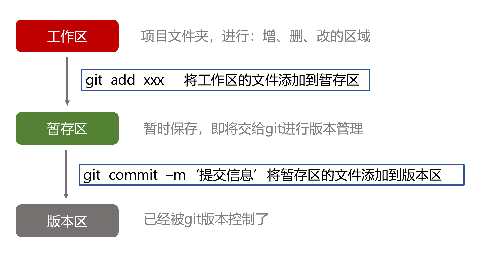
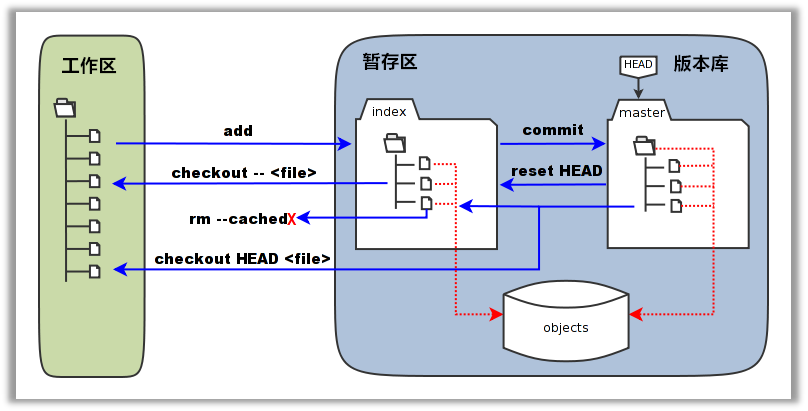

# Git与GitHub

## 1.git 简介

1.git是目前世界上最先进的分布式版本控制工具（没有之一）。

2.扩展：

- 林纳斯只写了Linux版的git，

- 而git的windows版本是后人添加的，相当于在windows系统上安装了小型Linux虚拟机。

## 2.git 安装后的设置命令

1.git 安装后设置自己的名字和邮箱（仅输入一次即可，除非要修改！）

```
git config --global user.name "Your Name"   设置自己的姓名
git config --global user.email "email@example.com"   设置自己的邮箱

git config user.name   用于查看配置的姓名
git config user.email   用于查看配置的邮箱
```
- 因为Git是分布式版本控制系统，所以每个机器都必须自报家门: 你的名字和Email地址。

## 3.linux的基本命令（扩展）

```
mkdir xxx   新建文件夹(目录)

cd xxx   进入xxx目录

cd ..   返回上一级目录

ls   列出当前文件夹中所有文件

pwd   显示当前目录

cat x.txt   显示文件内容

clear   清屏

vi x.txt   新建文件（Visual editor）

    输入 i   进入编辑模式

    ESC + : + wq   保存并退出

    ESC + : + q!   不保存并退出
```

## 4.git 三区 - 工作区+版本区+暂存区（用户仅能看到工作区）(重点！)

### 图解:



## 5.git基本使用

### 5.1创建版本库和提交文件（重点！）

```
1) git init :  初始化版本库, 即把当前的目录变成可以管理的git仓库，生成隐藏的.git文件夹

2) git add x.xx :  添加指定文件到暂存区中 (包括删文件等所有操作)
   git add * 或 git add . :   把工作区所有文件添加到暂存区 

3) git status :  查看文件状态
    1. 红色表示在工作区。
    2. 绿色表示在暂存区。
    3. 没有任何显示代表所有文件位于版本区。

4) git commit -m 'xxx' :  提交暂存区所有文件到版本区, -m 后面的是注释, 必须写！尽量写真实的修改信息！
```

### 5.2差异对比(了解)

```
git diff :  比较暂存区与工作区
git diff --cached :  比较版本区与暂存区
git diff master :  比较版本区与工作区
```

### 5.3查看日志 + 版本号

```
git log   显示从最近到最远的所有提交日志
git reflog   显示每次提交（commit）的commit id
```

### 5.4版本回退 (重点！) + 版本穿梭 + 版本撤销

```
git reset --hard HEAD^ :    版本回退（回退一次提交）
git reset --hard 版本号 :    回退到指定的commit id版本

git rm xx :   删除xx文件
git rm --cached x.txt :    从暂存区删除文件

以下了解:
git reset HEAD :  	 用版本库中的文件去替换暂存区的全部文件。
git checkout -- x.txt :     用暂存区指定文件去替换工作区的指定文件（危险!）
git checkout HEAD x.txt :   用版本库中的文件替换暂存区和工作区的文件（危险!）
```

### 5.5删除文件

```
git rm x.txt   删除文件
git rm -r xxxx   删除文件夹。空文件夹会被git忽略，无法删。
```

注: 

- 自己删的文件，暂存区和版本区不知道。用命令删文件会通知暂存区，但版本区也不知道。

- 用命令删文件必须先让git版本控制。

- 不能站在文件夹里用用命令删当前文件夹。

## 6.git 完整工作图



## 7.git 分支

### 7.1git 分支简介

1.主分支: master --- 代码经过了开发人员单元测试，以及测试人员详细的一套测试通过之后，确定没问题

2.开发分支: dev --- 开发人员所有的代码提交到此分支

3.测试分支: test -- 测试人员用的(由开发人员进行完单元测试的代码会放入此分支)

4.里程碑分支: tags --- v1.0.0

5.项目版本号， 如：1.0.0

- 第一位：大版本号

- 第二位：小功能更新

- 第三位：bug修复

扩展：

- 测试的种类：回归测试、压力测试、性能测试、单元测试(开发自己测的)

### 7.2git 分支命令  (重点！)

```
git checkout -b dev     创建dev分支，并切换到dev分支
git branch     查看当前分支
git checkout master   切换分支
git merge dev    合并dev分支到当前分支
git branch -d dev    删除指定分支

以下了解:
git diff branch1 branch2 	显示出两个分支之间所有有差异的文件的详细差异
git diff branch1 branch2 --stat   显示出两个分支之间所有有差异的文件列表
git diff branch1 branch2 xxx    显示指定文件的详细差异
```

注: 

- 如果当前分支为空分支( 即无文件和文件夹 )再去创建分支，则会将当前分支删除掉！

### 7.3版本冲突

- 合并分支时，如果在同一个文件，在同一个地方，都修改了或新增内容会引起版本冲突。

- 解决版本冲突最好的办法是借助IDE解决，简单且高效。

## 8.Github

### 8.1Github简介

- GitHub是一个Git项目托管网站

### 8.2GitHub远程仓库的使用（重点！）

#### 1. 场景一（关联）：本地有仓库，要和远程仓库做关联（项目开始，项目经理干）

1) 先建本地库：

```
git init
git add .
git commit -m “first commit”
```

2) 再在GitHub上创建一个远程仓库。

3) 最后关联：

```
git remote add origin https://github.com/Front-end-Chen/0909_demo.git (HTTPS)
```

- origin 为关联地址的别名

- 备注：如果此步关联错了，解决办法如下：
	
	- 暴力解决：删除.git文件夹，重新建立本地仓库。
	
	- 优雅解决：git remote remove origin，再重新关联仓库。

#### 2.场景二（推送）：本地有仓库有内容，要推送给远程库

```
git push -u origin master （首次加-u）
```

- 根据提示输入用户名密码

- 我们第一次推送master分支时，加上了-u参数，Git不但会把本地的master分支内容推送到远程新的master分支，
  还会把本地master分支和远程的master分支关联起来，在以后的推送时可以简化命令git push origin master。
  注：现在证明可以不写-u 效果一样的！

- 注：

	- 正常情况下，成功推送一次后，电脑会记住和账号与密码，下次推送时不会再提示输入。
	
	- 若在电脑不能够自动记住github的账户和密码，需执行以下命令解决：git config --global credential.helper store
	
	- 需要修改github的账户去控制面板的用户账户 -> 管理你的凭据 -> windows凭据 -> 删除github的密码选项！

#### 3.场景三（拉取）：本地有仓库有内容，获取远程库新内容

1) 第一种拉取方式：

```
git pull origin master
```

- 将远程仓库的master分支上代码版本复制/合并到本地master分支上

- 注:

    - 此方法合并代码时会产生冲突，需要解决！
    
    - 只能站在相同分支拉取对应的代码，即在master分支上 git pull origin master
    
    - 使用git pull 站在其他分支可拉取全部分支，其中包含本地没有的新分支!

2)（扩展）第二种拉取方式：

```
git fetch origin master:tmp
```

- 新建一个tmp分支，将远程仓库的master分支上代码版本复制到tmp分支上，不会自动合并。

#### 4.场景四（克隆）：本地无仓库，要获取一个完整的远程库

```
git clone https://github.com/xxx.git  (HTTPS)
```

- 克隆一个仓库，包含所有的分支，只不过git branch命令看不到而已，但切换其他分支后, 则可以用命令看到了。

- 注：

  - 只在第一次获取远程库时才需要克隆 （工作第一次上班）

### 8.3GitHub网站：新建仓库、新建组织、开源项目的多人协作（fork/pull request）、公司项目的多人协作

- github 仓库的wiki来代替REDME.md，显示更加丰富的介绍页面

- issues是提问的地方

- fork是复制别人的代码仓库到自己的账户，可以借鉴别人的代码，之后可以使用pull request提醒别人，我改了的优秀代码

## 9. .gitignore 忽略文件的配置文件

- 里面直接写忽略文件的类型即可，如.idea , .vscode

- 此文件也要提交（一般由工作小组长提交！）

## 10.使用开发工具进行git版本控制（多练）

- webstorm 右上角有图标操作。

- vscode在左边切换到git选项处。

## 11.提交代码的规范

1.每次提交之前：先更新, 再提交。

2.敏感时间点，一定及时更新文件。

3.多提交，避免“只关注写代码，不关注提交”的现象。

4.每次提交必须书写清晰明了的提交说明。

5.不要提交不能通过编译的代码。

6.不要提交自己不明白的代码。

7.慎用锁定功能（尽量避免使用锁，不轻易解锁上锁的文件）。

8.不要提交本地自动生成的文件、文件夹。

注：

- 学习别人代码时在本地不提交代码，只克隆后看，可以执行撤销revert回修改前的原始状态（即clone下来的状态）

