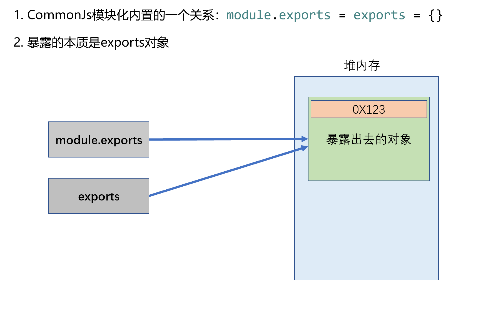

# 模块化

## 1.模块化的简介

### 1.1模块的概念

- 将一个复杂的程序依据一定的规则(规范)封装成几个块(文件), 并进行组合在一起

- 这些拆分的文件就是模块，模块内部数据/实现是私有的, 只是向外部暴露一些接口（方法）与外部其它模块通信

### 1.2模块的组成

（1）数据 ---> 内部的属性

（2）操作数据的行为 ---> 内部的函数

### 1.3模块化的概念

- 编码时是按照**模块**一个一个编码的, 整个项目就是一个**模块化**的项目

### 1.4为什么要模块化？

（1）降低复杂度，提高解耦性

（2）避免**命名冲突**（减少命名空间污染）

（3）更好的分离, **按需加载**

（4）更高复用性，高可维护性

## 2.模块化进化史

### 2.1全局function模式

- 全局函数模式：将不同的功能封装成不同的全局函数

- **问题**：全局被污染了，很容易引起命名冲突

**实例：**

```js
//module1.js
//数据
let data = 'atguigu.com'
//操作数据的函数
function foo() {
  console.log(`foo() ${data}`)
}
function bar() {
  console.log(`bar() ${data}`)
}

//module2.js
let data2 = 'other data';
function foo() {  //这里与另一个模块中的函数冲突了
  console.log(`foo() ${data2}`)
}

//test.html
<script type="text/javascript" src="module1.js"></script>
<script type="text/javascript" src="module2.js"></script>
<script type="text/javascript">
  let data = "我是修改后的数据"  //这里与一个模块中的变量冲突了
  foo()
  bar()
</script>
```

### 2.2namespace模式 - 简单对象封装

- namespace模式：简单对象封装

- 作用：减少了全局变量

- **问题**：不安全（数据不是私有的, 外部可以直接修改）

**实例：**

```js
//module1.js
let myModule = {
  data: 'module1 atguigu.com',
  foo() {
    console.log(`foo() ${this.data}`)
  },
  bar() {
    console.log(`bar() ${this.data}`)
  }
}

//module2.js
let myModule2 = {
  data: 'module2 atguigu.com',
  foo() {
    console.log(`foo() ${this.data}`)
  },
  bar() {
    console.log(`bar() ${this.data}`)
  }
}

//test.html
<script type="text/javascript" src="module2.js"></script>
<script type="text/javascript" src="module22.js"></script>
<script type="text/javascript">
  myModule.foo()
  myModule.bar()

  myModule2.foo()
  myModule2.bar()

  //外部可以直接修改模块内部的数据
  myModule.data = 'other data' 
  myModule.foo()
</script>
```

### 2.3IIFE模式

- IIFE模式：匿名函数自调用（会产生闭包）

- IIFE：immediately-invoked function expression（立即调用函数表达式）

- 作用：数据是私有的, 外部只能通过暴露的方法操作

- **问题**：如果当前这个模块依赖另一个模块怎么办？

**实例：**

```js
//module1.js
(function (w) {
  //数据
  let data = 'atguigu.com'

  //操作数据的函数
  function foo() { //向外暴露的内部私有函数
    console.log(`foo() ${data}`)
  }

  function bar() {//向外暴露的内部私有函数
    console.log(`bar() ${data}`)
    otherFun() //内部调用
  }

  function otherFun() { //未暴露的内部私有函数
    console.log('otherFun()')
  }

  //暴露行为
  w.myModule = {foo, bar}
})(window)

//test.html
<script type="text/javascript" src="module1.js"></script>
<script type="text/javascript">
  myModule.foo()
  myModule.bar()
  //myModule.otherFun()  //报错：myModule.otherFun is not a function
  console.log(myModule.data) //undefined 不能访问模块内部数据
  myModule.data = 'xxxx' //并不是修改的模块内部的data
  myModule.foo() //未受影响
</script>
```

### 2.4IIFE模式增强

- IIFE模式增强：引入依赖

- 这就是现代模块实现的基石

**实例：**

```js
//module1.js
(function (window, $) {
  //数据
  let data = 'atguigu.com'

  //操作数据的函数
  function foo() { //用于暴露有函数
    console.log(`foo() ${data}`)
    $('body').css('background', 'red')
  }

  function bar() {//用于暴露有函数
    console.log(`bar() ${data}`)
    otherFun() //内部调用
  }

  function otherFun() { //内部私有的函数
    console.log('otherFun()')
  }

  //暴露行为
  window.myModule = {foo, bar}
})(window, jQuery)

//test.html
//引入jquery
<script type="text/javascript" src="jquery-1.10.1.js"></script>
<script type="text/javascript" src="module4.js"></script>
<script type="text/javascript">
  myModule.foo()
</script>
```

## 3.页面加载多个js的问题

- 一个页面需要引入多个js文件

- 问题:
  * 请求过多
  * 依赖模糊
  * 难以维护

- 这些问题可以通过现代模块化编码和项目构建来解决

```html
//现实情况
<script type="text/javascript" src="module1.js"></script>
<script type="text/javascript" src="module2.js"></script>
<script type="text/javascript" src="module3.js"></script>
<script type="text/javascript" src="module4.js"></script>
<script type="text/javascript" src="module5.js"></script>
<script type="text/javascript" src="module6.js"></script>
<script type="text/javascript" src="module7.js"></script>
<script type="text/javascript" src="module8.js"></script>
<script type="text/javascript" src="module9.js"></script>
<script type="text/javascript" src="module10.js"></script>
<script type="text/javascript" src="module11.js"></script>
<script type="text/javascript" src="module12.js"></script>
```

## 4.模块化规范

### 4.1CommonJS --- 双端规范 (浏览器 / 服务器)（重点！）

1.在服务器端: 模块的加载是运行时同步加载的

2.在浏览器端: 模块需要提前编译打包处理

3.模块化之前需要使用npm init命令初始化项目结构

4.暴露语法

   1) module.exports = {value}

   2) exports.xxx = value

**注：**

- exports 是 module.exports 的别名(地址引用关系)

- 在 CommonJs 模块规范中，module.exports 和 exports.xxx 不能混用。

- 如果混用，导出对象以 module.exports 为主

5.引入语法(在汇总文件app.js里使用)

- require(xxx)

- 第三方模块：xxx为模块名

- 自定义模块：xxx为模块文件路径，要带./

**注：**导入模块时后缀可以省略！

6.暴露的本质到底是什么? 

- module.exports所指向的那个对象



#### 4.1.1服务器端（Node）

```js
//module1.js
/*
* 第一种暴露方式：module.exports = value
* */
module.exports = {
  data:'atguigu',
  test () {
    console.log(this.data)
  }
}
//下面这行代码同样会执行，但是没有经过任何的暴露
console.log('nice')

//module2.js
/*
* 第二种暴露方式：exports.xxx = value
* */
exports.haha = function () {
  console.log('我是module2里的一个函数')
}

//module3.js
/*
问题:
  1.暴露的本质到底是什么? module.exports所指向的那个对象
  2.在CommonJs模块规范中，module.exports 和 exports.xxx 不能混用。
  3.如果混用，以module.exports为主
*/
exports.peiqi = [1,3,5,7,9]
module.exports = function haha() {
  console.log('哈哈')
}

//app.js
/*
* 主文件，用于汇总各个模块
* 注意：引入模块时：
*       1.如果引入的是第三方模块，则直接写模块名。
*       2.如果引入的是自定义模块，必须写路径, 要加./。
* */
let module1 = require('./modules/module1.js')
let {data,test} = require('./modules/module1.js') //引入的同时，进行解构赋值
let module2 = require('./modules/module2.js')
let module3 = require('./modules/module3.js')
let uniq = require('uniq')

//如何使用一个模块取决于：模块暴露的是什么。
console.log(module1.data);
module1.test();
module2.haha();
console.log(module3.peiqi);
console.log(uniq([1, 3, 2, 5, 4, 3, 6, 7, 11, 10, 9, 8]));
console.log(data)
test()
console.log(require('./modules/module1').data)

//验证内置关系
console.log(module.exports === exports)
console.log(module.exports)
console.log(exports)
```

#### 4.1.2浏览器端

1.浏览器端需要使用Browserify实现require的功能

- Browserify用于把CommonJS的模块化语法，翻译成浏览器认识的语法，是一个“翻译官”

- 全局安装browserify: npm install browserify -g

2.在app.js所在的文件夹

- 输入命令 browserify js/src/app.js -o js/dist/bundle.js

- -o 为输出(output)的意思

- bundle.js 名字可改

**实例：** 核心代码同Node端，只是添加了html文件引入模块。

```js
//module1.js
/*
* 第一种暴露方式：module.exports = value
* */
module.exports = {
  data:'atguigu',
  test () {
    console.log(this.data)
  }
}
//下面这行代码同样会执行，但是没有经过任何的暴露
console.log('nice')

//module2.js
/*
* 第二种暴露方式：exports.xxx = value
* */
exports.haha = function () {
  console.log('我是module2里的一个函数')
}

//module3.js
/*
问题:
  1.暴露的本质到底是什么? module.exports所指向的那个对象
  2.在CommonJs模块规范中，module.exports 和 exports.xxx 不能混用。
  3.如果混用，以module.exports为主
*/
exports.peiqi = [1,3,5,7,9]
module.exports = function haha() {
  console.log('哈哈')
}

//app.js
/*
* 主文件，用于汇总各个模块
* 注意：引入模块时：
*       1.如果引入的是第三方模块，则直接写模块名。
*       2.如果引入的是自定义模块，必须写路径, 要加./。
* */
let module1 = require('./modules/module1.js')
let {data,test} = require('./modules/module1.js') //引入的同时，进行解构赋值
let module2 = require('./modules/module2.js')
let module3 = require('./modules/module3.js')
let uniq = require('uniq')

//如何使用一个模块取决于：模块暴露的是什么。
console.log(module1.data);
module1.test();
module2.haha();
console.log(module3.peiqi);
console.log(uniq([1, 3, 2, 5, 4, 3, 6, 7, 11, 10, 9, 8]));
console.log(data)
test()
console.log(require('./modules/module1').data)
//验证内置关系
console.log(module.exports === exports)
console.log(module.exports)
console.log(exports)

//引入模块的展示页面 - index.html
<body>
    <script type="text/javascript" src="./js/dist/bundle.js"></script>
</body>
```

### 4.2ES6模块化规范（重点！）

1.语法：

​    1) 导出模块: export 分别暴露，统一暴露，默认暴露，混合暴露就是前面都有

​    2) 引入模块: import 注意分别和统一暴露的引入时不是对象解构。

**注：** 推荐使用默认暴露，避免命名冲突。分别暴露和统一暴露可能产生命名冲突。

2.安装babel-cli, babel-preset-es2015 和 browserify：

​	1) 全局安装browserify: npm install browserify -g

​	2) 局部安装babel-preset-es2015: npm install babel-preset-es2015 -D

​	3) 创建.babelrc文件(给babel指定具体的任务)，内容如下：
```
{
	"presets": ["es2015"]
}
```

3.实现：

​    1) 使用Babel将ES6编译为ES5代码   babel 源文件路径 -d 编译后文件路径

​    2) 使用Browserify编译打包js   browserify 源文件路径/源文件 -o 编译后文件路径/文件

**注：** 此处源文件路径要是babel处理后的文件路径！

**实例：**

```js
//module1.js
/*
* module1使用了【分别暴露】的方式
* */
export let data = 'atguigu'
export function demo1() {
  console.log(`我是module1里的demo函数`,data.toUpperCase())
}
export function test1() {
  console.log('我是module1里的test函数',data.toLowerCase())
}

//module2.js
/*
* module2，使用的是【统一暴露】
* */
//arr是私有数据，不去暴露
let arr = [1,3,5,7,9]
function demo2() {
  console.log('我是module2里的demo2函数',arr)
}
function test2() {
  console.log('我是module2里的test2函数',arr)
}
//统一暴露(精简版写法)
export {demo2,test2} //不是对象
//统一暴露(完整版写法)
/*
export {
  demo2 as haha1, //暴露的同时可以，赋一个别名
  test2 as haha2
}*/

//module3.js
/*
* module3使用【默认暴露】, 只能暴露一次。
* */
export default 2
// export default {
//     name:'kobe',
//     age:25,
//     speak(){
//         console.log(`我的名字是${this.name}, 我的年龄是：${this.age}`);
//     }
// }

//module4.js
/*
* module4: 混合暴露
* */
//分别暴露
export let arr0 = [1,3,5,7,9,10]
export function bar() {
  console.log('module4-------bar()')
}
export function foo() {
  console.log('module4-------foo()')
}
//统一暴露
let str = 'hello,atguigu'
let student = {name:'peiqi',age:18}
class Dog {
  constructor(name,age){
    this.name = name;
    this.age = age;
  }
  run(){
    console.log('我正在奔跑')
  }
}
let d1 = new Dog('wc',3)
export {str,student,d1}
//默认暴露
export default {
  school:'atguigu',
  price:'15K'
}

//app.js
/*
* 主文件，用于汇总各个模块
* */
//在es6的模块化规范中，用哪一种方式引入，取决于用何种方式暴露的。
//引入module1，module1是【分别暴露】的
import {data,demo1,test1} from './module1'
//【另外一种写法】：引入module1，module1是【分别暴露】的，此种引入方式会将module1暴露的内容，收集成一个对象
//import * as haha from './module1'

//引入module2,module2是【统一暴露】的
import {demo2,test2} from './module2'
//【另外一种写法】，引入module2,module2是【统一暴露】的，此种引入方式会将module2暴露的内容，收集成一个对象
//import * as haha2 from './module2'
//引入module2,module2是【统一暴露】的（module2里面给暴露的内容起了别名）
//import {haha1,haha2} from './module2'

//引入module3,module3是【默认暴露】的
import module3 from './module3'
//如果模块是默认暴露的，尽量就不要用如下的写法
//import * as module3 from './module3'

//引入module4，module4里用了多种暴露的方式, 混合暴露引入时，默认暴露写前面
import module4,{arr0,bar,foo,str,student,d1} from './module4'

//引入第三方模块uniq，几乎所有的第三方模块，都用默认暴露的方式。
import uniq from 'uniq'

console.log(data)
demo1()
test1()
demo2()
test2()
/*console.log(module3.name)
console.log(module3.age)
module3.speak()*/
console.log(module3)
console.log(uniq([1, 3, 3, 3, 2, 5, 4, 6, 7, 9, 8, 11, 10]));
console.log(arr0,str,student,d1)
bar()
foo()
d1.run()
console.log(module4)

//index.html页面中引入测试
<body>
    //引入babel转换ES5语法和browserify翻译后的dist.js
    <script type="text/javascript" src="./js/dist/dist.js"></script>
</body>
```

### 4.3AMD规范

1.语法：

​	1-暴露

​        1) 定义没有依赖的模块
```
define(function(){
    return 模块
})
```
​        2) 定义有依赖的模块

```
define(['module1', 'module2'], function(m1, m2){
    return 模块
})
```

​	2-引入使用模块
```
require(['module1', 'module2'], function(m1, m2){
    使用m1/m2
})
```

2.实现

​	1) 下载require.js

​	2) 将require.js导入项目：js/libs/require.js

**实例：**

```js
//module1.js
/*
* 定义一个没有依赖的module1
* */
define(function () {
  //数据-----私有数据（只读）
  let data = 'atguigu'
  //获取数据的方法
  function getDataL() {
    return data.toLowerCase()
  }
  function getDataU() {
    return data.toUpperCase()
  }
  return {getDataL,getDataU} //暴露
})

//module2.js
/*
* 定义一个有依赖的module2,module2依赖于module1，要使用module1中的数据--data
* */
define(['module1'],function (module1) {
  let msg = '0719就业顺利！'
  //获取module1中的data和module2中的msg
  function getDataAndMsg() {
    return module1.getDataL() + msg
  }
  return getDataAndMsg
})

//app.js
/*
* 在AMD模块化中，主js文件(入口文件)需要写一个特殊的【配置对象】。
* */
//入口配置
requirejs.config({
  baseUrl: './js/', //如果配置了baseUrl，项目的根目录了就是index.html所在目录
  //在项目中所有用到的模块，都要在这里注册
  paths: {
    module1: 'modules/module1',
    module2: 'modules/module2',
    jquery: 'lib/jquery-1.10.1' //jquery必须小写
  }
});

requirejs(['module2','jquery'],function (m2,$) {
  console.log($)
  console.log(m2());
  $('body').css('background','skyblue')
});

//index.html页面中引入测试
<body>
    <!--AMD模块化中，主页面中也要用特殊的引入方式-->
	<script data-main="./js/app.js" src="./js/lib/require.js"></script>
</body>
```

### 4.4CMD规范

1.语法：

   1-暴露-语法是 CommonJS 与 AMD 混合

​        1) 定义没有依赖的模块

```
define(function(require, exports, module){
    exports.xxx = value
    module.exports = value
})
```

​        2) 定义有依赖的模块

```
define(function(require, exports, module){
    //引入依赖模块(同步)
    var module2 = require('./module2')
    //引入依赖模块(异步)
    require.async('./module3', function (m3) {
    })
    //暴露模块
    exports.xxx = value
})
```

  2-引入使用模块-语法是CommonJS与AMD混合

```
define(function (require) {
    var m1 = require('./module1')
    var m4 = require('./module4')
    m1.show()
    m4.show()
})
```

  3-如何使用模块(在html中)：
    seajs.use()

2.实现

​	1) 下载Sea.js

​	2) 将Sea.js导入项目：js/libs/Sea.js

**实例：**

```js
//module1.js
/*
* 定义一个没有依赖的模块，module1
* */
define(function (require,exports,module) {
  let data = '--------module1---------'
  function getData() {
    console.log(data)
  }
  module.exports = {getData}
})

//module2.js
/*
* 定义一个没有依赖的模块，module2
* */
define(function (require,exports,module) {
  let data = '--------module2---------'
  function getData() {
    console.log(data)
  }
  module.exports = {getData}
})

//module3.js
/*
* 定义一个没有依赖的模块，module3
* */
define(function (require,exports,module) {
  let data = '--------module3---------'
  function getData() {
    console.log(data)
  }
  module.exports = {getData}
})

//module4.js
/*
* 定义一个有依赖的模块，module4,依赖于module2和module3
* */
define(function (require,exports,module) {
  let data = '--------module4---------'
  //引入module2-----同步引入
  let module2 = require('./module2')
  module2.getData()
  //引入module3-----异步引入
  require.async('./module3',function (m3) {
    m3.getData()
  })
  function getData() {
    console.log(data)
  }
  module.exports = {getData}
})

//main.js
/*
* 主js文件，用于汇总各个模块
* */
define(function (require) {
  let module1 = require('./module1')
  let module4 = require('./module4')
  module1.getData()
  module4.getData()
})

//index.html页面中引入测试
<body>
   	<script type="text/javascript" src="js/libs/sea.js"></script>
    <script type="text/javascript">
      seajs.use('./js/modules/main')
    </script>
</body>
```

