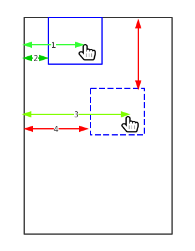
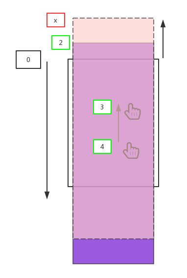

# 移动端开发基础

## 1.移动端特点

1.移动端与 PC 端网页有所不同，有以下几个特点

- 小屏幕
- 触摸交互
- 屏幕尺寸繁多

## 2.相关概念

### 2.1屏幕相关

#### 1）屏幕大小

​	屏幕大小指屏幕的对角线的长度，单位一般是英寸。常见的手机屏幕大小 3.5、4、4.7、5.0、5.5、6.0等。常见手机屏幕查看网址 <http://screensiz.es/>


**注意：**

* 英寸的英文为 inch，英尺的英文是 foot，如4.7inch

* 1foot = 12inch，1inch=2.54cm

#### 2）屏幕分辨率

​	屏幕分辨率是指屏幕横纵向上的像素点数。一般表示形式 x * y 或者 y * x 表示。例如 IPhone 6 的屏幕分辨率为 750 * 1334，华为 P30 的分辨率为 2340 * 1080。


**注意：**

* 屏幕分辨率是一个固定值，生产出来就固定了，无论手机屏幕还是电脑屏幕。
* 屏幕分辨率与显示分辨率不同。计算机可以修改显示分辨率，信号传递给屏幕，屏幕会进行计算，在屏幕上显示。
* 1080P 的分辨率是1920x1080，720P：1280 * 720
* 2K 屏幕是单一方向分辨率具有约 2000 像素的显示设备。最标准的 2K 分辨率为 2048×1024

几款手机分辨率：

| 型号                 | 分辨率         |
| -------------------- | -------------- |
| IPhone 3GS           | 320 * 480      |
| IPhone 4 / 4s        | 640 * 960      |
| IPhone 5 / 5s        | 640 * 1136     |
| ==IPhone 6 / 7 / 8== | ==750 * 1334== |
| 华为 P30             | 1080 * 2340    |
| IPhone X             | 1125 * 2436    |

### 2.2像素相关

#### 1）物理像素 / 设备像素

设备像素 / 物理像素是一个长度单位，单位是px。 1 物理像素对应显示设备中一个微小的物理部件。

设备像素是手机屏幕的一个参数，由手机制造商决定。例如 IPhone 6 的物理像素为 750 * 1334


#### 2）设备独立像素  /  设备无关像素

设备独立像素，简称 DIP或DP（device-independent pixel）,又称为设备无关像素，是一个长度计量单位。

设备独立像素也是手机屏幕的一个参数，由手机制造商决定。例如IPhone 6 的设备独立像素为 375 * 667

1 个设备独立像素可以认为是计算机坐标系统中的一个点，代表可以通过程序控制使用的虚拟像素。

* 普通屏幕下 1 设备独立像素 等于 1 物理像素
* 高清屏幕下 1 设备独立像素 等于 N 物理像素

**Retina 屏幕**

​	Retina 是苹果公司 2010 年推出的一种显示标准，在屏幕尺寸不变的前提下，把更多的像素点压缩至一块屏幕里，从而达到更高的分辨率并提高屏幕显示的细腻程度。


<span style="color:#ee0b41">设备独立像素的出现，使得即使在高分辨率的屏幕下，也可以正常尺寸的显示元素，代码不受到设备的影响。它是设备厂商根据屏幕特性设置的，无法修改。</span>

几款手机的屏幕像素参数，[点击这里查看更多](https://uiiiuiii.com/screen/)

| 型号                 | 设备像素总和   | 设备独立像素总和 |
| -------------------- | -------------- | ---------------- |
| IPhone 3GS           | 320 * 480      | 320 * 480        |
| IPhone 4 / 4s        | 640 * 960      | 320 * 480        |
| IPhone 5 / 5s        | 640 * 1136     | 320 * 568        |
| ==IPhone 6 / 7 / 8== | ==750 * 1334== | ==375 * 667==    |
| HUAWEI P10           | 1080 x 1920    | 360 x 640        |
| IPhone X             | 1125 * 2436    | 375 * 812        |

**IPhone 6  ppi  326**

#### 3）CSS 像素 / 逻辑像素

CSS 像素是 CSS 语言中用来表示长度的一个单位（抽象的单位），单位为 px。

* CSS 像素不能直接跟现实中的长度单位换算
* CSS 像素主要用在 CSS 与 JS 中控制元素的大小与位置

#### 4）像素之间的关系

* <span style="color:#ee0b41">页面不缩放的情况下，CSS 像素 == 设备独立像素 == 逻辑像素 == 位图像素</span>

#### 5）像素密度

​	屏幕上每英寸可以显示的像素点的数量，单位是 ppi （pixels per inch ），这里还有另一个单位 dpi（dots per inch），两个值的计算方式都一样，只是使用的场景不同。 PPI 主要用来衡量屏幕，DPI 用来衡量打印机，鼠标等设备。


苹果曾经给出个一个标准：手机屏幕达到 300PPI、平板屏幕达到 220PPI、笔记本电脑屏幕达到 200PPI 即可认为是 Retina 屏幕。

#### 6）像素比 / N倍屏

像素比（DPR / dpr）： 单一方向上设备物理像素和设备独立像素的比例。
```js
window.devicePixelRatio
```

像素比的作用：

<span style="color:#ee0b41">程序可以根据像素比来显示不同的图片，达到清晰显示网页的效果。</span>

### 2.3图片高清显示

#### 1）位图像素

位图和矢量图

- 位图图像亦称为点阵图像或栅格图像，是由单个的像素点组成的。放大后会失真。常见的有png，jpg，gif，一般使用软件有Photoshop
- 矢量图，也称为面向对象的图像或绘图图像，在数学上定义为一系列由线连接的点。放大后不会失真。常见的有svg，一般使用软件有Adobe Illustrator，Sketch

位图像素也是一个长度单位。位图像素是栅格图像最小的数据单元


<span style="color:red">注：1个位图像素对应于1个物理像素，图片才能得到完美清晰的展示</span>

使用媒体查询实现：

```css
/* 注意：像素比从小到大排列，不然大的会失效 */
@media screen and (-webkit-min-device-pixel-ratio: 2) {
    .logo {
        //改背景图
        background-image: url('./image/logo@2x.png');
        //改img的src
        content: url('./image/logo@2x.png');
    }
}

@media screen and (-webkit-min-device-pixel-ratio: 3) {
    .logo {
        //改背景图
        background-image: url('./image/logo@3x.png');
        //改img的src
        content: url('./image/logo@3x.png');
    }
}
```

<span style="color:#ee0b41">并不是所有的图片都这样处理，只需要处理那些页面布局需要的图片和图标即可</span>

### 2.4视口

#### 1）PC 端

​	在 PC 端，视口指的是浏览器的可视区域。其宽度和浏览器窗口的宽度保持一致。在 CSS 标准文档中，视口也被称为初始包含块，它是所有 CSS 百分比宽度推算的根源。

```js
console.log('最干净的显示区域' , document.documentElement.clientwidth);//常用
console.log( '最干净的显示区域+滚动条', window.innerwidth);
console.log( '最干净的显示区域+滚动条+浏览器边框', window.outerwidth);
console.log('与浏览器无关，当前设备显示分辨率横向的值' ,screen.width);
```

#### 2）移动端

移动端的视口与 PC 端不同，有三个视口
- 布局视口
- 视觉视口
- 理想视口

##### 布局视口

布局视口是用来放置网页内容的区域。

​	一般移动设备的浏览器都默认定义一个虚拟的布局视口（layout viewport），用于解决早期的页面在手机上显示的问题。 视口大小由浏览器厂商决定，<span style="color:#ee0b41">大多数设备的布局视口大小为 980px</span>。

获取方式：

```js
document.documentElement.clientWidth
document.documentElement.clientHeight
```

##### 视觉视口

视觉视口就是用户可见的区域。

获取方式：
```js
window.innerWidth
window.innerHeight
```

<span style="color:#ee0b41">注：不缩放的情况下，视觉视口宽度 == 布局视口宽度。</span>

##### 理想视口

宽度与屏幕（设备独立像素）同宽的布局视口称为理想视口。

理想视口的好处：

* 用户不需要缩放和滚动条就能看到网站的全部内容。
* 针对移动端的设计稿更容易开发。

<span style="color:#ee0b41">注意：理想视口不是真实存在的视口</span>

设置理想视口的方法
```html
<meta name="viewport" content="width=device-width" />
// 或者
<meta name="viewport" content="initial-scale=1.0" />
// 合体
<meta name="viewport" content="width=device-width,initial-scale=1.0" />
```

### 2.5缩放 - PC缩放会改变布局视口，移动端不会

#### 1）PC 端

放大时：
- 视口变小
- 元素的像素大小不变，但一个css像素所占的面积变大了

缩小时：

- 视口变大
- 元素的像素大小不变，但一个css像素所占的面积变小了

#### 2）移动端

放大时：
- 布局视口不变
- 视觉视口变小

缩小时：
- 布局视口不变
- 视觉视口变大

<span style="color:#ee0b41">注意：移动端缩放不会影响页面布局</span>

## 3.真机测试流程

真机测试是项目测试必需的一个流程，一定要掌握！

0.关闭防火墙

1.webstorm / vscode 设置调试端口，建议用 8000 8888
2.使 PC 与手机处于同一个网络。手机连接电脑 wifi，或者电脑连接手机热点，<span style="color:#ee0b41">两者在同一个 wifi 下最方便。</span>
3.cmd 查看电脑无线网卡的 IP（ipconfig）
4.webstorm / vscode 在浏览器中预览文件，将 localhost 更改为 IP
5.打开草料网址 https://cli.im/ 将 URL 转化为二维码，手机扫描即可。或者使用二维码生成器（Quick QR）

## 4.viewport 控制

viewport 标签是苹果公司在 2007 年引进的，用于移动端布局视口的控制。

使用示例：

```html
<meta name="viewport" content="width=device-width, initial-scale=1.0,
user-scaleable=no, maximum-scale=1.0, minimum-scale=1.0">
```

viewport 相关选项：
- width  布局视口宽度
- initial-scale  初始化缩放比例
- minimum-scale  最小缩放比例
- maximum-scale 最大缩放比例
- user-scalable  设置是否允许用户缩放
- viewport-fit   auto/contain/cover

#### width

<span style="color:#ee0b41">width 值可以是数字，也可以是设备宽度表示  device-width，这样可以得到理想视口，但有些安装手机是不支持具体值，IOS全系列都支持</span>

#### initial-scale

initial-scale 为页面初始化时的显示比例。

initial-scale = 屏幕宽度（设备独立像素） /  布局视口

**注意：**

* chrome 测试该参数会有偏差，真机测试
* <span style="color:#ee0b41">initial-scale = 1.0 也可以得到理想视口</span>
* initial-scale 会影响布局视口和视觉视口的大小
* width 与 initial-scale 同时设置时，会选择尺寸较大的那个

#### minimum-scale

设置允许用户最小缩放比例。

minimum-scale = 屏幕宽度（设备独立像素）/ 视觉视口

#### maximum-scale

设置允许用户最大缩放比例，苹果浏览器 safari 不认识该属性

maximum-scale = 屏幕宽度（设备独立像素）/ 视觉视口

#### user-scalable

是否允许用户通过手指缩放页面。苹果浏览器 safari 不认识该属性。

#### viewport-fit

设置为 cover 可以解决『刘海屏』的留白问题


## 5.适配

移动端设备的屏幕尺寸繁多，要想让页面的呈现统一，需要对不同尺寸的设备进行适配。适配的方式主要有两种

* viewport 适配
* rem 适配（主流方式，几乎完美适配）
* vw适配

### 1）viewport 适配

方法：拿到设计稿之后，设置布局视口宽度为设计稿宽度，然后直接按照设计稿给的宽度进行布局即可。

优点：不用复杂的计算，直接使用图稿上标注的px值

缺点：

- 不能使用完整的meta标签，会导致在某些安卓手机上有兼容性问题。
- 不希望适配的东西，例如边框，也强制参与了适配
- 图片会失真

```html
<meta name="viewport" content="width=375">
<style>
    *{
        margin: 0;
        padding: 0;
    }
    #demo{
        width: 345px;
        height: 150px;
        background-color: #8FAADC;
        margin: 0 auto;
        margin-top: 15px;
        border: 1px solid black;
    }
</style>
<div id="demo"></div>
```

### 2）rem适配（重点！）

#### 1.em 和 rem

em 和 rem 都是 CSS 中的长度单位。而且两个都是相对长度单位，不过两个有点区别：

* em 相对的是父级元素的字体大小
* rem 相对的是根元素（html）的字体大小 

```html
<style>
    html {
        font-size: 50px;
    }
    #test1 {
        width: 400px;
        height: 400px;
        background-color: orange;
        font-size: 20px;
    }
    #test2 {
        /*width: 5em;*/
        /*height: 5em;*/
        width: 4rem;
        height: 4rem;
        background-color: skyblue;
    }
</style>
<div id="test1">
    <div id="test2"></div>
</div>
```

**核心是等比缩放**

rem 适配的策略有以下几种：

#### 2.方法一（淘宝，百度）

核心思想：

1）设置理想视口

2）通过js设置根字体大小 = (手机横向设备独立像素值* 100) / 设计稿宽度

3）编写样式时：

- 直接以rem为单位
- 值为：设计稿值 / 100

**注：** 100是自定义的html的font-size，可以改，只是为了编码时好算

4）优化：通过js设置设备改变时实时适配，使用window.resize监听布局视口的改变

```html
<style>
    * {
        margin: 0;
        padding: 0;
    }
    #demo {
        width: 3.45rem;
        height: 1.50rem;
        margin: 0 auto;
        margin-top: 0.15rem;
        background-color: skyblue;
        /*设置rem为单位则会进行适配*/
        /* border: 0.01rem solid black; */
    }
</style>
<div id="demo"></div>
<script type="text/javascript">
    function adapter(){
        //获取布局视口宽度，因为开启了理想视口，布局视口=设备横向独立像素值
        const dpWidth = document.documentElement.clientWidth
        //计算根字体大小
        const rootFonstSize = (dpWidth * 100) / 375
        //设置根字体大小
        document.documentElement.style.fontSize = rootFonstSize + 'px'
    }
    adapter()
    //优化：设备改变实时适配 - 使用resize监听布局视口的改变
    window.onresize = adapter
</script>
```

#### 3.方法二（搜狐，唯品会）（推荐！）

核心思想：

1）设置理想视口

2）通过js设置根字体大小 = 设备横向独立像素值 / 10

3）编写样式时：

- 直接以rem为单位

- 值为：设计值 / (设计稿宽度 / 10)

**注：** 10是自定义的html的font-size，可以改

4）优化：通过js设置设备改变时实时适配，使用window.resize监听布局视口的改变

```html
<style>
    * {
        margin: 0;
        padding: 0;
    }
    #demo {
        width: 9.2rem;
        height: 4rem;
        margin: 0 auto;
        margin-top: 0.4rem;
        background-color: skyblue;
    }
</style>
<div id="demo"></div>
<script type="text/javascript">
    function adapter() {
        //获取布局视口宽度，因为开启了理想视口，布局视口=设备横向独立像素值
        const dpWidth = document.documentElement.clientWidth
        //计算根字体大小
        const rootFonstSize = dpWidth / 10
        //设置根字体大小
        document.documentElement.style.fontSize = rootFonstSize + 'px'
    }
    adapter()
    //优化：设备改变实时适配 - 使用resize监听布局视口的改变
    window.onresize = adapter
</script>
```

#### 4.方法一（配合less）

注意：样式里的rem写@font变量里

```less
//index.less
@font: 100rem;
*{
	margin: 0;
	padding: 0;
}
#demo{
	width: 345/@font;
	height: 150/@font;
	margin: 0 auto;
	margin-top: 15/@font;
	background-color: #87CEEB;
	/* border: 0.01rem solid black; */	/* 边框参与适配*/
	border: 1px solid black;  /* 边框不参与适配*/
}
```

```html
//rem1.html
<link rel="stylesheet" href="./css1/index.css">
<div id="demo"></div>
<script type="text/javascript">
    function adapter(){
        //获取布局视口宽度，因为开启了理想视口，布局视口=设备横向独立像素值
        const dpWidth = document.documentElement.clientWidth
        //计算根字体大小
        const rootFonstSize = (dpWidth * 100) / 375
        //设置根字体大小
        document.documentElement.style.fontSize = rootFonstSize + 'px'
    }
    adapter()
    //优化：设备改变实时适配 - 使用resize监听布局视口的改变
    window.onresize = adapter
</script>
```

#### 5.方法二（配合less）

注意：样式里的rem写@font变量里

```less
//index.less 
@font: 375/10rem;
*{
	margin: 0;
	padding: 0;
}
#demo{
	width: 345/@font;
	height: 150/@font;
	margin:  0 auto;
	margin-top: 15/@font;
    background-color: skyblue;
}
```

```html
//rem2.html
<link rel="stylesheet" href="./css2/index.css">
<div id="demo"></div>
<script type="text/javascript">
    function adapter() {
        //获取布局视口宽度，因为开启了理想视口，布局视口=设备横向独立像素值
        const dpWidth = document.documentElement.clientWidth
        //计算根字体大小
        const rootFonstSize = dpWidth / 10
        //设置根字体大小
        document.documentElement.style.fontSize = rootFonstSize + 'px'
    }
    adapter()
    //优化：设备改变实时适配 - 使用resize监听布局视口的改变
    window.onresize = adapter
</script>
```

#### 6.非标准设计稿处理

设计稿宽度：750/800

1）方法一（配合less）

```less
//index.less
@font: 100rem;
*{
	margin: 0;
	padding: 0;
}
#demo{
	width: 690/@font; //或 760
	height: 300/@font; //或 335
	margin: 0 auto;
	margin-top: 30/@font; //或 20
	background-color: #87CEEB;
	/* border: 0.01rem solid black; */	/* 边框参与适配*/
	border: 1px solid black;  /* 边框不参与适配*/
}
```

```html
//rem1.html
<link rel="stylesheet" href="./css1/index.css">
<div id="demo"></div>
<script type="text/javascript">
    function adapter(){
        //获取布局视口宽度，因为开启了理想视口，布局视口=设备横向独立像素值
        const dpWidth = document.documentElement.clientWidth
        //计算根字体大小
        const rootFonstSize = (dpWidth * 100) / 750 //或 800
        //设置根字体大小
        document.documentElement.style.fontSize = rootFonstSize + 'px'
    }
    adapter()
    //优化：设备改变实时适配 - 使用resize监听布局视口的改变
    window.onresize = adapter
</script>
```

2）方法二（配合less）

```less
//index.less 
@font: 750/10rem; //或 800
*{
	margin: 0;
	padding: 0;
}
#demo{
	width: 690/@font; //或 760
	height: 300/@font; //或 335
	margin:  0 auto;
	margin-top: 30/@font; //或 20
    background-color: skyblue;
}
```

```html
//rem2.html
<link rel="stylesheet" href="./css2/index.css">
<div id="demo"></div>
<script type="text/javascript">
    function adapter() {
        //获取布局视口宽度，因为开启了理想视口，布局视口=设备横向独立像素值
        const dpWidth = document.documentElement.clientWidth
        //计算根字体大小
        const rootFonstSize = dpWidth / 10
        //设置根字体大小
        document.documentElement.style.fontSize = rootFonstSize + 'px'
    }
    adapter()
    //优化：设备改变实时适配 - 使用resize监听布局视口的改变
    window.onresize = adapter
</script>
```

### 3）vw适配（百分比）

vw和vh是两个相对单位

- 1vw=等于布局视口宽度的1%

- 1vh=等于布局视口高度的1%

不过vw和vh有一定的兼容性问题：详见：https://caniuse.com/?search=vw

```less
//index.less
@basic: 375/100vw;
* {
	margin: 0;
	padding: 0;
}
#demo {
	width: 345/@basic;
	height: 150/@basic;
	background-color: skyblue;
	margin: 0 auto;
	margin-top: 15/@basic;
	border: 1px solid black;
}
```

```html
<link rel="stylesheet" href="./index.css">
<div id="demo"></div>
```

### 4）1px 边框问题（1物理像素边框）

高清屏幕下 1px 对应更多的物理像素，所以 1 像素边框看起来比较粗，解决方法如下：

#### 1.方法一

用css媒体查询

```css
#demo {
    width: 150px;
    height: 150px;
    background-color: pink;
    margin: 0 auto;
    margin-top: 20px;
    border: 1px solid black;
}
@media screen and (-webkit-min-device-pixel-ratio:2){
    #demo{
        border: solid 0.5px black;
    }
}
@media screen and (-webkit-min-device-pixel-ratio:3){
    #demo{
        border: solid 0.333px black;
    }
}
```

#### 2.方法二（推荐！）

1.边框使用伪类选择器，或者单独的元素实现。例如底部边框

```css
.box2::after{
    content: '';
    height: 1px;
    width: 100%;
    position: absolute;
    left: 0;
    bottom: 0;
    background: #000;
}
```

2.在高清屏幕下设置

```css
@media screen and (-webkit-min-device-pixel-ratio: 2){
    .box2{
        transform: scaleY(0.5);
    }
}

@media screen and (-webkit-min-device-pixel-ratio: 3){
    .box2{
        transform: scaleY(0.333);
    }
}
```

#### 3.方法三

1.rem 页面布局

```js
var fontSize = 50;
document.documentElement.style.fontSize = '50' + px;
```

2.元素的边框设置为 1px

3.通过 viewport 中的 initial-scale 将页面整体缩小 ，布局视口变大

```js
var dpr = window.devicePixelRatio;
var viewport = document.querySelector('meta[name=viewport]');
viewport.setAttribute('content', 
                      'user-scalable=no, initial-scale='+ 1/dpr + ',user-scalable=no');
```

4.重新设置根元素字体，内容再放大，边框只缩小没放大

```js
document.documentElement.style.fontSize = fontSize * dpr + 'px';
```

**实例：**

```html
<style>
    #box {
        width:3rem;
        height: 3rem;
        border:solid 1px #000;
    }
</style>
<div id="box"></div>
<script>
    //设置 font-size 的值
    var fontSize = 50;
    //设置html根标签的 font-size
    document.documentElement.style.fontSize = fontSize + 'px';

    // 1. 整体的缩小  initial-scale  设备独立像素宽度  / 布局视口的宽度  2   375  => 750  0.5
    var dpr = window.devicePixelRatio;
    var initialScale = 1 / dpr;

    //获取 meta 标签
    var meta = document.querySelector('meta[name=viewport]');

    //设置 content 属性
    meta.content = 'user-scalable=no,initial-scale='+initialScale;

    // 2. 内容进行放大
    var newFontSize = fontSize * dpr;
    document.documentElement.style.fontSize = newFontSize + 'px';
</script>
```

## 6.移动端事件

### 1）事件类型

移动端事件列表

* touchstart   元素上触摸开始时触发
* touchmove   元素上触摸移动时触发
* touchend   手指从元素上离开时触发
* touchcancel   触摸被打断时触发

这几个事件最早出现于IOS safari中，为了向开发人员转达一些特殊的信息。

### 2）应用场景

touchstart 事件可用于元素触摸的交互，比如页面跳转，标签页切换

touchmove 事件可用于页面的滑动特效，网页游戏，画板

touchend 事件主要跟 touchmove 事件结合使用

touchcancel 使用率不高

**注意：**

- touchmove 事件触发后，即使手指离开了元素，touchmove 事件也会持续触发
- 触发 touchmove 与 touchend 事件，一定要先触发 touchstart
- <span style="color:#ee0b41">事件的作用在于实现移动端的界面交互</span>

### 3）事件绑定

方式一

```js
box.ontouchstart = function(){
    console.log('touch start')
}
```

方式二

```js
box.addEventListener('touchstart', function(){
	console.log('touch start')
})
```

**注意：** 这里推荐使用第二种，第一种有时会失灵。

### 4）点击穿透

<span style="color:#ee0b41">        touch 事件结束后会默认触发元素的 click 事件</span>，如没有设置完美视口，则事件触发的时间间隔为 300ms 左右，如设置完美视口则时间间隔为 50ms 左右。

​       如果 touch 事件隐藏了元素，则 click 动作将作用到新的元素上，触发新元素的 click 事件或页面跳转，此现象称为 **点击穿透**。

#### 1.解决方法：

方法一：阻止当前元素事件的默认行为。

```js
cls.addEventListener('touchstart', function(e){
	e.preventDefault();
})
```

方法二：阻止顶级元素事件的默认行为，可以增加一个包裹元素绑定（推荐！），也可以给 document 和 window 绑定，不过需要关闭被动模式。

```js
document.addEventListener('touchstart', function(e){
	e.preventDefault();
}, {
	passive: false // 被动模式: true / false, 控制 e.preventDefault 是否失效
});
```

方法三：使用非链接的元素代替 a 标签，并绑定 touchstart 事件

```html
<div id="nav">
        <div class="item" data-href="http://www.baidu.com" data-test="abc"></div>
        <div class="item" data-href="http://www.jd.com"></div>
        <div class="item" data-href="http://www.taobao.com"></div>
    </div>
</div>
<script>
    var tupian = document.querySelectorAll('.item');
    for(var i = 0; i < tupian.length; i++){
        tupian[i].addEventListener('touchstart', function(){
            // this.dataset.test    getAttribute('data-href')
            location.href = this.dataset.href;
        });
    }
</script>
```

方法四：延时隐藏遮盖元素

```js
setTimeout(function(){
	zhezhao.style.display = 'none';
}, 400)
```

### 5）页面跳转的选择

移动端页面跳转可以使用 a 链接，也可以使用 touchstart 事件来触发 JS 代码完成跳转

- 效率上，touchstart 速度更快
- SEO 优化上， a 链接效果更好

### 6）浏览器默认行为

这里指的浏览器默认行为主要有两个

* 滑动露白
* 页面缩放

#### 1.为什么要阻止这些默认行为

这样可以让网页在不同的浏览器都有一样的表现。

#### 2.如何阻止默认行为

可以给 document 绑定 touchstart 事件，并阻止默认行为，不过需要关闭被动模式。<span style="color:#ee0b41">这里推荐创建一个包裹元素，绑定 touchstart 事件并阻止默认行为。</span>

CSS 代码

```css
html, body, #app {
    width: 100%;
    height:100%;
    overflow: hidden;
}
```

HTML 代码

```html
<body>
    <div id="app">
		...
    </div>
</body>
```

JS 代码

```js
app.addEventListener('touchstart', function(e){
	e.preventDefault();
})
```

#### 3.后遗症

最外层元素阻止了 touchstart 默认行为之后，会产生一些意外现象：

* 链接失效
* 内容无法选择
* form 元素无法获得焦点

#### 4.解决

产生『后遗症』的原因在于 touchstart 阻止了默认行为，后续所有的操作都已经失效。解决问题只需要给目

标元素绑定 touchstart 事件并阻止事件冒泡，这样当前操作的默认行为仍然可用。

```js
var link = document.getElementsByTagName('a')[0];
link.addEventListener('touchstart', function(e){
	e.stopPropagation();
})
```

<span style="color:#ee0b41"> 注:  不是非要阻止浏览器的默认行为，这是一种极端要求的应对方法，正常只需要设置完美视口即可。</span>

### 7）事件对象属性

touch 事件对象中有 3 个非常重要的属性

* changedTouches
* targetTouches
* touches

#### 1.touchstart 事件

在 touchstart 事件中：

changedTouches  为当前在元素上<span style="color:#ee0b41">同时按下</span>的触点对象数组。

targetTouches  为按下后，当前元素上的触点对象数组

touches  为按下后，当前屏幕上所有的触点对象数组

#### 2.touchmove 事件

在 touchmove 事件中：

changedTouches  为当前在元素上<span style="color:#ee0b41">同时滑动</span>的触点对象数组。

targetTouches  为滑动时，当前元素上的触点对象数组

touches  为滑动时，当前屏幕上所有的触点对象数组

#### 3.touchend 事件

在 touchend 事件中

changedTouches  为当前在元素上<span style="color:#ee0b41">同时抬起</span>的触点对象数组。

targetTouches  为结束时时，当前元素上的触点对象数组

touches  为结束时时，当前屏幕上所有的触点对象数组

#### 4.触点对象

每一个触点对象都包含一些位置信息，其中包括

* clientX  相对可视区域左侧的偏移
* clientY  相对可视区域顶侧的偏移
* pageX   相对文档左侧的偏移
* pageY   相对文档顶部的偏移

#### 5.小案例

- 触摸拖拽

思路图解：4 = 3 - (1 - 2)



```html
<style>
    * {
        margin: 0;
        padding: 0;
    }
    ul {
        list-style: none;
    }
    #box {
        width: 100px;
        height: 100px;
        background: darkred;
        color: white;
        position: absolute;
        left: 0;
        top: 0;
        /*background:rgb(200,241,200);*/
    }
</style>
<div id="box"></div>
<script>
    var box = document.querySelector("#box");
    
    box.addEventListener("touchstart", function (e) {
        //获取按下时触点的位置   1
        this.size1 = e.touches[0].clientX;
        //获取按下时 元素距离左侧的偏移量  2
        this.size2 = box.offsetLeft;

        this.size1Y = e.touches[0].clientY;
        this.size2Y = box.offsetTop;
    });

    box.addEventListener("touchmove", function (e) {
        //位置3
        this.size3 = e.touches[0].clientX;
        //获取移动后的触点的位置
        this.size3Y = e.touches[0].clientY;

        var size4 = this.size3 - (this.size1 - this.size2);
        var size4Y = this.size3Y - (this.size1Y - this.size2Y);

        //获取最大的left 的值
        var maxLeft = document.documentElement.clientWidth - box.offsetWidth;
        //检测水平方向的位置
        if (size4 <= 0) {
            size4 = 0;
        }

        if (size4 >= maxLeft) {
            size4 = maxLeft;
        }

        //获取最大的Top 的值
        var maxTop = document.documentElement.clientHeight - box.offsetHeight;
        //检测垂直方向的位置
        if (size4Y <= 0) {
            size4Y = 0;
        }

        if (size4Y >= maxTop) {
            size4Y = maxTop;
        }

        //设置css left 的值
        box.style.left = size4 + "px";
        box.style.top = size4Y + "px";
    });
</script>
```

- 竖向滑屏

思路图解：x - 2 = 3 - 4（即x与2的距离等于3与4）



```html
<style>
    * {
        margin: 0;
        padding: 0;
    }

    ul {
        list-style: none;
    }
    html,
    body,
    #app {
        width: 100%;
        height: 100%;
        overflow: hidden;
        background: #a88;
    }

    #app {
        position: relative;
    }

    #box {
        position: absolute;
    }
</style>
<div id="app">
    <div id="box"></div>
</div>
<script>
    var box = document.querySelector("#box");
    var app = document.querySelector("#app");

    //模拟填充内容
    var str = "";
    for (var i = 0; i < 100; i++) {
        str += i + "<br>";
    }
    box.innerHTML = str;

    app.addEventListener("touchstart", function (e) {
        //获取触点的起始位置
        box.pointerStartY = e.touches[0].clientY;
        //获取box起始位置的垂直方向的位置
        box.boxTop = box.offsetTop;
    });

    app.addEventListener("touchmove", function (e) {
        //获取移动以后触点的垂直位置
        box.pointerEndY = e.touches[0].clientY;
        // 1 - 2 = 3 - 4
        var newTop = box.pointerEndY - box.pointerStartY + box.boxTop;
        //判断 top 的值
        if (newTop >= 0) {
            newTop = 0;
        }

        var minTop = -(box.offsetHeight - app.offsetHeight);
        if (newTop <= minTop) {
            newTop = minTop;
        }
        box.style.top = newTop + "px";
    });
</script>
```

## 附：

### 1）在线绘图工具

https://www.draw.io/
https://www.processon.com

### 2）在线UI图预览与标注工具（移动端推荐）

#### 1.蓝湖

蓝湖是一个生态, 团队开发, 设计稿在线预览与标注

https://lanhuapp.com

使用步骤：

1.注册账号

2.下载蓝湖的PS插件，直接无脑下一步安装

3.打开 PS 并打开 PSD 文件

4.PS -> 窗口 -> 扩展功能 -> 蓝湖

### 3）离线UI图预览与标注工具（移动端推荐）

#### 1.像素大厨PxCook

https://www.fancynode.com.cn/pxcook


